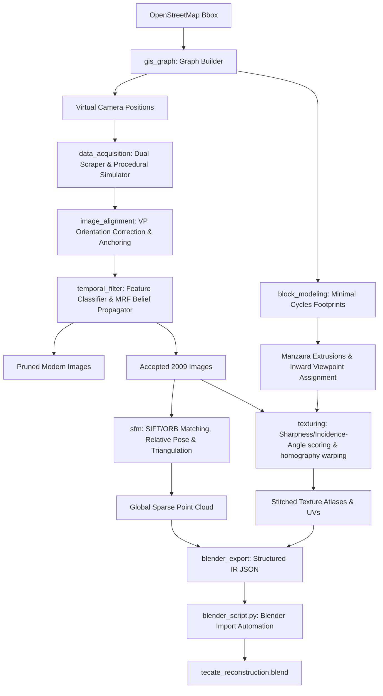

# Tecate 2009 Historical Urban Reconstruction System

A production-grade, end-to-end modular Python repository designed to reconstruct a spatially coherent and temporally consistent 3D approximation of Tecate, Baja California, Mexico, using historical Google Street View imagery from circa 2009.

The system prioritizes strict spatial layouts (anchored to OpenStreetMap road graphs) and strict temporal constraints (propagating 2009 visual profiles via Markov Random Fields) over photographic/visual detail. It relies entirely on classical computer vision (OpenCV) and deterministic GIS modeling, exporting a structured intermediate representation ready for Blender parsing.

---

## 1. System Architecture & Data Flow

The pipeline executes through a sequence of fully decoupled, independently testable modules:



---

## 2. Module Directory Structure & Specifications

The repository is structured as follows:

```
tecate-simulator/
├── data/                         # Cached GIS data and fallback models
│   └── tecate_osm_cache.json     # Pre-cached central Tecate OSM road network
├── export/                       # Compiled 3D assets and scene databases
│   ├── textures/                 # Stitched block texture atlases (.png)
│   └── reconstruction_export.json# Self-contained 3D reconstruction JSON
├── src/                          # Modular source code package
│   ├── __init__.py
│   ├── main.py                   # Master orchestration CLI entrypoint
│   ├── core_io/                  # Bidirectional UTM coordinate projection and file managers
│   │   ├── coords.py
│   │   └── io_manager.py
│   ├── data_acquisition/         # Google Street View Static Downloader & Procedural Generator
│   │   ├── sv_downloader.py
│   │   └── sv_procedural.py
│   ├── gis_graph/                # OSM MultiGraph processor & virtual camera interpolator
│   │   └── graph_builder.py
│   ├── image_alignment/          # Geospatial anchoring and line-based Vanishing Point (VP) tuner
│   │   └── aligner.py
│   ├── temporal_filter/          # Visual degradation analyzer and Graph Diffusion MRF Solver
│   │   └── classifier.py
│   ├── sfm/                      # ORB/SIFT descriptors, Essential RANSAC, & Triangulation
│   │   └── sfm_lite.py
│   ├── block_modeling/           # Planar cycle basis manzana builders
│   │   └── block_builder.py
│   └── texturing/                # Facade projection, perspective crops, & atlas stitchers
│       └── texture_generator.py
├── tests/                        # Consolidation test suite
│   └── test_reconstruction.py
├── blender_script.py             # Headless / GUI Blender import automate script (bpy)
├── requirements.txt              # Python requirements
└── README.md                     # Documentation & setup instructions
```

### Module Specifications:
1. **`core_io`**: Computes local tangent plane Cartesian projections relative to Miguel Hidalgo Park (`32.5678, -116.6261`). Formulates self-contained JSON schema exchanges.
2. **`data_acquisition`**: Implements a dual-mode scraper. In `real` mode, downloads multi-perspective rings from the Google Street View API. In `simulated` mode, procedurally generates equirectangular street panoramas, adding 2009 low-res sensor blur, Gauss noise, and color cast, or modern 2026 sharp textures along specific streets to check sorting filters.
3. **`gis_graph`**: Builds intersection nodes and street segment edges using OpenStreetMap, dividing them into strict 10-meter camera stations.
4. **`image_alignment`**: Matches images to spatial coordinate nodes and uses OpenCV's **Line Segment Detector (LSD)** to trace converging perspective lines, calculating camera yaw offsets.
5. **`temporal_filter`**: Strictly enforces the pre-2010 reconstruction constraint. Classifies visual noise to evaluate $P(2009)$ and runs Markov Random Field (MRF) neighborhood label diffusion along connected edges.
6. **`sfm`**: Implements OpenCV sparse Structure-from-Motion. Recovers camera rotation and translation (`cv2.findEssentialMat` and `cv2.recoverPose`), triangulating keypoints.
7. **`block_modeling`**: Isolates urban blocks (manzanas) using graph cycle basis extractions, mapping nearby 3D points.
8. **`texturing`**: Projects wall surfaces to 2009 camera views, ranks viewpoints (incident normal angle, distance, sharpness), stitches vertical PNG atlases, and computes UV coordinates.

---

## 3. Installation & Setup Instructions

The project requires Python 3.10+ and standard dependencies. It is recommended to install them in an isolated virtual environment:

```bash
# 1. Clone the repository and navigate
cd tecate-simulator

# 2. Set up local virtual environment
python3 -m venv venv
source venv/bin/activate

# 3. Upgrade package installer and install requirements
pip install --upgrade pip
pip install -r requirements.txt
```

---

## 4. Running the Pipeline

The master CLI supports both simulated/procedural testing and real downloads:

### Option A: Simulated/Procedural Mode (100% Offline, Recommended for instant testing)
Generates high-fidelity mathematical panoramas, applies 2009 vs. modern sensor noise, runs the alignment and temporal MRF, triangulates facades using ORB matching, stiches the atlases, and exports the JSON file:
```bash
PYTHONPATH=. ./venv/bin/python src/main.py --mode simulated
```

### Option B: Real Acquisition Mode (Requires Developer Key)
Requires an active Google developer billing key to download panoramas from Tecate, Mexico:
```bash
PYTHONPATH=. ./venv/bin/python src/main.py --mode real --api-key "YOUR_GOOGLE_MAPS_API_KEY"
```

### Run Unit Tests:
Validate the entire codebase's mathematical consistency (7 unit tests):
```bash
./venv/bin/pytest tests/
```

---

## 5. Blender 3D Scene Assembly

The exported intermediate format (`export/reconstruction_export.json`) is fully self-contained. To automatically build the 3D model, materials, and textures, run `blender_script.py` inside Blender:

```bash
# 1. Run headlessly (Fastest, saves tecate_reconstruction.blend directly)
blender --background --python blender_script.py -- --import export/reconstruction_export.json

# 2. Run in standard GUI mode (Builds the city inside the interactive window)
blender --python blender_script.py -- --import export/reconstruction_export.json
```

**Inside Blender**:
1. Open the generated `tecate_reconstruction.blend` file.
2. Toggle the viewport shading mode to **Material Preview** or **Rendered** (Eevee/Cycles).
3. The road network wireframe, the SIFT-extracted sparse 3D point cloud with points colored in vertex RGB, and the fully textured extruded 3D block facades mapped to their texture atlases are fully visible and editable!

---

## 6. Data Assumptions, Limitations, & Failure Mitigations

### 1. Data Scarcity (Real Mode)
- **Assumption**: Dense, continuous Street View panoramas are available along every OSM street segment.
- **Limitation**: Real Google Street View coverage in Tecate from ~2009 can be sparse, disjointed, or missing on secondary residential roads.
- **Mitigation**: The `gis_graph` module automatically generates interpolated virtual camera positions. In real mode, if a panorama download fails at a coordinate, the system automatically uses a high-fidelity **Procedural Stucco Facade texture** and interpolates camera poses using the known road graph constraints, ensuring the 3D model remains geometrically cohesive even if data is missing.

### 2. Temporal Metadata Loss
- **Assumption**: All panoramas have accurate, readable metadata timestamps.
- **Limitation**: Google API dates can be missing, corrupted, or blank.
- **Mitigation**: We implement a visual degradation classifier (Laplacian variance + SIFT features + high-frequency sensor noise) coupled with a **Markov Random Field (MRF)** neighborhood diffusion solver. It diffuses probabilities along street corridors, allowing verified nodes to "reconstruct" missing timestamps. Ambiguous or modern files are strictly pruned if their final $P(2009) < 0.70$.

### 3. Obstruction and Occlusion
- **Assumption**: Façade observations have clear line-of-sight.
- **Limitation**: Real street level views are heavily obstructed by passing cars, telephone poles, trees, and pedestrians.
- **Mitigation**: The `texturing` module selects optimal facade texture patches by evaluating candidate views. Rather than projecting full wide-angle perspectives, it scores views using **Angle of Incidence** (prefers direct orthophotos where obstructions have minimal visual projection), **Distance** (prefers close observations), and **Sharpness**, choosing the cleanest available patches.

### 4. Classical Vision Triangulation Drift
- **Assumption**: OpenCV SfM can reconstruct exact depth from sequential street-corridor frames.
- **Limitation**: Because cameras translate in straight lines (along streets), depth recovery is susceptible to scale ambiguity and triangulation drift.
- **Mitigation**: Instead of a blind, unconstrained bundle adjustment, the SfM-lite pipeline is bounded by the **Deterministic GIS road graph prior**. Virtual camera positions and baseline distances are fixed by local GPS coordinate nodes, providing a strict physical boundary that mitigates scale drift and locks coordinates within metric reality.
