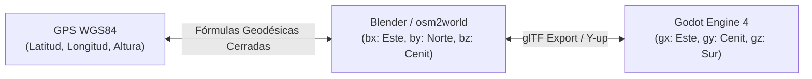
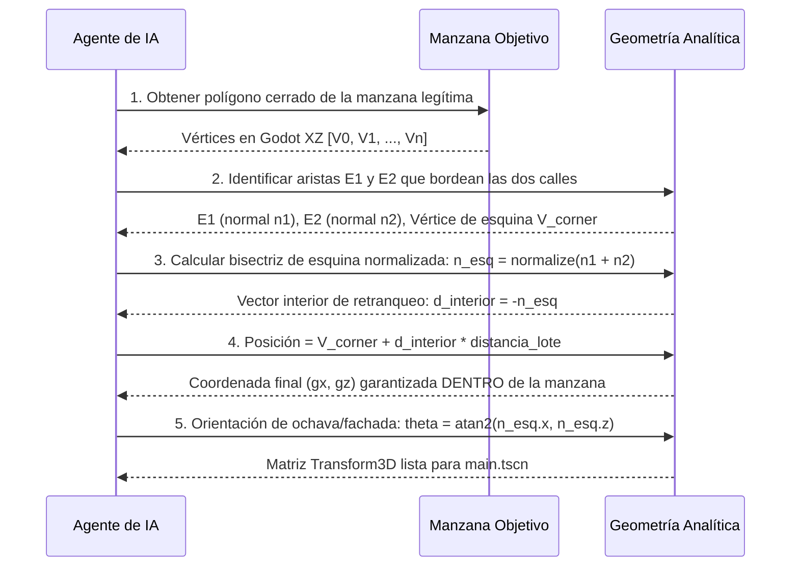

# Sistema Universal de Coordenadas, Geodesia y Posicionamiento Espacial
## Manual de Referencia Matemática y Protocolo de Posicionamiento Autónomo para Agentes de IA
### Tecate Simulator — Nivel Municipal y Canónico

---

### Propósito y Alcance del Documento
Este manual define formalmente la infraestructura matemática, geodésica y topológica que rige la posición, escala y orientación de cualquier activo tridimensional dentro de **Tecate Simulator**. 

Su propósito fundamental es proporcionar a cualquier **Agente de IA** (o desarrollador) las fórmulas analíticas cerradas, las convenciones de ejes y los algoritmos topológicos necesarios para operar **sin ambigüedades a lo largo de todo el municipio de Tecate** (desde la línea fronteriza norte hasta Valle de las Palmas en el sur, y desde el límite poniente con Tijuana hasta La Rumorosa en el oriente).

---

## 1. El Marco Geodésico y la Proyección Cartográfica Municipal

El simulador utiliza un sistema de proyección ortogonal local derivado del estándar cartográfico **WGS84 / osm2world**, calibrado analíticamente contra las **4,239 manzanas catastrales** del municipio de Tecate.



### Constantes Geodésicas Universales de Tecate

| Parámetro | Símbolo / Variable | Valor Matemático | Significado Físico / Cartográfico |
| :--- | :--- | :--- | :--- |
| **Latitud de Origen** | $\phi_0$ (`ORIGIN_LAT`) | $32.5732357^\circ\text{ N}$ | Origen métrico ($Y=0$ en Blender, $Z=0$ en Godot). |
| **Longitud de Origen** | $\lambda_0$ (`ORIGIN_LON`) | $-116.6265288^\circ\text{ W}$ | Origen métrico ($X=0$ en Blender, $X=0$ en Godot). |
| **Escala Latitudinal** | $S_{\text{lat}}$ (`METERS_PER_DEG_LAT`) | $111\,323.6051\text{ m/grado}$ | Metros equivalentes por cada grado de latitud. |
| **Escala Longitudinal** | $S_{\text{lon}}$ (`METERS_PER_DEG_LON`) | $93\,810.7490\text{ m/grado}$ | Metros equivalentes por cada grado de longitud. |
| **Relación de Achatamiento** | $\cos(\phi_0)$ | $0.842704$ | Factor métrico $\frac{S_{\text{lon}}}{S_{\text{lat}}} = \cos(32.5732^\circ)$. |
| **Paso Latitud por Metro** | $D_{\text{lat}}$ (`DEG_LAT_PER_METER`) | $8.982823 \times 10^{-6}\text{ }^\circ\text{/m}$ | Grados de avance latitudinal por cada metro. |
| **Paso Longitud por Metro** | $D_{\text{lon}}$ (`DEG_LON_PER_METER`) | $1.065976 \times 10^{-5}\text{ }^\circ\text{/m}$ | Grados de avance longitudinal por cada metro. |

> [!NOTE]
> En la escena maestra `main.tscn`, el nodo `Terrain` posee un factor de escala transformacional de `0.84277856`. Este número corresponde con precisión analítica al factor $\cos(\phi_0)$ para eliminar la distorsión cilíndrica de Web Mercator y lograr una relación métrica $1:1$ exacta en todo el territorio del simulador.

---

## 2. Fórmulas Analíticas de Conversión Bidireccional

Cualquier agente puede convertir puntos entre coordenadas GPS, Blender y Godot en tiempo constante $\mathcal{O}(1)$ mediante las siguientes ecuaciones inmutables:

### A. De Geoposición GPS a Espacio Métrico Godot (Directo)
Dadas la latitud $\phi$ y la longitud $\lambda$ en grados decimales, y la elevación $h$ en metros sobre el nivel del mar:

$$gx = (\lambda - \lambda_0) \cdot S_{\text{lon}} = (\lambda + 116.6265288) \times 93\,810.7490$$

$$gy = h$$

$$gz = -(\phi - \phi_0) \cdot S_{\text{lat}} = -(\phi - 32.5732357) \times 111\,323.6051$$

### B. De Coordenadas Godot a Geoposición GPS (Inverso)
Dadas las coordenadas cartesianas $(gx, gy, gz)$ en metros dentro del mundo Godot:

$$\phi\text{ (Latitud)} = \phi_0 - \frac{gz}{S_{\text{lat}}} = 32.5732357 - 8.982823 \times 10^{-6} \cdot gz$$

$$\lambda\text{ (Longitud)} = \lambda_0 + \frac{gx}{S_{\text{lon}}} = -116.6265288 + 1.065976 \times 10^{-5} \cdot gx$$

$$\text{Elevación} = gy$$

### C. Conversión entre Blender y Godot (glTF Y-up)
- **Blender $\to$ Godot**:
  $$gx = bx, \quad gy = bz, \quad gz = -by$$
- **Godot $\to$ Blender**:
  $$bx = gx, \quad by = -gz, \quad bz = gy$$

---

## 3. Matriz Canónica de Puntos Cardinales

A continuación se resume la correspondencia estricta entre direcciones cardinales geográficas y ejes del motor de simulación:

| Punto Cardinal | Eje en Godot 4 | Eje en Blender | Signo de Variación Lat/Lon | Referencia Geográfica en Tecate |
| :--- | :--- | :--- | :--- | :--- |
| **Norte** | **$-Z$** | **$+Y$** | Latitud aumenta ($\Delta \phi > 0$) | Frontera con California / EE.UU. (Av. México) |
| **Sur** | **$+Z$** | **$-Y$** | Latitud disminuye ($\Delta \phi < 0$) | Valle de las Palmas / Carretera a Ensenada |
| **Este** | **$+X$** | **$+X$** | Longitud aumenta ($\Delta \lambda > 0$, menos negativa) | La Rumorosa / Mexicali |
| **Oeste** | **$-X$** | **$-X$** | Longitud disminuye ($\Delta \lambda < 0$, más negativa) | Paso del Águila / Tijuana |
| **Cenit / Vertical** | **$+Y$** | **$+Z$** | Elevación sobre el nivel del mar | Hacia el cielo |

> [!CAUTION]
> **Error de Inversión Cardinal Típico en Agentes de IA**:  
> En muchos motores y convenciones matemáticas, el eje $Y$ o $Z$ positivo suele asociarse al Norte. En **Godot Engine 4** (siguiendo el estándar OpenGL/glTF donde la cámara mira hacia $-Z$), **el Norte es $-Z$ y el Sur es $+Z$**. Confundir este signo invierte la orientación de todo el municipio $180^\circ$.

---

## 4. El Principio Canónico de Manzana: Topología y Límites Inviolables

Para lograr un modelado verdaderamente generalizable a nivel municipal, los agentes **no deben confiar en heurísticas verbales de nombres de calles**. La única autoridad territorial sobre el terreno es el polígono cerrado de la manzana urbana, definido en `blocks_cache.json`.

```
        Vialidad Norte (Calle A)
    ────────────────────────────────────────────
            ▲ Normal exterior arista n1
    ┌───────┴──────────────────────────┐
    │                                  │
    │        POLÍGONO DE MANZANA       │
    │         (blocks_cache.json)      │
    │                                  │
    │   • Edificio legítimo            │
    │     (Point-in-Polygon = TRUE)    │
    │                                  │
    └──────────────────────────────────┘
    ────────────────────────────────────────────
        Vialidad Sur (Calle B)
```

### Reglas de Validación Topológica
1. **Pertenencia Poligonal Obligatoria**:
   - Todo edificio debe residir completamente en el interior de su manzana:
     $$\text{point\_in\_polygon}(gx, gz, P_{\text{manzana}}) = \text{True}$$
2. **Detección Automática de Invasión de Banqueta / Asfalto**:
   - Si un cálculo preliminar sitúa al edificio con $\text{point\_in\_polygon} = \text{False}$, el punto se encuentra físicamente sobre el arroyo vehicular o en la manzana de enfrente.
3. **Retranqueo Analítico hacia el Interior**:
   - Para corregir un punto exterior o ubicar un edificio nuevo sobre la alineación de la calle, se proyecta ortogonalmente sobre la arista exterior más próxima y se retranquea hacia adentro en dirección opuesta a la normal saliente:
     $$\vec{P}_{\text{corregido}} = \vec{P}_{\text{proyección}} - (\vec{n}_{\text{exterior}} \times d_{\text{retranqueo}})$$

---

## 5. Algoritmo Universal para Esquinas y Cruces Viales

El error más recurrente de los agentes consiste en intentar ubicar un inmueble a partir del cruce de dos calles (ejemplo: *"Hotel Tecate en la esquina de Callejón Libertad y Calle Cárdenas"*). En toda intersección vial convergen **cuatro cuadrantes (cuatro manzanas distintas)**.

### Pasos Deterministas para Resolver Cualquier Esquina del Municipio



### Caso de Estudio Resuelto: El Hotel Tecate
- **Error Histórico**: Un agente anterior tomó el cruce de Libertad y Cárdenas ($gx \approx -56, gz \approx 46$). Al no verificar pertenencia poligonal, aplicó un retranqueo hacia el norte (hacia $gz < 0$), depositando el hotel en la manzana del BBVA (al otro lado del Callejón Libertad).
- **Resolución Analítica Correcta**:
  - Manzana legítima: Manzana sur del Ayuntamiento (`block_lat_32.57293_lon_-116.62685` o sector sur $gz > 40$).
  - Arista 1 (Libertad): Normal saliente apunta al Norte ($\vec{n}_1 \approx (0, -1)$).
  - Arista 2 (Cárdenas): Normal saliente apunta al Oeste ($\vec{n}_2 \approx (-1, 0)$).
  - Normal de esquina combinada: $\vec{n}_{\text{esq}} \approx (-0.707, -0.707)$.
  - Vector interior de retranqueo: $-\vec{n}_{\text{esq}} \approx (+0.707, +0.707)$.
  - Desplazamiento: Al sumar $+0.707 \cdot d$, $gz$ aumenta ($gz > 40$), garantizando que el edificio permanezca **al sur del callejón**, en el interior de su manzana y con su ochava mirando hacia el cruce.

---

## 6. Generación del `Transform3D` en Godot 4

La fachada principal del modelo exportado desde Blender (`.glb`) se orienta canónicamente hacia $+Z$ local en Godot (frente). Para orientar la fachada hacia la calle con normal exterior $\vec{n} = (n_x, n_z)$:

1. **Ángulo de Rotación en $Y$**:
   $$\theta = \text{atan2}(n_x, n_z)$$
2. **Matriz de Rotación `Basis`**:
   $$\text{Transform3D} = \begin{pmatrix} 
   \cos\theta & 0 & -\sin\theta & gx \\
   0 & 1 & 0 & gy \\
   \sin\theta & 0 & \cos\theta & gz
   \end{pmatrix}$$
3. **Formato en Archivo `.tscn`**:
   ```gdscript
   transform = Transform3D(cos_t, 0, -sin_t, 0, 1, 0, sin_t, 0, cos_t, gx, gy, gz)
   ```

---

## 7. Biblioteca de Soporte en Python: `spatial_utils.py`

El proyecto incluye el módulo ejecutable [`scripts/spatial_utils.py`](file:///Users/hakkindavid/Documents/GitHub/tecate-simulator/scripts/spatial_utils.py). Todo agente debe consultar o importar este módulo antes de realizar operaciones espaciales:

```python
from scripts.spatial_utils import SpatialContext, gps_to_godot, godot_to_gps

# 1. Cargar el contexto espacial de todo el municipio (4,239 manzanas indexadas)
ctx = SpatialContext.load()

# 2. Conversión universal de coordenadas GPS a Godot
gx, gy, gz = gps_to_godot(32.57293, -116.62685, 400.0)

# 3. Resolución analítica completa de un edificio
res = ctx.resolve_building("Building_BBVA_México")
print(f"Posición Godot: ({res.godot_pos.x:.2f}, {res.elevation_y:.2f}, {res.godot_pos.z:.2f})")
print(f"Transform3D listo para pegar en main.tscn:\n{res.transform3d_tscn}")

# 4. Resolución analítica de una esquina de manzana cualquiera
pos, t3d, edge = ctx.resolve_corner_placement(
    block_id="block_lat_32.57293_lon_-116.62685",
    edge_idx_1=39,
    edge_idx_2=40,
    setback_distance_m=6.0,
    elevation_y=400.0
)
```

---

## 8. Lista de Verificación Obligatoria para Agentes de IA

Antes de dar por concluida la colocación de cualquier edificio en `main.tscn`, el agente debe verificar los siguientes 5 puntos:

- [ ] **1. Pertenencia Poligonal Verificada**: `point_in_polygon(Vec2(gx, gz), polygon) == True`. El edificio está físicamente dentro de su manzana.
- [ ] **2. Zócalo Basal Enterrado Presente**: Muros y colisionadores bajan a $Z \le -1.20\text{ m}$ en Blender para absorber pendientes.
- [ ] **3. Cero Banquetas Embebidas**: El `.glb` del edificio no incluye banquetas, guarniciones ni asfalto.
- [ ] **4. Normal Saliente Hacia la Calle**: La rotación `Transform3D` orienta la fachada hacia el espacio público y no hacia el traspatio.
- [ ] **5. Idempotencia Geodésica**: La conversión inversa `godot_to_gps(gx, gy, gz)` coincide con la ubicación catastral de OpenStreetMap dentro de un margen menor a $0.0001^\circ$.
