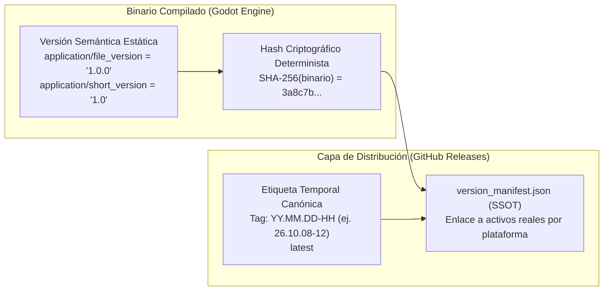

# Arquitectura de Releases y Distribución Multiplataforma

## Manual de Ingeniería y Estándar de Single Source of Truth (SSOT) en Tecate Simulator

---

### 1. Propósito y Filosofía del Sistema

Este documento define la arquitectura oficial de compilación, control criptográfico de versiones y distribución de binarios para **Tecate Simulator**.

El objetivo fundamental de esta arquitectura es resolver de forma óptima el conflicto clásico entre **frecuencia de despliegue** y **coste de transferencia de datos**:
- El simulador es un proyecto 3D pesado con más de **1.9 GB** de activos de mundo (mallas de terreno TIN, geometría urbana vectorizada, modelos arquitectónicos PBR y texturas).
- Los paquetes ejecutables empaquetados (`tecate-windows.zip`, `tecate-macos.zip`) pesan más de **200 MB** cada uno.
- Si se realizara una subida monolítica completa en cada cambio menor de código o ajuste de una plataforma individual, se consumirían cientos de megabytes de ancho de banda de subida local de manera innecesaria, saturando el almacenamiento y ralentizando las descargas de los usuarios.

Para evitarlo, Tecate Simulator adopta el **estándar de la industria para distribución de videojuegos y software moderno**: desacoplamiento modular y manifiesto único de integridad (**Single Source of Truth - SSOT**).

---

### 2. Desacoplamiento entre Versión Interna y Versión Temporal

Existe una distinción conceptual crítica entre los dos identificadores de versión del proyecto:



1. **Versión Semántica Interna (`1.0.0`):**
   - Declarada en [`godot_project/export_presets.cfg`](file:///Users/hakkindavid/Documents/GitHub/tecate-simulator/godot_project/export_presets.cfg) y metadatos de sistema (cabecera PE en Windows, `Info.plist` en macOS).
   - Permanece constante entre parches menores.
   - **Garantía de Determinismo:** Al no inyectar la fecha ni la hora dentro del ejecutable durante la exportación, dos compilaciones idénticas producen **exactamente el mismo hash SHA-256**, permitiendo la validación criptográfica de contenido.

2. **Versión Temporal de Distribución (`YY.MM.DD-HH`):**
   - Identifica el momento exacto en que se publicó la versión para el usuario final (año a dos dígitos, mes a dos dígitos, día a dos dígitos, guion y hora en formato 24h, por ejemplo `26.10.08-12`).
   - Es una etiqueta de Git y un release en GitHub, marcada como `latest`.

---

### 3. El Manifiesto de Distribución (`version_manifest.json`) como SSOT

Cada release publicado en GitHub incluye en su raíz el archivo canónico [`version_manifest.json`](file:///Users/hakkindavid/Documents/GitHub/tecate-simulator/godot_project/build), el cual funge como la **Única Fuente de Verdad** para la versión.

#### Esquema Estructurado:
```json
{
  "$schema": "https://json-schema.org/draft/2020-12/schema",
  "format_version": "1.0",
  "release_version": "26.10.08-12",
  "published_at_utc": "2026-10-08T19:28:00.123456+00:00",
  "git_commit": "45ddac6ef9ebc1f833aeae48433b57b74b70ba92",
  "repository": "Bonsanbec/tecate-simulator",
  "binaries": {
    "windows": {
      "filename": "tecate-windows.zip",
      "display_name": "Windows (x86_64 Desktop)",
      "sha256": "3a8c7b41e98d...",
      "size_bytes": 240123456,
      "status": "UPDATED",
      "origin_release": "26.10.08-12",
      "download_url": "https://github.com/Bonsanbec/tecate-simulator/releases/download/26.10.08-12/tecate-windows.zip"
    },
    "macos": {
      "filename": "tecate-macos.zip",
      "display_name": "macOS (Apple Silicon & Intel Universal)",
      "sha256": "7b1f92a4c83e...",
      "size_bytes": 210987654,
      "status": "PRESERVED",
      "origin_release": "26.10.08-10",
      "download_url": "https://github.com/Bonsanbec/tecate-simulator/releases/download/26.10.08-10/tecate-macos.zip"
    }
  }
}
```

#### Estados Posibles de un Binario:
- **`UPDATED` (Actualizado):**
  - El código o los assets cambiaron para esta plataforma, o se forzó su compilación.
  - El archivo físico **se sube directamente** al nuevo release (`YY.MM.DD-HH`).
  - `origin_release` apunta al tag de la versión actual.
- **`PRESERVED` (Preservado / Referenciado):**
  - El binario local tiene el **mismo hash SHA-256** que en la versión anterior.
  - **No se vuelve a subir desde la máquina local** (ahorro total de ancho de banda).
  - Su enlace de descarga y `origin_release` apuntan al release donde fue generado originalmente.
  - Mantiene integridad histórica y compatibilidad total.

---

### 4. Arquitectura de Decisión en Dos Niveles

El pipeline implementado en [`scripts/release_local.sh`](file:///Users/hakkindavid/Documents/GitHub/tecate-simulator/scripts/release_local.sh) y [`scripts/release_hash_manager.py`](file:///Users/hakkindavid/Documents/GitHub/tecate-simulator/scripts/release_hash_manager.py) opera en dos niveles:

```mermaid
flowchart TD
    Start["Inicio: ./scripts/release_local.sh"] --> L1["Nivel 1: Caché Local de Exportación"]
    L1 --> CheckLocal{"¿Las fuentes de godot_project/ y assets cambiaron?"}
    
    CheckLocal -- No --> SkipBuild["🟢 CACHE HIT: Reutilizar .zip local existente"]
    CheckLocal -- Sí o --force --> DoBuild["🔨 CACHE MISS: Compilar con export.sh y registrar nuevo hash"]
    
    SkipBuild --> L2["Nivel 2: Evaluación SSOT contra GitHub Releases"]
    DoBuild --> L2
    
    L2 --> FetchManifest["Descargar version_manifest.json del release latest en GitHub"]
    FetchManifest --> Compare{"Comparar hashes locales contra el manifiesto"}
    
    Compare -- "Todos coinciden (0 cambios)" --> NoOp["🛑 NOTHING TO DO<br>Cancela la operación; todo está al día.<br>Cero duplicados en GitHub."]
    
    Compare -- "Al menos un binario cambió o es nuevo" --> CreateNew["🚀 CREATE RELEASE: Crear nuevo release YY.MM.DD-HH<br>1. Sube ÚNICAMENTE los binarios UPDATED.<br>2. Preserva los binarios PRESERVED referenciando su origen.<br>3. Genera nuevo version_manifest.json y notas con enlaces directos.<br>4. Marca como 'latest'."]
```

---

### 5. Notas Automáticas de Release con Enlaces Cruzados

Cuando se publica un nuevo release con binarios preservados, el script genera automáticamente un archivo [`release_notes.md`](file:///Users/hakkindavid/Documents/GitHub/tecate-simulator/godot_project/build) con formato enriquecido que se inyecta en la descripción de GitHub:

```markdown
# Tecate Simulator v26.10.08-12

Versión de release correspondiente a `2026-10-08T19:28:00 UTC` (Commit: `45ddac6ef9`).

### 📦 Binarios y Plataformas Disponibles

| Plataforma | Estado | Archivo | Tamaño | SHA-256 | Descarga Directa |
| :--- | :--- | :--- | :--- | :--- | :--- |
| **Windows (x86_64 Desktop)** | 🆕 **Actualizado** | `tecate-windows.zip` | 240.1 MB | `3a8c7b41e98d...` | [Descargar (v26.10.08-12)](https://github.com/Bonsanbec/tecate-simulator/releases/download/26.10.08-12/tecate-windows.zip) |
| **macOS (Universal)** | ⏩ *Sin cambios (v26.10.08-10)* | `tecate-macos.zip` | 210.9 MB | `7b1f92a4c83e...` | [Descargar (v26.10.08-10)](https://github.com/Bonsanbec/tecate-simulator/releases/download/26.10.08-10/tecate-macos.zip) |

> [!NOTE]
> Los binarios marcados como *Sin cambios* preservan su integridad criptográfica y su enlace de origen para evitar re-cargas innecesarias y optimizar la descarga de actualizaciones.
```

---

### 6. Consumo del Manifiesto por Clientes y Actualizadores (Launchers)

Cualquier lanzador futuro (*launcher* en Flutter, Electron, Rust o C#) o cliente de juego puede consultar la última versión disponible consumiendo una sola URL pública fija:

```text
GET https://github.com/Bonsanbec/tecate-simulator/releases/latest/download/version_manifest.json
```

El lanzador:
1. Lee `binaries[os_actual]`.
2. Compara el `sha256` remoto con el archivo local en el equipo del usuario.
3. Si coinciden, no descarga nada (*juego al día*).
4. Si difieren, descarga desde `download_url` y valida el hash antes de descomprimir.

#### Verificación Manual en Terminal (Equivalente a `sha256sum -c`):
Dado que `version_manifest.json` es la fuente única de verdad, no se requiere un archivo `SHA256SUMS.txt` adicional redundante. Si un usuario o script desea verificar la integridad en la terminal estándar de Linux/macOS, puede hacerlo directamente en una sola línea:

```bash
# Con jq y sha256sum:
jq -r '.binaries[] | "\(.sha256)  \(.filename)"' version_manifest.json | sha256sum -c

# O con Python en cualquier sistema operativo:
python3 -c "
import json, hashlib
with open('version_manifest.json') as f:
    for b in json.load(f)['binaries'].values():
        h = hashlib.sha256(open(b['filename'],'rb').read()).hexdigest()
        assert h == b['sha256'], f'Fallo en {b[\"filename\"]}'
print('Todos los hashes son válidos.')
"
```

---

### 7. Guía Rápida de Comandos para el Desarrollador

#### Publicación Estándar Automática (Recomendada):
Verifica la caché local de fuentes, exporta lo necesario, compara con `version_manifest.json` remoto y crea el nuevo release con subida selectiva:
```bash
./scripts/release_local.sh
```

#### Exportar y Publicar una Plataforma Específica:
Si realizaste cambios exclusivos para Windows y no deseas reconstruir macOS:
```bash
./scripts/release_local.sh windows
```
*(macOS será referenciado automáticamente como `PRESERVED` desde su release previo).*

#### Forzar Recompilación y Subida Total (`--force`):
Ignora las cachés locales y remotas, recompila todas las plataformas y sube todos los archivos físicos al nuevo release:
```bash
./scripts/release_local.sh all --force
```

#### Consultar Opciones de Ayuda:
```bash
./scripts/release_local.sh --help
```
