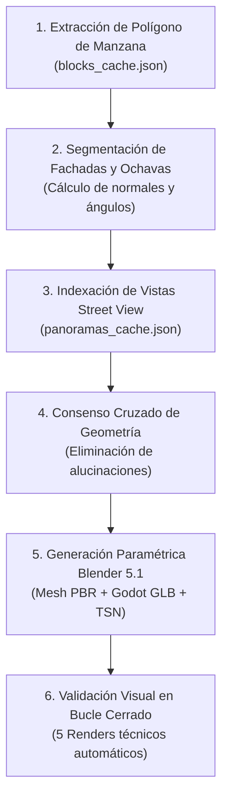

# Metodología y Pipeline de Reconstrucción 3D Radial por Manzanas (Tecate Simulator)

Documento de ingeniería y especificación de pipeline autónomo para la reconstrucción procedural 3D de todas las manzanas y edificios de Tecate, Baja California, partiendo radialmente desde el Parque Miguel Hidalgo `(0, 0)` hacia la periferia urbana.

---

## 1. Justificación y Lecciones Aprendidas (El Paradigma BBVA)

La reconstrucción del Banco BBVA Tecate Centro demostró un principio metodológico fundamental para agentes de IA:

> **El análisis de una sola cara genera alucinaciones arquitectónicas inevitables.**
> Si un agente examina un edificio desde una única perspectiva frontal, tenderá a:
> 1. Alucinar una geometría ortogonal de 90º ignorando ochavas/chaflanes a 45º.
> 2. Confundir mobiliario urbano exterior (postes de luz, semáforos, cables) con marquesinas, cornisas o techumbres del propio inmueble.
> 3. Ignorar por completo la segunda fachada comercial sobre la calle transversal (que a menudo posee elementos estilísticos cruciales, como ménsulas/canecillos o accesos a cajeros).
> 4. Malinterpretar espectaculares de azotea o anuncios lejanos como estructuras flotantes o techos de doble altura.

Para lograr una reconstrucción **fidedigna, automatizada y con mínima intervención humana**, el sistema debe operar a nivel de **Manzana Urbana Completa (Block-Level Multi-Perspective Consensus)**.

---

## 2. Secuenciación Radial de Manzanas (Origen: Parque Hidalgo)

El sistema de coordenadas de *Tecate Simulator* fija su origen cartesiano `(0, 0, 0)` en el centro del **Kiosko del Parque Miguel Hidalgo**. Toda la reconstrucción se procesa en anillos concéntricos ordenados por distancia euclidiana:

$$r = \sqrt{X^2 + Y^2}$$

```
                           [ ANILLO 3: Periferia y Accesos (r > 250 m) ]
                     [ ANILLO 2: Centro Histórico Extendido (120 < r <= 250 m) ]
               [ ANILLO 1: Manzanas Perimetrales del Parque (50 < r <= 120 m) ]
         [ ANILLO 0: Parque Hidalgo (r <= 50 m) ]
                        (0, 0) KIOSKO
```

### Anillo 0 ($r \le 50\text{ m}$): Núcleo Cívico Parque Hidalgo
- **Estado**: COMPLETADO (Kiosko octagonal, letrero de calle `Presidente Cárdenas / Av. Hidalgo`, jardineras, bancas coloniales).

### Anillo 1 ($50 < r \le 120\text{ m}$): Manzanas Directamente Colindantes
- **Manzana 01 (Suroeste)**: Sucursal BBVA Tecate Centro (`X = -84.03, Y = 25.92`, Torreón Guajardo 1954, rampa vehicular, consultorios norte).
- **Manzana 02 (Sur)**: Portal comercial de Avenida Juárez frente al parque.
- **Manzana 03 (Este)**: Palacio Municipal de Tecate y explanada cívica.
- **Manzana 04 (Norte)**: Parroquia de Nuestra Señora de Guadalupe y corredor peatonal Ortiz Rubio.

### Anillo 2 ($120 < r \le 250\text{ m}$): Centro Comercial y Bancario
- Comercios de Av. Juárez, bancos adicionales, farmacias tradicionales y terminales de autobuses.

### Anillo 3 ($r > 250\text{ m}$): Expansión Radiales Urbanas
- Cervecería Tecate, colonias residenciales y accesos carreteros (Tijuana / Mexicali / Ruta del Vino).

---

## 3. Protocolo de Ingestión de Datos y Transferencia Tailscale

Para evitar bloqueos por congelamiento de I/O en volúmenes de red locales, se establece la **Regla Estricta de Transferencia Tailscale**:

```
[ Servidor Remoto Windows ]                             [ Agente Antigravity (macOS) ]
D:/tecate-simulator/data/                               scratch/staging/block_<id>/
   ├── blocks_cache.json       -- (1. SCP Inicial) -->     ├── block_metadata.json
   ├── facades_cache.json                                  ├── facades.json
   ├── panoramas_cache.json                                └── images/
   └── screenshots/pano/                                       ├── pano_front.png
       └── <pano_id>_yaw_<h>.png -- (2. SCP Selectivo) ------> ├── pano_corner.png
                                                               └── pano_side.png
```

### Comandos Normativos SCP
```bash
# Transferencia con timeout estricto de 15 segundos:
scp -o ConnectTimeout=15 HakkinDavid@hakkin.tail4b53f5.ts.net:"D:/tecate-simulator/data/screenshots/pano/<image_name>.png" scratch/staging/block_<id>/
```

---

## 4. Algoritmo de Consenso Multi-Perspectiva y Síntesis Procedural

El pipeline automatizado de reconstrucción para cada manzana consta de 5 fases ejecutadas de manera desatendida por subagentes especializados:



### Fase 1: Extracción del Polígono de Parcela
- Del archivo `blocks_cache.json`, se extrae el contorno vectorial del predio en coordenadas locales $(X_i, Y_i)$.
- Se computa el perímetro y los vectores de arista $\vec{e}_i = P_{i+1} - P_i$.

### Fase 2: Detección Automática de Ochavas / Chaflanes a 45º
- Se calcula el ángulo exterior $\theta_i$ entre aristas contiguas:
  $$\cos \theta_i = \frac{\vec{e}_i \cdot \vec{e}_{i+1}}{\|\vec{e}_i\| \|\vec{e}_{i+1}\|}$$
- Si $\theta_i \approx 45^\circ$ ($\Delta \theta \le 5^\circ$) y la longitud del segmento $L \in [3.5, 7.5\text{ m}]$, el sistema clasifica automáticamente el segmento como **Ochava / Chaflán de Esquina**.
- Cada ochava se asocia con las dos calles que confluyen (ej. Av. Juárez $\cap$ Calle Cárdenas).

### Fase 3: Consulta Indexada de Panoramas y Orientación (Yaw)
- Para cada cara identificada con vector normal exterior $\hat{n}$:
  - Se buscan en `panoramas_cache.json` los nodos fotográficos a distancia $d \in [5, 25\text{ m}]$ cuyo vector visual $\vec{v}_{\text{cam}}$ satisfaga:
    $$\vec{v}_{\text{cam}} \cdot (-\hat{n}) > 0.707 \quad (\text{ángulo visual } < 45^\circ)$$
  - Se calcula el ángulo `yaw` exacto para orientar la captura hacia el centro del segmento de fachada.

### Fase 4: Consenso Cruzado (Anti-Hallucination Gate)
- **Regla de Coincidencia Cruzada**: Si un elemento vertical sobresaliente (letrero, poste, marquesina) aparece en una toma frontal de la Calle A, pero en la toma perpendicular de la Calle B y en la vista oblicua de la ochava no tiene anclaje físico a la losa o muro, **se clasifica como mobiliario urbano exterior y se excluye del mesh arquitectónico del edificio**.
- **Regla de Continuidad de Cornisa**: Las cornisas, faldones de teja y fascias no deben volar hacia el vacío en las esquinas; deben rematar contra el torreón o doblar a inglete según la tipología detectada.

### Fase 5: Generación Paramétrica y Exportación Directa
- El script procedural genera la geometría limpia en Blender:
  - Sin booleanas sucias; mallas prismáticas axiales y segmentos angulados con normales recalculadas.
  - Paleta de materiales PBR (albedo, rugosidad, metalicidad y normal maps).
  - Exportación automática a `.glb` compatible con Godot 4.
  - Generación de escena `.tscn` con colisionadores analíticos (`StaticBody3D` con formas `BoxShape3D`).

### Fase 6: Puerta de Calidad Visual (Closed-Loop Quality Gate)
- Renderizado headless de 5 vistas canónicas:
  1. `guajardo_45`: Vista directa a la ochava y acceso.
  2. `street_a_frontal`: Elevación de la primera calle.
  3. `street_b_side`: Elevación de la calle transversal.
  4. `rear_parking`: Fachada posterior / rampas / colindancias.
  5. `aerial_top`: Vista ortográfica cenital para cotejo con satélite.
- El agente de IA inspecciona las imágenes generadas mediante `view_file` para certificar la ausencia de solapamientos, volúmenes flotantes o inconsistencias antes de dar por cerrada la manzana.

---

## 5. Plantilla de Automatización para Nuevos Lotes

Para cada nuevo lote o manzana $M_k$, el pipeline ejecuta:

```python
# scripts/pipeline/reconstruct_block.py
def process_block(block_id):
    # 1. Extraer polígono y lotes
    block_data = load_block_cache(block_id)
    # 2. Descargar fotos vía SCP Tailscale
    stage_block_panoramas(block_data)
    # 3. Clasificar fachadas y ochavas
    facades = classify_block_facades(block_data)
    # 4. Generar script blender específico
    script_path = generate_blender_script(block_id, facades)
    # 5. Ejecutar Blender headless
    run_blender_headless(script_path)
    # 6. Validar renders canónicos
    validate_renders(block_id)
```

Este procedimiento garantiza un gemelo digital escalable, libre de alucinaciones, rigurosamente georreferenciado y optimizado para alto rendimiento en tiempo real en Godot 4.
