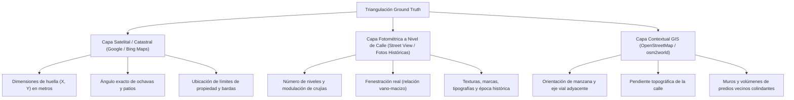
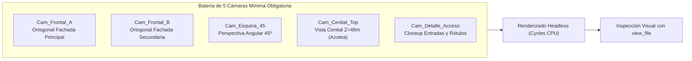

# Estándar Universal de Reconstrucción y Modelado Procedural 3D de Edificios
## Manual de Arquitectura de Ejecución y Guía Operativa para Agentes de IA en Tecate Simulator

---

### Propósito y Alcance del Estándar
Este documento establece el **estándar técnico y metodológico universal** para la reconstrucción procedural, fidedigna y automatizada de cualquier edificio, manzana o hito arquitectónico dentro del proyecto **Tecate Simulator** (entorno Godot Engine 4 / Blender Python API).

El objetivo de esta guía es proporcionar a cualquier **Agente de IA** (o desarrollador) las reglas de diseño, las restricciones geométricas, las fórmulas matemáticas de transformación, el pipeline de colisiones y la plantilla de código procedural necesarios para recrear un inmueble con fidelidad histórica y calidad de producción sin requerir intervención manual interactiva.

---

## 1. Filosofía y Principios Rectores

1. **Proceduralismo por Código sobre Modelado Manual**:
   - Todo edificio debe generarse mediante scripts de Python (`bpy` + `bmesh`) ejecutados en modo *headless* (`--background`).
   - El código es determinista, versionable en Git, matemáticamente exacto y reproducible en segundos. Permite corregir cualquier cota, rotación o desfase modificando un parámetro sin degradar la topología.

2. **El Principio del Desacoplamiento Urbano**:
   - **El edificio es un activo volumétrico autónomo**.
   - **Prohibición estricta**: Nunca incluir banquetas, cordones de banqueta, postes, vialidades ni parcelas de terreno dentro de la malla principal (`.glb`) del edificio.
   - Las banquetas y calles pertenecen a capas GIS independientes del simulador (`Roadways`, `Manzanas`, `Geometry`). Si un edificio embebe su propia banqueta, se producirán duplicidades, desalineaciones de textura y colisiones fantasma con el piso urbano.

3. **Cero Barreras Invisibles (Caminabilidad Total)**:
   - Todo espacio diseñado para el peatón (accesos, escalinatas, zaguanes, rampas, descansos, portales de cajero) debe ser físicamente transitable por el avatar del jugador.
   - Se prohíbe el uso de mallas de colisión envolventes automáticas (*Convex Hull* o *Trimesh* simplificado) para edificios transitables, ya que sellan vanos y generan planos invisibles bloqueantes. La colisión debe ser **analítica, modular y descompuesta** en primitivas convexas simples (`BoxShape3D`, `CylinderShape3D`).

4. **Verificación Closed-Loop Autónoma**:
   - Un agente nunca asume que su modelo es correcto sin evidencia empírica.
   - Todo script de generación debe incluir una batería de cámaras fijas y generar renders técnicos en alta resolución que el agente inspecciona obligatoriamente con sus herramientas de visión antes de dar por concluida la tarea.

---

## 2. Fase 1: Ingesta y Triangulación de Verdad de Terreno (Ground Truth Protocol)

Antes de programar la geometría, el agente debe recolectar y triangular tres capas de información:



### Reglas de Análisis de Fotografía de Terreno
1. **Identificación de la Época Histórica Objetivo**:
   - Los edificios urbanos mutan con el tiempo. El agente debe fijar el año meta (ej. 2009) y verificar que los rótulos comerciales, colores institucionales y acabados coincidan con dicho período, ignorando remodelaciones contemporáneas.
2. **Conteo Riguroso de Crujías (Modulación Estructural)**:
   - No asumir simetría ni módulos idénticos sin evidencia. Contar columna por columna y vano por vano en cada cara visible.
3. **Comprobación de Fachadas Posteriores y Cuadrantes Ocultos**:
   - Si una cara no es visible desde la calle principal, buscar fotos desde estacionamientos, callejones o fotos de satélite oblicuas.
   - *Caso de Estudio*: En el Edificio Guajardo (BBVA), las fotos frontales solo mostraban un edificio ortogonal; las fotos desde el estacionamiento interior revelaron que la fachada posterior poseía un muro en arco cóncavo con un machón saliente coronado por encima del pretil.

---

## 3. Fase 2: El Contrato Cartesiano Canónico y la Matriz de Alturas

### A. El Contrato Cartesiano Canónico
Para evitar confusiones espaciales e inversiones de fachadas, todo script debe iniciar definiendo de manera explícita e inmutable su sistema de coordenadas en relación con la trama urbana:

$$\text{Origen }(0, 0, 0) \implies \text{Vértice principal de la esquina más prominente a nivel de banqueta}$$
$$\text{Eje }+X \implies \text{Vector paralelo a la vialidad frontal principal (o eje Poniente } \to \text{ Oriente)}$$
$$\text{Eje }+Y \implies \text{Vector paralelo a la vialidad lateral secundaria (o eje Sur } \to \text{ Norte)}$$
$$\text{Eje }+Z \implies \text{Cota de elevación vertical (Normal de suelo hacia el cenit)}$$

> [!IMPORTANT]
> **Prohibición de rotaciones arbitrarias locales**:  
> El modelo en Blender debe alinearse con sus caras paralelas a los ejes cartesianos $X$ e $Y$. La rotación hacia el mundo real se aplica **exclusivamente al instanciar el edificio en Godot (`main.tscn`)** mediante rotaciones ortogonales cardinales puras ($0^\circ, 90^\circ, 180^\circ, 270^\circ$). Las rotaciones con sesgos decimales angostan las banquetas y rompen el paralelismo urbano.

### B. La Matriz de Alturas Estándar de Tecate
La arquitectura comercial y patrimonial de la región central de Tecate responde a proporciones constructivas recurrentes. Se establece la siguiente escala de cotas verticales para modular edificios de dos niveles:

| Cota $Z$ | Rango de Elevación | Componente Arquitectónico | Propósito Técnico |
| :--- | :--- | :--- | :--- |
| **Subterránea** | $[-1.50\text{ m},\, 0.00\text{ m}]$ | **Zócalo basal enterrado** | **Absorción de pendiente topográfica**. Evita que el edificio flote en calles con declive. |
| **Planta Baja** | $[0.00\text{ m},\, 3.20\text{ m}]$ | Cancel de acceso, escaparates y pilastras | Área transitable y comercial de acceso peatonal. |
| **Entrepiso** | $[3.20\text{ m},\, 4.30\text{ m}]$ | Faja estructural, fascia comercial o marquesina | Banda portante de rótulos comerciales e iluminación. |
| **Planta Alta** | $[4.30\text{ m},\, 6.25\text{ m}]$ | Ventanales superiores modulares | Despachos u oficinas; comúnmente con paños de vidrio rectangulares. |
| **Dintel / Muro**| $[6.25\text{ m},\, 7.10\text{ m}]$ | Muro ciego superior y antepecho | Paño macizo de estuco; bloquea visión de estructura de azotea. |
| **Remate** | $[7.10\text{ m},\, 7.45\text{ m}]$ | Cornisa corrida, tejas coloniales y albardilla | Corona perimetral que define la silueta contra el cielo. |
| **Sobresaliente**| $[> 7.45\text{ m}]$ | Torreones, anuncios espectaculares, casetas HVAC | Elementos verticales singulares que rompen la horizontalidad. |

---

## 4. Fase 3: Estructura y Patrones de Código Procedural (Blender Python API)

### A. Arquitectura Modular del Script Generador
El script debe estructurarse en funciones atómicas de responsabilidad única:
```python
def main():
    root_col = clean_scene()
    mats = create_materials()
    
    # 1. Cuerpos arquitectónicos principales
    obj_corner = build_corner_feature(mats, root_col)
    obj_facade_a = build_facade_primary(mats, root_col)
    obj_facade_b = build_facade_secondary(mats, root_col)
    obj_facade_rear = build_facade_rear(mats, root_col)
    
    # 2. Cámaras de inspección y renders de validación
    cams = setup_lighting_and_render(root_col)
    save_master_blend(blend_path)
    export_production_glb(glb_path, exclude_list=[])
    generate_godot_tscn(tscn_path, glb_path)
    execute_validation_renders(cams)
```

### B. Primitivas Geométricas Universales

#### 1. Muros y Volúmenes Ortogonales (`add_box`):
Construye paralelepípedos limpios de 8 vértices y 6 caras manifold en coordenadas cartesianas globales:
```python
def add_box(bm, x1, x2, y1, y2, z1, z2):
    """Genera una caja cerrada con normales orientadas hacia el exterior."""
    verts = [
        bm.verts.new((x1, y1, z1)), bm.verts.new((x2, y1, z1)),
        bm.verts.new((x2, y2, z1)), bm.verts.new((x1, y2, z1)),
        bm.verts.new((x1, y1, z2)), bm.verts.new((x2, y1, z2)),
        bm.verts.new((x2, y2, z2)), bm.verts.new((x1, y2, z2))
    ]
    bm.faces.new((verts[0], verts[1], verts[2], verts[3])) # Inferior
    bm.faces.new((verts[4], verts[7], verts[6], verts[5])) # Superior
    bm.faces.new((verts[0], verts[4], verts[5], verts[1])) # Frontal (-Y)
    bm.faces.new((verts[1], verts[5], verts[6], verts[2])) # Derecha (+X)
    bm.faces.new((verts[2], verts[6], verts[7], verts[3])) # Trasera (+Y)
    bm.faces.new((verts[3], verts[7], verts[4], verts[0])) # Izquierda (-X)
```

#### 2. Cajas Orientadas en Curvas, Chaflanes y Muros Angulados (`add_oriented_box`):
El **algoritmo fundamental** para generar repisas de ventanas, machones salientes, columnas y cancelería sobre muros curvos o en ángulo sin deformación métrica:
```python
def add_oriented_box(bm, center_xy, tangent_xy, normal_xy, s_min, s_max, n_min, n_max, z_min, z_max):
    """Construye una caja orientada según un marco ortonormal 2D (tangente, normal exterior).
    
    Args:
        bm: BMesh destino.
        center_xy: Tupla (x, y) del centro de referencia en la curva/muro.
        tangent_xy: Vector unitario paralelo a la pared (dirección s).
        normal_xy: Vector unitario perpendicular exterior (dirección n).
        s_min, s_max: Extensión longitudinal a lo largo de la pared.
        n_min, n_max: Profundidad relativa al muro (negativo = empotrado, positivo = saliente).
        z_min, z_max: Cotas verticales inferior y superior.
    """
    verts = []
    for s in (s_min, s_max):
        for n in (n_min, n_max):
            for z in (z_min, z_max):
                vx = center_xy[0] + s * tangent_xy[0] + n * normal_xy[0]
                vy = center_xy[1] + s * tangent_xy[1] + n * normal_xy[1]
                verts.append(bm.verts.new((vx, vy, z)))
    faces = [
        (0, 1, 3, 2), # Cara lateral s_min
        (4, 6, 7, 5), # Cara lateral s_max
        (0, 4, 5, 1), # Cara interior n_min
        (2, 3, 7, 6), # Cara exterior n_max
        (0, 2, 6, 4), # Tapa inferior z_min
        (1, 5, 7, 3), # Tapa superior z_max
    ]
    for f in faces:
        bm.faces.new((verts[f[0]], verts[f[1]], verts[f[2]], verts[f[3]]))
```

### C. Regla Universal para Evitar Textos y Rótulos Espejeados
Las curvas de texto en Blender poseen una cara frontal (normal local $+Z$) y una lectura de izquierda a derecha en $+X$ local. Para garantizar que un texto nunca se lea al revés (*efecto espejo*) desde la calle, aplicar la siguiente matriz de rotación según la normal de la fachada portante:

| Fachada Portante | Vector Normal Hacia Afuera | Rotación Euler en Blender (`rotation_euler`) |
| :--- | :--- | :--- |
| **Fachada Sur** | $(0, -1, 0)$ | `(math.radians(90.0), 0.0, 0.0)` |
| **Fachada Norte** | $(0, +1, 0)$ | `(math.radians(90.0), 0.0, math.radians(180.0))` |
| **Fachada Poniente / Oeste** | $(-1, 0, 0)$ | `(math.radians(90.0), 0.0, math.radians(-90.0))` |
| **Fachada Oriente / Este** | $(+1, 0, 0)$ | `(math.radians(90.0), 0.0, math.radians(90.0))` |
| **Chaflán a 45º (Suroeste)** | $(-0.707, -0.707, 0)$ | `(math.radians(90.0), 0.0, math.radians(-45.0))` |

> [!TIP]
> **Cálculo de Despegue (*Offset*)**: Colocar el origen del texto siempre a $1\text{ a }2\text{ cm}$ por delante del vidrio o pared (`offset = 0.015`) para evitar artefactos de *Z-fighting* durante el renderizado.

---

## 5. Fase 4: Batería de Validación Closed-Loop con Renderizado Automático

El agente debe implementar una batería de cámaras que cubra el 100% de la envolvente del edificio:



### Checklist de Auto-Inspección Visual para el Agente
Antes de dar por finalizada la generación, el agente debe inspeccionar cada render y validar:
- [ ] **Azotea hermética (`aerial_top`)**: ¿La losa de impermeabilización cubre toda la huella sin huecos triangulares abiertos hacia el interior?
- [ ] **Lectura tipográfica (`fachadas_frontales`)**: ¿Todos los rótulos comerciales se leen de izquierda a derecha sin inversión en espejo?
- [ ] **Fenestración proporcional**: ¿La relación entre muro macizo y vidrio coincide con las fotografías reales?
- [ ] **Continuidad de cornisas y aleros**: ¿Las molduras corren sin roturas ni quiebres angulares erráticos?
- [ ] **Enrase medianero**: ¿Las paredes colindantes con vecinos son planas y no tienen columnas u ornamentos que invadan propiedades adyacentes?

---

## 6. Fase 5: Arquitectura del Asset para el Motor de Videojuegos (Godot 4)

### A. Desacoplamiento de Archivos
- **`edificio_nombre.glb`**: Malla 3D física limpia del edificio, optimizada en escala 1:1 métrica, con materiales PBR y normales calculadas.
- **`edificio_nombre.tscn`**: Escena instanciable con la jerarquía de colisiones analíticas.

### B. Generación Programática del Archivo `.tscn`
El script procedural debe escribir directamente el archivo de escena de Godot en formato texto:
```godot
[gd_scene load_steps=N format=3 uid="uid://edificio_nombre_001"]

[ext_resource type="PackedScene" path="res://assets/buildings/edificio_nombre.glb" id="1_mesh"]

[sub_resource type="BoxShape3D" id="BoxShape3D_cuerpo_principal"]
size = Vector3(22.0, 8.5, 16.0)

[sub_resource type="BoxShape3D" id="BoxShape3D_escalon_1"]
size = Vector3(0.40, 0.18, 2.30)

[node name="Edificio_Nombre" type="StaticBody3D"]

[node name="ModelInstance" parent="." instance=ExtResource("1_mesh")]

[node name="Col_Principal" type="CollisionShape3D" parent="."]
transform = Transform3D(1, 0, 0, 0, 1, 0, 0, 0, 1, 11.0, 3.05, -8.0)
shape = SubResource("BoxShape3D_cuerpo_principal")

[node name="Col_Escalon_1" type="CollisionShape3D" parent="."]
transform = Transform3D(1, 0, 0, 0, 1, 0, 0, 0, 1, 0.40, 0.09, -27.0)
shape = SubResource("BoxShape3D_escalon_1")
```

### C. Estrategia de Colisión Analítica para Prevención de Paredes Invisibles
1. **Retranqueo en Accesos Peatonales**: El colisionador del muro frontal no debe cruzar el vano de la puerta. Se divide en dos cajas (`Col_Muro_Izq`, `Col_Muro_Der`) y una caja de dintel superior (`Col_Dintel`).
2. **Escalinatas Transitables**: Cada peldaño debe tener un `BoxShape3D` con altura igual a la huella ($0.15\text{ a }0.18\text{ m}$) para que el componente `CharacterBody3D` del jugador pueda subirlo automáticamente mediante la propiedad `floor_max_angle` o `step_up` sin rebotar.
3. **Muros Curvos**: No intentar usar colisionadores cóncavos complejos en StaticBody3D estáticos; aproximar la curvatura con 2 o 3 cajas anguladas tangentes de espesor suficiente ($0.40\text{ m}$).

---

## 7. Fase 6: Integración Urbana en la Escena Principal (`main.tscn`)

### A. Regla de Posicionamiento y Paralelismo Estricto
Al insertar el nodo del edificio en `main.tscn`:
```godot
[node name="Edificio" parent="." instance=ExtResource("id_edificio")]
transform = Transform3D(-1, 0, 0, 0, 1, 0, 0, 0, -1, X_mundo, Y_rasante, Z_mundo)
```
- Usar **rotaciones cardinales puras** ($180^\circ$ corresponde a `Basis(-1,0,0, 0,1,0, 0,0,-1)`).
- Ajustar `Y_rasante` de modo que la cota de la banqueta coincida con $Z = 0.0\text{ m}$ del edificio, dejando que el zócalo enterrado absorba el desnivel hacia los extremos.

### B. Prevención de Z-Fighting con Elementos Urbanos Colindantes
- Si el edificio colinda con una barda de manzana o con otro edificio proveniente de OpenStreetMap (`osm2world_baked.glb`), la cara medianera del edificio procedural debe ser **lisa y enrasada** exactamente en el límite del predio.
- Eliminar cualquier columna, moldura saliente o acabado ornamental en los paños medianeros que sobrepase el límite de propiedad.

---

## 8. Fase 7: Protocolo de Alineación Interactiva (`/grill-me`)

Cuando un agente se enfrente a vacíos de información crítica que puedan provocar desvíos mayores, debe activar el protocolo de entrevista guiada `/grill-me` utilizando la herramienta `ask_question`:

### Criterios para Activar `/grill-me`:
1. **Volumetría Posterior No Documentada**: Cuando el fondo del lote o la conexión entre laterales no sea visible en fotos de calle y existan varias interpretaciones (ej. patio interno vs nave continua vs arco de cierre).
2. **Discrepancia entre Épocas Históricas**: Cuando convivan fotos históricas y fotos contemporáneas con remodelaciones incompatibles (ej. cantera original vs recubrimiento Alucobond moderno).
3. **Decisiones de Interacción Peatonal**: Definir si un local comercial debe tener interior transitable modelado o cancelería ciega con persianas.

---

## 9. Plantilla de Código Reutilizable (Boilerplate Universal)

A continuación se proporciona la estructura base completa en Python para que un agente comience la reconstrucción de cualquier nuevo edificio en Tecate:

```python
"""
GENERADOR PROCEDURAL 3D UNIVERSAL - TECATE SIMULATOR
Edificio: [NOMBRE DEL EDIFICIO] (Año: [AÑO OBJETIVO])
Coordenadas Cartesianas Canónicas:
  - Origen (0,0,0): Esquina [DESCRIPCIÓN]
  - +X: Paralelo a [CALLE PRINCIPAL] (hacia el [ORIENTE/PONIENTE])
  - +Y: Paralelo a [CALLE SECUNDARIA] (hacia el [NORTE/SUR])
  - +Z: Cota vertical (Normal de suelo)
"""

import bpy
import bmesh
import math
import os
from mathutils import Vector

def clean_scene():
    bpy.ops.wm.read_factory_settings(use_empty=True)
    scene = bpy.context.scene
    col = bpy.data.collections.new("Edificio_Collection")
    scene.collection.children.link(col)
    return col

def add_box(bm, x1, x2, y1, y2, z1, z2):
    verts = [
        bm.verts.new((x1, y1, z1)), bm.verts.new((x2, y1, z1)),
        bm.verts.new((x2, y2, z1)), bm.verts.new((x1, y2, z1)),
        bm.verts.new((x1, y1, z2)), bm.verts.new((x2, y1, z2)),
        bm.verts.new((x2, y2, z2)), bm.verts.new((x1, y2, z2))
    ]
    bm.faces.new((verts[0], verts[1], verts[2], verts[3]))
    bm.faces.new((verts[4], verts[7], verts[6], verts[5]))
    bm.faces.new((verts[0], verts[4], verts[5], verts[1]))
    bm.faces.new((verts[1], verts[5], verts[6], verts[2]))
    bm.faces.new((verts[2], verts[6], verts[7], verts[3]))
    bm.faces.new((verts[3], verts[7], verts[4], verts[0]))

def add_oriented_box(bm, center_xy, tangent_xy, normal_xy, s_min, s_max, n_min, n_max, z_min, z_max):
    verts = []
    for s in (s_min, s_max):
        for n in (n_min, n_max):
            for z in (z_min, z_max):
                vx = center_xy[0] + s * tangent_xy[0] + n * normal_xy[0]
                vy = center_xy[1] + s * tangent_xy[1] + n * normal_xy[1]
                verts.append(bm.verts.new((vx, vy, z)))
    faces = [
        (0, 1, 3, 2), (4, 6, 7, 5),
        (0, 4, 5, 1), (2, 3, 7, 6),
        (0, 2, 6, 4), (1, 5, 7, 3)
    ]
    for f in faces:
        bm.faces.new((verts[f[0]], verts[f[1]], verts[f[2]], verts[f[3]]))

def create_standard_materials():
    mats = {}
    
    # 1. Muro Estuco Blanco
    m_wall = bpy.data.materials.new("M_Estuco_Blanco")
    m_wall.use_nodes = True
    bsdf = m_wall.node_tree.nodes.get("Principled BSDF")
    bsdf.inputs["Base Color"].default_value = (0.86, 0.86, 0.85, 1.0)
    bsdf.inputs["Roughness"].default_value = 0.85
    mats["muro"] = m_wall
    
    # 2. Zócalo Basal Concreto Grafito
    m_base = bpy.data.materials.new("M_Zocalo_Basal")
    m_base.use_nodes = True
    bsdf_b = m_base.node_tree.nodes.get("Principled BSDF")
    bsdf_b.inputs["Base Color"].default_value = (0.04, 0.045, 0.05, 1.0)
    bsdf_b.inputs["Roughness"].default_value = 0.90
    mats["zocalo"] = m_base
    
    # 3. Cancelería Aluminio Oscuro
    m_alum = bpy.data.materials.new("M_Aluminio_Oscuro")
    m_alum.use_nodes = True
    bsdf_al = m_alum.node_tree.nodes.get("Principled BSDF")
    bsdf_al.inputs["Base Color"].default_value = (0.02, 0.02, 0.022, 1.0)
    bsdf_al.inputs["Metallic"].default_value = 0.85
    bsdf_al.inputs["Roughness"].default_value = 0.25
    mats["aluminio"] = m_alum
    
    # 4. Vidrio Comercial Reflectante
    m_glass = bpy.data.materials.new("M_Vidrio_Reflectante")
    m_glass.use_nodes = True
    bsdf_gl = m_glass.node_tree.nodes.get("Principled BSDF")
    bsdf_gl.inputs["Base Color"].default_value = (0.08, 0.12, 0.16, 1.0)
    bsdf_gl.inputs["Roughness"].default_value = 0.08
    bsdf_gl.inputs["Transmission Weight"].default_value = 0.85
    bsdf_gl.inputs["IOR"].default_value = 1.52
    mats["vidrio"] = m_glass

    # 5. Azotea Asfáltica
    m_roof = bpy.data.materials.new("M_Azotea_Asfalto")
    m_roof.use_nodes = True
    bsdf_rf = m_roof.node_tree.nodes.get("Principled BSDF")
    bsdf_rf.inputs["Base Color"].default_value = (0.045, 0.045, 0.045, 1.0)
    bsdf_rf.inputs["Roughness"].default_value = 0.95
    mats["azotea"] = m_roof

    return mats

# [AQUÍ SE INCORPORAN LAS FUNCIONES ESPECÍFICAS DE CADA FACHADA: build_facade_x(...)]

def setup_lighting_and_render(col, cameras_config):
    # Configuración de Sol diurno + Luz de cielo Cycles CPU
    scene = bpy.context.scene
    scene.render.engine = 'CYCLES'
    if hasattr(scene.cycles, 'device'):
        scene.cycles.device = 'CPU'
    scene.cycles.samples = 64
    
    cams = {}
    for cam_name, pos, tgt, lens in cameras_config:
        c_data = bpy.data.cameras.new(cam_name)
        c_data.lens = lens
        c_obj = bpy.data.objects.new(cam_name, c_data)
        col.objects.link(c_obj)
        c_obj.location = Vector(pos)
        direction = Vector(tgt) - Vector(pos)
        c_obj.rotation_euler = direction.to_track_quat('-Z', 'Y').to_euler()
        cams[cam_name] = c_obj
    return cams
```

---

## 10. Conclusión y Criterio de Aceptación Universal

Para certificar que un edificio está **Listo para Producción** en Tecate Simulator, el agente debe verificar que:
1. El archivo `.glb` exportado contiene exclusivamente la edificación, sin banquetas embebidas.
2. El archivo `.tscn` contiene colisionadores `BoxShape3D` descompuestos analíticamente, con zaguán y escalones transitables y sin barreras invisibles en puertas.
3. El zócalo basal se extiende al menos $-1.0\text{ m}$ por debajo de la rasante para garantizar absorción topográfica sin flotación.
4. Todos los rótulos tipográficos 3D están orientados con su normal hacia el exterior de la fachada (cero efecto espejo).
5. Las aristas medianeras están enrasadas con la línea de propiedad sin clipear con mallas de predios colindantes.
6. La vista aérea cenital muestra una azotea continua, hermética e impermeable.
