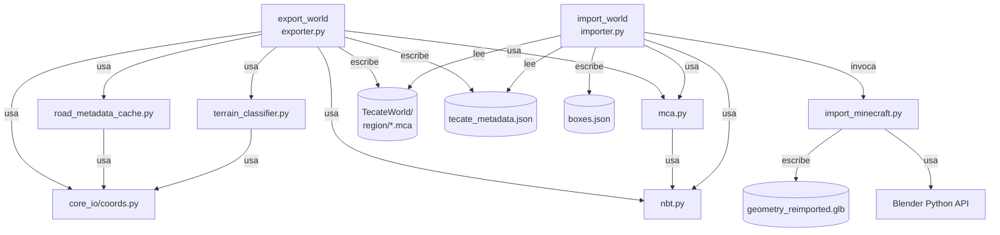

# Arquitectura del Minecraft Pipeline

## 1. Visión general

El pipeline se implementa como un paquete Python ubicado en `src/minecraft_pipeline/`. Se compone de **9 módulos** con responsabilidades bien delimitadas. Existen dos sub-pipelines principales con dirección opuesta:

- **Export pipeline** (`exporter.py`): Tecate geográfico → Mundo Minecraft
- **Import pipeline** (`importer.py` + `import_minecraft.py`): Mundo Minecraft editado → Modelo 3D Blender/GLB

---

## 2. Módulos

### `__init__.py`
Marca el directorio como paquete Python. No expone API pública.

---

### `nbt.py` — Serialización NBT
**Responsabilidad única:** Leer y escribir el formato NBT (Named Binary Tag), el formato binario nativo de Minecraft para datos estructurados.

Implementa la especificación completa de tags NBT:

| Constante | ID | Tipo Python |
|-----------|-----|------------|
| `TAG_END` | 0 | — |
| `TAG_BYTE` | 1 | `int` (8-bit) |
| `TAG_SHORT` | 2 | `int` (16-bit) |
| `TAG_INT` | 3 | `int` (32-bit) |
| `TAG_LONG` | 4 | `int` (64-bit) |
| `TAG_FLOAT` | 5 | `float` (32-bit) |
| `TAG_DOUBLE` | 6 | `float` (64-bit) |
| `TAG_BYTE_ARRAY` | 7 | `bytes` |
| `TAG_STRING` | 8 | `str` (UTF-8) |
| `TAG_LIST` | 9 | `list` |
| `TAG_COMPOUND` | 10 | `list[NBT]` |
| `TAG_INT_ARRAY` | 11 | `list[int]` |
| `TAG_LONG_ARRAY` | 12 | `list[int]` |

**Funciones de compresión:**
- `save_gzip(tag, filepath)` / `load_gzip(filepath)`: Para `level.dat` (compresión GZIP)
- `save_zlib(tag)` / `load_zlib(data)`: Para chunks en archivos `.mca` (compresión Zlib)

**Dependencias:** Ninguna interna.

---

### `mca.py` — Formato de Región Minecraft
**Responsabilidad:** Leer y escribir el formato de archivo de región `.mca` (Minecraft Anvil Region).

Un archivo `.mca` agrupa 32×32 = 1,024 chunks. Cada chunk cubre 16×16 bloques en XZ.

**Estructura del archivo `.mca`:**
```
[0..4095]   Tabla de ubicaciones: 1024 entradas × 4 bytes
              - bits [31..8]: offset en sectores de 4096 bytes
              - bits [7..0]:  cantidad de sectores ocupados
[4096..8191] Tabla de timestamps: 1024 entradas × 4 bytes (epoch Unix)
[8192..]     Datos de chunks (sectores de 4096 bytes)
              - 4 bytes: longitud del chunk (tipo + datos comprimidos)
              - 1 byte: tipo de compresión (2 = Zlib)
              - N bytes: datos Zlib comprimidos del NBT del chunk
```

**Función clave — `pack_block_states(block_indices, bits_per_block)`:**
Convierte 4,096 índices de bloque en un array de enteros de 64 bits (Long Array) siguiendo la estrategia de empaquetado **non-overlapping** de Minecraft 1.16+:
- `blocks_per_long = 64 // bits_per_block`
- Cada Long almacena `blocks_per_long` índices consecutivos, empezando desde el bit menos significativo.
- No se permiten índices que cruzen fronteras de Long.
- `bits_per_block = max(4, ceil(log2(palette_size)))`

**Función opuesta — `unpack_block_states(longs, bits_per_block)`:** Usada en el importador para reconstruir índices.

**Clase `MCARegion`:**
- `set_chunk_nbt(cx_local, cz_local, chunk_nbt)`: Comprime y almacena un chunk.
- `get_chunk_nbt(cx_local, cz_local)`: Descomprime y devuelve un chunk.
- `save(filepath)`: Escribe el archivo `.mca` completo.
- `load(filepath, rx, rz)`: Carga un archivo `.mca` existente.

**Dependencias:** `nbt.py`.

---

### `road_metadata_cache.py` — Caché de Metadatos de Calles
**Responsabilidad:** Enriquecer las aristas del grafo de calles con metadatos reales de OpenStreetMap (OSM), y persistirlos en caché.

**Flujo:**
1. Lee `reconstruction_export.json` para obtener nodos y aristas del grafo vial.
2. Convierte coordenadas de nodos (locales) a GPS usando `local_to_gps` de `core_io/coords.py`.
3. Construye una bounding box con 0.005° de margen (~500 m).
4. Lanza una consulta Overpass API para obtener todos los `way[highway]` en esa bbox.
5. Para cada arista del grafo, busca el `way` de OSM que contiene ambos nodos (u, v).
6. Extrae y normaliza: `highway`, `lanes`, `width`, `surface`, `service`, `bridge`, `layer`.
7. Aplica valores por defecto según `get_default_metadata(highway_type)` cuando falta información.
8. Guarda el resultado en `road_metadata.json`.

**Valores por defecto de ancho (metros/bloques):**

| highway | ancho | carriles |
|---------|-------|----------|
| motorway / trunk | 12.0 | 3 |
| primary | 10.0 | 2 |
| secondary | 8.0 | 2 |
| tertiary | 7.0 | 2 |
| residential / unclassified | 6.0 | 2 |
| living_street | 5.0 | 1 |
| service | 4.0 | 1 |
| otros | 4.0 | 1 |

**Función clave — `get_edge_key(u, v)`:**
Genera una clave estable y bidireccional para identificar aristas sin importar la dirección:
```python
f"{min(str(u), str(v))},{max(str(u), str(v))}"
```

**Dependencias:** `core_io/coords.py`, `requests`, `json`, OSM Overpass API.

---

### `terrain_classifier.py` — Clasificador de Superficie
**Responsabilidad:** Descargar polígonos de `landuse`, `natural`, `leisure` y `surface` de OSM, clasificarlos en tres categorías, proyectarlos a coordenadas locales y guardarlos en caché.

**Clases de superficie:**

| Clase | Bloques Minecraft | Fuentes OSM |
|-------|-------------------|-------------|
| `grass` | `grass_block` | `landuse=grass/meadow/forest`, `leisure=park/garden`, `natural=wood/grassland` |
| `paved` | `andesite` / `polished_andesite` / `stone_bricks` | `landuse=industrial/commercial`, `surface=paved/asphalt`, `amenity=parking` |
| `dirt` | `coarse_dirt` / `dirt` / `gravel` | `natural=sand/mud/shingle`, `surface=dirt/unpaved/gravel` |

**Transformación de coordenadas en classifier:**
```python
lx, ly = gps_to_local(pt["lat"], pt["lon"])
poly_pts.append((lx, -ly))  # Inversión del eje Y para MC
```

**Dependencias:** `core_io/coords.py`, `requests`, `json`, OSM Overpass API.

---

### `exporter.py` — Exportador Principal
**El módulo más extenso (2,909 líneas)**. Implementa todo el pipeline de exportación.

**Clases internas:**

| Clase | Propósito |
|-------|-----------|
| `VoxelMap` | Almacén de bloques personalizados ordenado por chunk con acceso O(1) |
| `TerrainHeightCache` | Caché thread-safe de alturas y coordenadas MC |
| `TerrainHeightInterpolator` | Interpolación del TIN del GLB por grilla espacial lazy |
| `TerrainWaterInterpolator` | Índice espacial de triángulos de agua OSM |
| `TerrainClassificationIndex` | Índice espacial de polígonos de clasificación de superficie |

**Funciones de rasterización:**

| Función | Propósito |
|---------|-----------|
| `rasterize_single_block()` | Rasteriza una manzana urbana (plataforma de bloques) |
| `rasterize_roads_worker()` | Rasteriza un conjunto de aristas viales |
| `find_inside_points()` | Escaneo de puntos interiores a un polígono |
| `fill_chunk_jit()` | Relleno JIT del terreno de un chunk completo |
| `export_single_region()` | Genera un archivo `.mca` de una región |
| `export_world()` | Función principal del pipeline de exportación |

**Punto de entrada:** `export_world(reconstruction_json_path, glb_path, output_dir, parallel_workers)`

**Dependencias:** `nbt.py`, `mca.py`, `road_metadata_cache.py`, `terrain_classifier.py`, `core_io/coords.py`, `scipy`, `numpy`, `cv2`, `numba` (opcional).

---

### `importer.py` — Importador de Ediciones
**Responsabilidad:** Comparar un mundo Minecraft "fresco" (generado por el exportador) con un mundo "modificado" (editado por el jugador), extraer las diferencias como datos geoespaciales.

**Flujo:**
1. Carga `tecate_metadata.json` del mundo generado para obtener el `vertical_offset`.
2. Escanea todos los archivos `.mca` en ambos mundos en paralelo.
3. Para cada región, compara chunks a tres niveles: archivo completo → bytes comprimidos → NBT profundo.
4. Extrae los bloques modificados (presentes en el modificado pero no en el fresco).
5. Aplica face culling: elimina bloques completamente rodeados para reducir geometría.
6. Convierte coordenadas Minecraft → coordenadas de escena Blender.
7. Escribe `boxes.json` con geometría de vóxeles expuestos.
8. Invoca Blender en modo headless para compilar un `.blend` + `.glb`.

**Conversión MC → Blender en importer.py (línea 441-443):**
```python
loc_x = float(x)
loc_y = float(-z)
loc_z = float(y + y_offset)
```

**Dependencias:** `nbt.py`, `mca.py`, `import_minecraft.py`, `blender`.

---

### `import_minecraft.py` — Script Blender
**Responsabilidad:** Recibe `boxes.json` (lista de vóxeles expuestos con posición, máscara de caras y tipo de bloque) y construye una malla 3D en Blender.

**Estrategia:** Agrupa vóxeles por región y tipo de bloque. Para cada grupo, construye una malla con solo las caras expuestas (según bitmask de 6 bits). Aplica `remove_doubles` para fusionar vértices coincidentes. Configura materiales PBR con texturas relativas del resource pack de Minecraft.

**Máscara de caras (bitmask):**

| Bit | Cara | Dirección |
|-----|------|-----------|
| 0 (`mask & 1`) | Right | +X |
| 1 (`mask & 2`) | Left | -X |
| 2 (`mask & 4`) | Top | +Z (Blender Y up) |
| 3 (`mask & 8`) | Bottom | -Z |
| 4 (`mask & 16`) | Front | -Y |
| 5 (`mask & 32`) | Back | +Y |

**Dependencias:** `bpy` (Blender Python), `mathutils`.

---

## 3. Diagrama de dependencias



---

## 4. Puntos de entrada

### Exportación
```bash
# Desde CLI directo:
python -m src.minecraft_pipeline.exporter \
    --import-json export/reconstruction_export.json \
    --glb-path models/tecate/glb/tecate.glb \
    --output-dir export/minecraft_world

# Via script shell:
./export_minecraft.sh
```

### Importación
```bash
python -m src.minecraft_pipeline.importer \
    --fresh-world export/minecraft_world/TecateWorld \
    --modified-world ~/Library/Application\ Support/minecraft/saves/TecateWorld \
    --output-dir export/minecraft_world

# Via script shell:
./run_minecraft_importer.sh
```

---

## 5. Variables de entorno

Configuradas en `.env`:

| Variable | Descripción |
|----------|-------------|
| `IMPORT_JSON` | Ruta a `reconstruction_export.json` |
| `GLB_PATH` | Ruta al modelo de terreno `.glb` |
| `FRESH_WORLD` | Directorio del mundo generado (referencia) |
| `MODIFIED_WORLD` | Directorio del mundo editado por el jugador |
| `OUTPUT_DIR` | Directorio de salida del importador |
| `REMOTE_HOST` | Host SSH para sincronización remota |
| `REMOTE_PATH` | Ruta remota del proyecto |

---

## 6. Metadatos del mundo generado (`tecate_metadata.json`)

El exportador escribe este archivo en la raíz del mundo para que el importador pueda leerlo y mantener coherencia entre ejecuciones:

```json
{
  "vertical_offset": 437,
  "bbox": {
    "min_local_x": -2340.5,
    "max_local_x": 3120.8,
    "min_local_y": -1890.2,
    "max_local_y": 2450.1
  },
  "terrain_alignment": {
    "scale": 0.8427785648661434,
    "translation_x": 28052.404303473268,
    "translation_z": -16620.3853885848
  }
}
```

`vertical_offset` es el desplazamiento vertical en metros que convierte coordenadas del terreno real en coordenadas Y de Minecraft. Se calcula una vez y se reutiliza en todas las ejecuciones incrementales.
