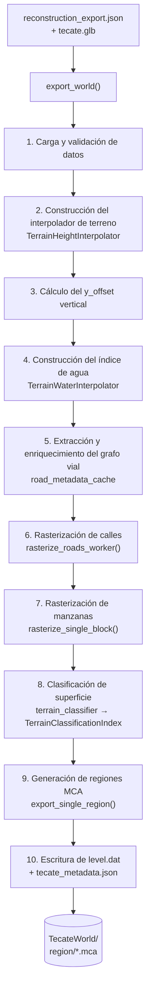

# Pipeline de Exportación: De Tecate Geográfico a Mundo Minecraft

## Visión general del flujo



---

## Etapa 1: Carga y validación de datos

**Fuente:** `reconstruction_export.json`

El JSON contiene:
- `blocks`: Lista de manzanas urbanas. Cada manzana tiene un `polygon` con vértices en coordenadas locales `[x, y]` (metros, relativo a Parque Hidalgo).
- `road_graph.nodes`: Nodos de intersecciones, con `id`, `x`, `y` (locales).
- `road_graph.edges`: Aristas de segmentos viales, con `u` (nodo origen), `v` (nodo destino), `name` (nombre de la calle).

**Filtrado de manzanas grandes:**
```python
# exporter.py línea 2111-2113
area = polygon_area(poly)
if area <= 60000.0:  # Solo manzanas de menos de 60,000 m² (6 ha)
    filtered_blocks.append(b)
```
Manzanas más grandes que 6 hectáreas se descartan. Esto elimina áreas como grandes terrenos baldíos o parques sin estructura urbana que podrían generar plataformas erróneas.

---

## Etapa 2: Construcción del interpolador de terreno

**Fuente:** `tecate.glb` (Mesh 1 = TIN de superficie)

`TerrainHeightInterpolator` carga los vértices del Mesh 1 del GLB (la malla TIN del terreno), los transforma al espacio local Cartesiano, y construye un índice espacial por celdas para consultas de altura rápidas.

**Carga del GLB** (`load_terrain_vertices`):
```python
# Leer el archivo binario GLB:
# Header: magic (0x46546c67), version, length
# Chunk 0: JSON (gltf)
# Chunk 1: Binary buffer

# Mesh 1 = tinMesh (superficie TIN)
mesh = gltf['meshes'][1]
prim = mesh['primitives'][0]
# Leer posiciones como float32, shape (N, 3)
positions = np.frombuffer(binary_data[offset:offset + count * 12], dtype=np.float32)

# Transformar GLB → Local Cartesiano
x_godot = s * positions[:, 0] + tx   # X local
z_godot = s * (-positions[:, 2]) + tz # Z local (Y invertido)
y_godot = s * positions[:, 1]         # Altura real en metros
```

**Estructura del índice espacial:**
- Divide el plano XZ en celdas de 500×500 metros.
- Cada celda guarda índices de los vértices del TIN que caen en ella.
- Para una consulta en `(x, z)`, se busca la celda y sus 8 vecinas (±1 en cada dimensión), y se construye un `LinearNDInterpolator` (Delaunay) con esos vértices.
- Si `LinearNDInterpolator` devuelve `NaN` (punto fuera de la triangulación), se usa `NearestNDInterpolator` como fallback.

**Consulta de altura:**
```python
h_real = interpolator.query_height(x_local, -z_mc)
# Nota: query_height recibe (x_local, y_local_positivo)
# z_mc = -y_local → y_local = -z_mc
```

---

## Etapa 3: Cálculo del offset vertical (`y_offset`)

Ver **SPATIAL_MODEL.md §3** para el algoritmo completo.

```python
y_offset = int(floor(min_terrain_height)) + 230
```

Esto posiciona el terreno mínimo del área activa en aproximadamente Y=0 en Minecraft, dejando espacio hacia abajo para capas geológicas subsuperficiales.

**Nota importante:** Si `tecate_metadata.json` ya existe, se reutiliza el `y_offset` previo para garantizar coherencia incremental entre ejecuciones.

---

## Etapa 4: Índice de agua (`TerrainWaterInterpolator`)

Descarga o carga desde caché (`export/water_osm_cache.json`) los cuerpos de agua de OSM en el área activa.

**Tipos manejados:**
- **Áreas de agua** (`natural=water`, `waterway=riverbank/dock/basin`): Se triangula el polígono usando Delaunay 2D, verificando que cada triángulo pertenezca al polígono original.
- **Líneas de cauce** (`waterway=river/stream/canal`): Se convierte cada segmento en un rectángulo buffered perpendicular al segmento con ancho según tipo:
  - `river`: half_w = 6.0 m
  - `stream`: half_w = 1.5 m
  - otros: half_w = 3.0 m

Las alturas de los vértices de agua se obtienen del interpolador de terreno, creando superficies de agua que siguen la topografía real.

**Uso posterior:** El interpolador de agua tiene dos funciones:
1. `query_water(px, pz)`: Consulta si un punto está sobre agua y devuelve su altura interpolada.
2. `lot_overlaps_water(polygon_local)`: Prueba vectorizada para omitir manzanas que quedan sobre agua.

---

## Etapa 5: Enriquecimiento del grafo vial

`extract_and_cache_road_metadata()` consulta la API Overpass y enriquece cada arista del grafo con:
- `highway`: tipo de vía OSM
- `lanes`, `width`: geometría de la sección transversal
- `surface`: material de superficie
- `bridge`, `layer`: elevación y estructura especial
- `name`: nombre de la calle

Ver **ARCHITECTURE.md §`road_metadata_cache.py`** para detalles.

---

## Etapa 6: Rasterización del grafo vial

Esta es la etapa más compleja computacionalmente. Para cada arista `(u → v)`:

### 6.1 Resolución de propiedades visuales

```python
road_props = resolve_road_properties(name, highway_type)
```

La función clasifica la calle en 5 categorías basándose en el nombre y tipo:
- **highway/expressway**: `width=12`, `lanes=4`, `marking_type="highway"`
- **boulevard**: `width=14`, `lanes=4`, `marking_type="boulevard"`
- **avenida**: `width=9`, `lanes=2`, `marking_type="avenida"`
- **calle**: `width=6`, `lanes=2`, `marking_type="calle"`
- **rural/sin nombre**: `width=4`, `lanes=1`, `surface="gravel"`, `marking_type="none"`

**Propagación de estilo por nombre normalizado:**
Todas las aristas con el mismo nombre de calle normalizado reciben el estilo más alto encontrado en esa calle. Esto garantiza que una Avenida que tiene un segmento clasificado erróneamente como "residential" siga viéndose como avenida en todo su recorrido.

### 6.2 Geometría de rasterización

Para un segmento `(x1, z1) → (x2, z2)` de longitud `dist` y ancho `width`:

```
w_adjusted = width + 3.0   # Padding para cubrir fronteras de bloque
half_w = w_adjusted / 2.0
steps = ceil(dist * 2)     # Muestreo sub-bloque a lo largo del segmento
```

Para cada paso `t ∈ [0, 1]`:
```
centro = (x1 + t·dx, z1 + t·dz)
for d in [-half_w ... half_w]:
    punto = centro + d · perp_unit_vector
```

Donde `perp_unit_vector = (-dz/dist, dx/dist)` es el vector perpendicular al segmento.

### 6.3 Altura de los bloques de calle

**Para calles normales (no puente):**
- Se pre-consultan las alturas de todos los puntos del centerline en batch.
- Para cada punto del centerline, la altura es la del terreno en ese punto.
- Esto produce calles que **siguen el relieve topográfico** de Tecate.

```python
y_road = centerline_heights[(cx_mc, cz_mc)]
# donde: centerline_heights[(x,z)] = round(interpolator.query_height(x, -z)) - y_offset
```

**Para puentes (`bridge=yes`):**
- Los extremos del puente tienen la altura del terreno.
- Los puntos centrales se elevan 6 bloques sobre el terreno base.
- Hay una rampa lineal de `min(10, dist/2)` metros en cada extremo.
- Se generan pilares de `cobblestone` en los bordes del puente cada 8 pasos.

```python
y_road = y_base + 6.0  # en la sección central del puente
```

**Fusión de segmentos de puente fragmentados (`_merge_bridge_gaps`):**
OSM a veces representa un puente como múltiples segmentos con pequeños huecos entre ellos (por ejemplo, cuando el puente cruza una intersección). El código detecta estos huecos y los fusiona promoviendo el hueco a `bridge=yes` si:
1. El segmento hueco comparte nombre normalizado con los puentes adyacentes.
2. Los ángulos son colineales dentro de 30°.
3. La longitud del hueco es ≤ la longitud del tramo de puente más corto adyacente.

### 6.4 Asignación de bloques por tipo de calle

**Calles rurales/tierra:**
```python
choices = ["minecraft:gravel", "minecraft:cobblestone", "minecraft:coarse_dirt",
           "minecraft:andesite", "minecraft:mossy_cobblestone"]
weights = [0.5, 0.25, 0.15, 0.05, 0.05]
block = get_deterministic_choice(x, y, z, choices, weights)
```

**Calles modernas (asfalto):**
El bloque depende de la posición perpendicular `d` respecto al centro del segmento.

**Marcas viales:**

| Zona | Tipo | Bloque |
|------|------|--------|
| Centro (`|d| < 0.5`) en highways | Línea amarilla sólida | `yellow_concrete` |
| Centro (`|d| < 0.5`) en boulevards/avenidas | Línea amarilla punteada | `yellow_concrete` (cada 4m, 2 on/2 off) |
| Centro (`|d| < 0.5`) en calles | Línea blanca punteada | `white_concrete` (cada 4m, 2 on/2 off) |
| Borde lateral en highways/boulevards | Línea blanca continua | `white_concrete` |
| Divisor interno en boulevards (`|d| ≈ 3.5`) | Línea blanca punteada | `white_concrete` (cada 4m, 2 on/2 off) |

**Las marcas se suprimen cerca de intersecciones** (`dist_along < 4.0` o `dist - dist_along < 4.0`).

**Superficie del tramo:**

| surface | choices | weights |
|---------|---------|---------|
| `asphalt_clean` | `gray_concrete`, `black_concrete` | 0.8, 0.2 |
| `asphalt_light` | `gray_concrete_powder`, `andesite`, `gravel` | 0.7, 0.2, 0.1 |
| `asphalt` (default) | `gray_concrete_powder`, `black_concrete_powder`, `smooth_basalt`, `cobbled_deepslate`, `coal_block` | 0.6, 0.25, 0.05, 0.05, 0.05 |

**Selección determinística:** `get_deterministic_choice(x, y, z, choices, weights)` usa un hash aritmético de las coordenadas para seleccionar bloques de forma estable y reproducible (mismo bloque siempre en la misma posición, incluso entre ejecuciones).

### 6.5 Limpieza de aire sobre la calle

Cada bloque de calle limpia 4 bloques de aire por encima de él:
```python
for y_above in range(y_road + 1, y_road + 5):
    local_custom_blocks[(x_mc, y_above, z_mc)] = "minecraft:air"
```
Esto previene que el terreno "entierre" las calles en zonas donde la interpolación del TIN sobresale por encima de la calle.

### 6.6 Paralelización

Los segmentos viales se dividen en chunks por número de workers disponibles y se rasterizadn en paralelo con `ThreadPoolExecutor`. El resultado de cada worker es un `dict` de bloques que se fusionan al final.

**Ordenamiento de aristas:**
Las aristas se procesan en orden de prioridad ascendente (calles rurales primero, autopistas y puentes últimos), de modo que los segmentos de mayor rango **sobreescriban** a los de menor rango en caso de overlap.

---

## Etapa 7: Rasterización de manzanas urbanas

`rasterize_single_block(b, get_mc_terrain_y, ...)` procesa una manzana (bloque urbano):

1. Convierte el polígono a coordenadas MC: `(x_local, -y_local)`.
2. Calcula el bounding box del polígono.
3. Llama a `find_inside_points()` que devuelve todos los enteros `(x, z)` dentro del polígono + su distancia al borde.
4. Para cada punto interior, consulta la altura del terreno (`get_mc_terrain_y(x, z)`).
5. Coloca un bloque `minecraft:smooth_stone` en `Y = y_terreno + 1`.

**Omisión de manzanas sobre agua:**
Antes de rasterizar, se verifica `water_interp.lot_overlaps_water(poly)`. Si la manzana intersecta un cuerpo de agua, se omite completamente. Esto previene que manzanas que el sistema de reconstrucción colocó sobre ríos o canales generen plataformas erróneas.

**`find_inside_points()` — Scanner de rasterización:**
- Implementado con `_point_in_polygon_jit()` (Numba JIT) para velocidad.
- Para polígonos pequeños (<100,000 puntos en bounding box): pre-aloca array máximo.
- Para polígonos grandes: doble pasada (primero cuenta, luego llena).
- Calcula la distancia al borde (`_distance_to_polygon_boundary_jit`) para futuros usos (actualmente almacenado pero no usado en la rasterización base).

---

## Etapa 8: Clasificación de superficie del terreno

Mientras se rasterizaron calles y manzanas, la clasificación del terreno se usa al **generar los chunks MCA**. 

`TerrainClassificationIndex` mantiene un índice espacial de polígonos clasificados como `grass`, `paved`, o `dirt`. Al procesar cada columna del chunk, se consulta qué clase corresponde a ese `(X, Z)`.

---

## Etapa 9: Generación de regiones MCA

`export_single_region(rx, rz, ...)` genera el archivo `.mca` para una región 32×32 chunks (512×512 bloques).

### 9.1 Resolución de datos por chunk

Para cada uno de los 1,024 chunks de la región, se construyen tres arrays de 256 elementos (16×16 columnas):
```python
local_heights = np.zeros(256, dtype=np.int32)       # Y del terreno
local_water   = np.full(256, -9999, dtype=np.int32)  # Y del agua (-9999=sin agua)
local_classes = np.zeros(256, dtype=np.int32)        # 0=grass, 1=paved, 2=dirt
```

Los datos de agua se resuelven con `query_water_chunk_jit()` (Numba JIT) que prueba todos los triángulos de agua para las 256 columnas simultáneamente.

### 9.2 `fill_chunk_jit()` — Relleno JIT del chunk

Esta función Numba JIT es el núcleo del generador de terreno. Procesa todas las secciones del chunk en una sola pasada:

**Para cada posición `(x, y, z)` en el chunk:**

```
si hay agua en (x, z) y y <= y_agua:
    si y < y_terreno - 3: bloque = stone
    si y < y_terreno:     bloque = dirt
    si y == y_terreno:    bloque = sand   # Fondo del cuerpo de agua
    si y > y_terreno:     bloque = water  # Columna de agua

sino (terreno normal):
    si clase == paved:
        si y < y_terreno:    bloque = stone
        si y == y_terreno:   bloque = andesite|polished_andesite|stone_bricks (60/30/10%)
    
    si clase == dirt:
        si y < y_terreno-3:  bloque = stone
        si y < y_terreno:    bloque = dirt
        si y == y_terreno:   bloque = coarse_dirt|dirt|gravel (60/30/10%)
    
    si clase == grass (default):
        si y < y_terreno-3:  bloque = stone
        si y < y_terreno:    bloque = dirt
        si y == y_terreno:   bloque = grass_block
```

Después, los **bloques personalizados** (calles, manzanas) sobreescriben el terreno generado:
```python
for i in range(num_custom):
    result[s_idx, flat_idx] = custom_block_ids[i]
```

**Paleta estándar del JIT:**
```python
STANDARD_BLOCKS = [
    "minecraft:air",              # 0
    "minecraft:stone",            # 1
    "minecraft:dirt",             # 2
    "minecraft:sand",             # 3
    "minecraft:water",            # 4
    "minecraft:grass_block",      # 5
    "minecraft:andesite",         # 6
    "minecraft:polished_andesite",# 7
    "minecraft:stone_bricks",     # 8
    "minecraft:coarse_dirt",      # 9
    "minecraft:gravel",           # 10
]
```

### 9.3 Construcción del NBT del chunk

El resultado del JIT (array `[sections × 4096]` de IDs) se convierte a la estructura NBT de Minecraft:

```
chunk NBT:
  DataVersion: 3463         (Minecraft 1.20.x)
  xPos, zPos: coordenadas globales del chunk
  yPos: sección Y mínima
  Status: "full"
  sections: [TAG_LIST de secciones]
    sección:
      Y: índice de sección (Y/16)
      block_states:
        palette: [TAG_COMPOUND de {Name: "minecraft:X"}]
        data: [TAG_LONG_ARRAY] empaquetado con pack_block_states()
      biomes:
        palette: ["minecraft:plains"]
  block_entities: [TAG_LIST]
```

Las secciones completamente de aire se omiten. `bits_per_block = max(4, ceil(log2(palette_size)))`.

### 9.4 Paralelización de regiones

La generación de regiones se paraleliza con `ProcessPoolExecutor`. Para cada región:
1. El hilo principal prepara: alturas pre-calculadas, triángulos de agua, polígonos de clasificación.
2. Se envía la región a un proceso worker.
3. El worker ejecuta `export_single_region()` en aislamiento.
4. El cache de alturas del worker se fusiona de vuelta al hilo principal.

**Orden de regiones:** Las regiones se ordenan por distancia a Parque Hidalgo (0, 0) para priorizar el área central de la ciudad.

---

## Etapa 10: Escritura de `level.dat` y metadatos

**`level.dat`** contiene:
- `LevelName`: "Tecate Simulator"
- `generatorName`: "flat" (generador plano)
- `SpawnX/Y/Z`: `(0, spawn_y, 0)` — el jugador aparece en Parque Hidalgo
- `GameType`: 1 (Creative)
- `Difficulty`: 0 (Peaceful)
- `Time/DayTime`: 6000 (mediodía permanente)
- `GameRules`: `doMobSpawning=false`, `keepInventory=true`, `doDaylightCycle=false`
- `DataPacks`: activa "vanilla" + el datapack "Higher Heights" si está disponible

**`tecate_metadata.json`** almacena `y_offset`, bounding box y parámetros de alineación del terreno.

---

## Sistema de caché y reanudación incremental

El pipeline implementa un sistema de caché en tres niveles para soportar ejecuciones largas que pueden interrumpirse:

### Caché de geometría rasterizada (`custom_blocks_cache.npz`)
Almacena:
- Arrays NumPy de coordenadas `(x, y, z)` y IDs de bloque de todos los bloques rasterizados.
- `last_edge_idx`: índice de la última arista del grafo vial completamente rasterizada.
- `last_block_idx`: índice de la última manzana completamente rasterizada.
- `completed_block_indices`: conjunto de índices de manzanas completadas (para paralelo desordenado).
- Acompañante `_entities.pkl`: block entities serializados con pickle.

### Caché de alturas del terreno (`terrain_height_cache.json`)
Mapa `"x,z" → Y_mc` con todas las alturas ya interpoladas. Evita reejecutar la interpolación del TIN.

### Caché incremental de regiones MCA
Al inicio de la generación de regiones, se verifica si el archivo `.mca` ya existe y tiene chunks. Si es válido, se salta esa región (mensaje: "Incremental export: skipped N already generated valid region files").

### Checkpoint del importador (`importer_checkpoint.json`)
Almacena los MTimes y tamaños de los archivos `.mca` ya escaneados, junto con los bloques modificados encontrados. Permite retomar el escaneo sin re-leer regiones no modificadas.
