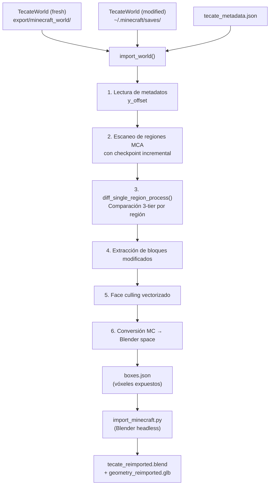

# Pipeline de Importación: De Mundo Editado a Modelo 3D

## Visión general

El pipeline de importación extrae las **modificaciones hechas por el jugador** en el mundo Minecraft y las convierte en un modelo 3D. Compara el mundo "fresco" (generado por el exportador, sin editar) con el mundo "modificado" (guardado del jugador), y extrae el diferencial como geometría geoespacial.



---

## Etapa 1: Lectura de metadatos

Se lee `tecate_metadata.json` del mundo fresco o del modificado para obtener `y_offset`, que es necesario para convertir `Y_mc` a altura real en metros.

```python
y_offset = metadata["vertical_offset"]
```

**Rango vertical manejado:**
```python
min_s_y = -16   # Sección mínima Y (bloque Y = -256)
max_s_y = 80    # Sección máxima Y (bloque Y = 1280)
```

Estos valores cubren el rango máximo del datapack "Higher Heights" que extiende el mundo Minecraft por encima de Y=320.

**Localización del directorio de regiones:**
```python
def get_region_dir(world_dir):
    # Soporte para worldgen con Higher Heights (dimensiones custom)
    custom_path = world_dir / "dimensions/minecraft/overworld/region"
    if os.path.exists(custom_path):
        return custom_path
    return world_dir / "region"
```

---

## Etapa 2: Escaneo incremental con checkpoint

El importador escanea **todas** las regiones MCA presentes en ambos mundos. Para cada región:

1. Calcula `mtime` y `size` de ambos archivos (`fresh`, `modified`).
2. Consulta el checkpoint: si ya escaneó esta región con los mismos MTimes, reutiliza el resultado.
3. Si cambió, agrega la región a la lista de escaneo.

```python
region_key = f"r.{rx}.{rz}"
cached_info = checkpoint["mtimes"].get(region_key)
if cached_info == [fresh_mtime, fresh_size, mod_mtime, mod_size]:
    # Reutiliza bloques del checkpoint
else:
    # Escanear esta región
```

**Paralelización:** Las regiones a escanear se procesan con `ProcessPoolExecutor` (máximo de CPUs disponibles).

---

## Etapa 3: Comparación de chunks por región (`diff_single_region_process`)

Para cada región, la comparación opera en **3 niveles jerárquicos** de costo creciente:

### Tier 1: Comparación de archivo completo
```python
import filecmp
if filecmp.cmp(fresh_mca_path, modified_mca_path, shallow=False):
    return empty_result  # Archivos idénticos, no hubo cambios
```
Comparación byte a byte del archivo completo. Si el jugador no modificó ningún chunk de esta región, esto termina la comparación inmediatamente.

### Tier 2: Comparación de bytes comprimidos por chunk
```python
if comp_fresh == comp_modified:
    is_changed = False  # Chunk idéntico a nivel de bytes comprimidos
```
Si los datos Zlib del chunk son idénticos, el chunk no cambió.

### Tier 3: Comparación NBT profunda
```python
is_changed = chunk_block_states_differ(fresh_nbt, modified_nbt)
```

`chunk_block_states_differ()` compara:
1. Los `block_states` de cada sección Y: deserializa paleta + data, convierte a Python nativo, compara.
2. Los `block_entities` de ambos chunks: deserializa, normaliza, ordena por posición, compara.

Si el único cambio es `grass_block → dirt` (decaimiento natural de Minecraft al cubrir hierba), se ignora.

---

## Etapa 4: Extracción de bloques modificados

Para cada chunk marcado como modificado:

```python
fresh_blocks   = extract_chunk_all_blocks(fresh_nbt,    cx_global, cz_global, min_s_y, max_s_y)
modified_blocks = extract_chunk_all_blocks(modified_nbt, cx_global, cz_global, min_s_y, max_s_y)

for coord in (fresh_coords | modified_coords):
    b_fresh = fresh_blocks.get(coord, "minecraft:air")
    b_mod   = modified_blocks.get(coord, "minecraft:air")
    if b_mod != b_fresh and b_mod != "minecraft:air":
        # Ignorar grass→dirt
        if not (b_fresh == "grass_block" and b_mod == "dirt"):
            block_data[coord] = b_mod
```

**Solo se extraen bloques que el jugador colocó** (presentes en el modificado pero diferentes del fresco o ausentes en el fresco). Los bloques eliminados por el jugador no se extraen.

**`extract_chunk_all_blocks()`:**
- Lee las secciones Y del chunk.
- Para cada sección, deserializa la paleta y los datos de block_states usando `unpack_block_states()`.
- Devuelve `{(x, y, z): block_name}` para todos los bloques no-aire.

---

## Etapa 5: Face culling de vóxeles

Para reducir la geometría final (y el tamaño del GLB exportado), se eliminan los bloques completamente rodeados por otros bloques. Se calcula una máscara de 6 bits:

```python
mask = 0
if (x+1, y, z) not in preserved_blocks: mask |= 1   # +X expuesto
if (x-1, y, z) not in preserved_blocks: mask |= 2   # -X expuesto
if (x, y+1, z) not in preserved_blocks: mask |= 4   # +Y expuesto
if (x, y-1, z) not in preserved_blocks: mask |= 8   # -Y expuesto
if (x, y, z+1) not in preserved_blocks: mask |= 16  # +Z expuesto
if (x, y, z-1) not in preserved_blocks: mask |= 32  # -Z expuesto

if mask == 0:
    culled += 1  # Interior, descartar
```

Solo los bloques con al menos una cara expuesta (mask > 0) se incluyen en la salida.

---

## Etapa 6: Conversión MC → Blender

```python
loc_x = float(x)         # X_mc → Blender X (Este)
loc_y = float(-z)        # -Z_mc → Blender Y (Norte)
loc_z = float(y + y_offset)  # Y_mc + y_offset → Blender Z (metros sobre el nivel)
```

Esta transformación restaura las coordenadas a un espacio similar al local Cartesiano del proyecto:
- `loc_x` ≈ metros al Este de Parque Hidalgo
- `loc_y` ≈ metros al Norte de Parque Hidalgo (no negado porque Blender Z es diferente)
- `loc_z` ≈ altura real en metros sobre referencia

**Nota:** La transformación no es exactamente la inversa de la de exportación porque no usa `gps_to_local`/`local_to_gps`. Es una aproximación directa suficiente para visualización en Blender.

---

## Etapa 7: Escritura de `boxes.json`

```json
{
  "region_data": {
    "r.0.0": [
      {
        "pos": [loc_x, loc_y, loc_z],
        "mask": 6,
        "block_type": "minecraft:yellow_concrete",
        "color": [0.95, 0.8, 0.1]
      },
      ...
    ],
    "r.-1.0": [...]
  }
}
```

Los bloques se agrupan por región `r.RX.RZ` para permitir procesamiento paralelo o por partes en Blender.

---

## Etapa 8: Compilación Blender (`import_minecraft.py`)

Invocado en modo headless:
```bash
blender --background --python import_minecraft.py -- --import boxes.json --output-dir output/
```

**Proceso en Blender:**
1. Limpia la escena (objetos, materiales, imágenes, luces).
2. Para cada región y tipo de bloque:
   - Agrupa todos los vóxeles del mismo tipo.
   - Construye una malla con solo las caras expuestas (según `mask`).
   - Aplica `remove_doubles` (fusión de vértices a distancia < 0.0001).
   - Recalcula normales hacia afuera.
   - Asigna material PBR con textura relativa: `//resource_pack/assets/minecraft/textures/block/{block_name}.png`
3. Añade luz solar para renderizado.
4. Guarda `tecate_reimported.blend`.
5. Exporta `geometry_reimported.glb` con materiales y texturas.

**Colores de fallback por tipo de bloque** (usados si la textura no está disponible):
```python
BLOCK_COLORS = {
    "minecraft:yellow_concrete":     [0.95, 0.80, 0.10],
    "minecraft:gray_concrete":       [0.30, 0.30, 0.35],
    "minecraft:stone":               [0.50, 0.50, 0.50],
    "minecraft:grass_block":         [0.40, 0.60, 0.20],
    ...
}
```

---

## Significado geoespacial del diferencial importado

Los bloques extraídos por el importador representan **intervenciones territoriales del jugador**:

| Tipo de bloque colocado | Interpretación geoespacial |
|-------------------------|---------------------------|
| `yellow_concrete` | Marcación vial (propuesta de calle nueva o modificada) |
| `gray_concrete` | Pavimento urbano nuevo |
| `grass_block` | Área verde propuesta |
| `stone` | Estructura/edificación |
| `white_concrete` | Señalización / demarcación |

Al importar estas modificaciones al modelo 3D del proyecto, las intervenciones del jugador en el espacio Minecraft se convierten en propuestas de diseño urbano geolocalizadas.

**Invertir a GPS:**
Para cualquier bloque extraído `(x_mc, y_mc, z_mc)`:
```python
x_local = x_mc
y_local = -z_mc
H_real  = y_mc + y_offset
lat, lon = local_to_gps(x_local, y_local)
```
