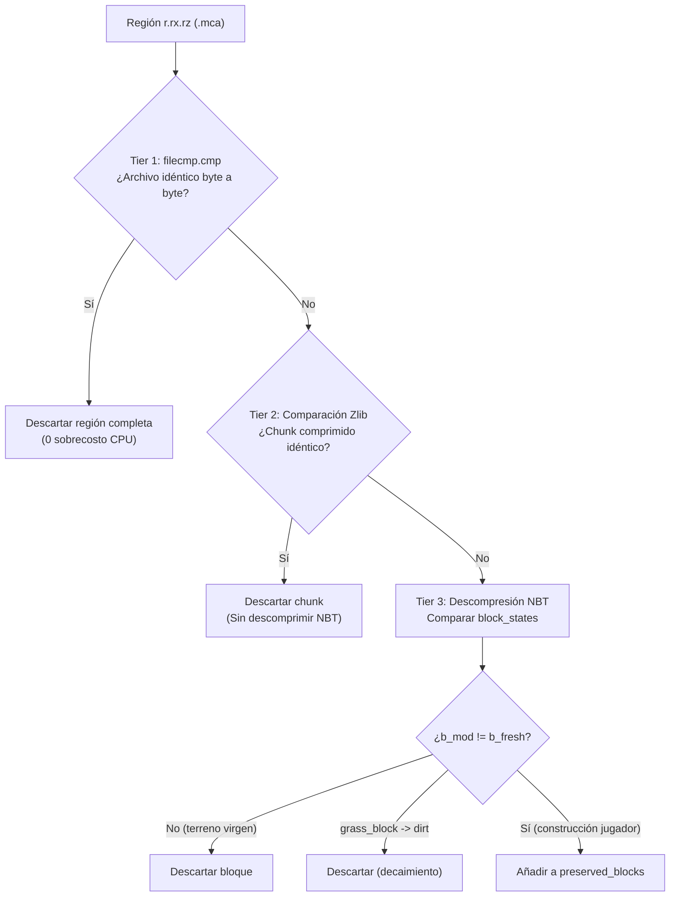
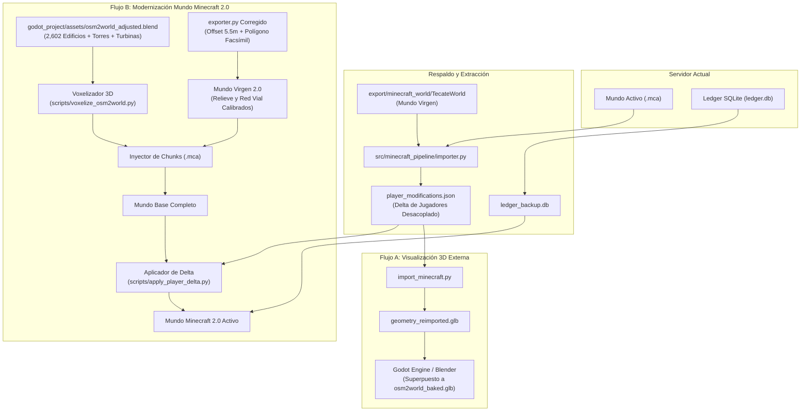

# Reconciliación del Minecraft Pipeline: Hallazgos, Descarte de Terreno y Preservación de Ledger SQLite

> **Estado:** Documento de diseño técnico y hallazgos arquitectónicos.  
> **Fecha:** Septiembre 2026.  
> **Ámbito:** Integración entre el modelo 3D calibrado (`osm2world_adjusted.blend`, `tecate.glb`), el mundo de Minecraft original (`export/minecraft_world/TecateWorld`), el historial de jugadores y la base de datos de auditoría Ledger (`ledger.db`).

---

## 1. Resumen Ejecutivo

Durante la fase de calibración geoespacial de alta precisión del simulador de Tecate, se determinaron parámetros cartográficos exactos que resuelven discrepancias históricas en la orientación, escala y posición de los modelos 3D y su relieve.

Al comparar estos hallazgos con la implementación actual del generador de Minecraft (`src/minecraft_pipeline/exporter.py`) y el mundo base de referencia (`export/minecraft_world/TecateWorld`), se identificaron divergencias estructurales críticas:

1. **Cobertura Urbana Incompleta en Minecraft:** El exportador original únicamente procesó **159 manzanas** procedimentales de `reconstruction_export.json` (~3.75% del área urbana), dejando el 96.25% restante del municipio de Tecate como terreno virgen sin edificaciones. En contraste, `osm2world_adjusted.blend` contiene **2,602 edificios 3D reales**, además de 449 torres eléctricas y 79 turbinas eólicas que cubren la totalidad del municipio.
2. **Desfase de Terreno de ~5.5 m en `exporter.py`:** Una diferencia de $5.50\text{ m}$ en los parámetros de traslación del interpolador de terreno respecto a la calibración oficial de Godot generó un corrimiento sistemático hacia el Noroeste en el relieve de Minecraft frente a las carreteras y manzanas.
3. **Límite Municipal vs. Polígono Facsímil:** Minecraft utilizó el polígono oficial de INEGI (`reference/tecate-polygon.json`), cortando la extensión de ~2.84 km al Noroeste hacia el Cerro Cuchumá (Donohoe Mountain) presente en la malla de terreno `tecate.glb`.
4. **Preservación Total del Trabajo de los Jugadores:** El escáner diferencial de 3 niveles en `src/minecraft_pipeline/importer.py` ya posee la lógica para **descartar el 100% del terreno base** y extraer exclusivamente las construcciones humanas en un conjunto $\Delta_{\text{player}}$.
5. **Integridad de Ledger SQLite (`ledger.db`):** La base de datos relacional de Ledger opera desacoplada de los archivos de región `.mca`. Las ediciones offline del terreno o la inyección de edificios de OSM no corrompen el archivo SQLite, y las coordenadas registradas $(X, Z)$ se mantienen 1:1 con el origen en Parque Hidalgo $(0, 0)$.

---

## 2. Matriz Comparativa: Minecraft World vs. Pipeline Calibrado

| Dimensión | Minecraft World Actual (`TecateWorld`) | Modelo Calibrado (`osm2world_adjusted.blend` / Godot) | Diferencia / Impacto |
| :--- | :--- | :--- | :--- |
| **Fuente de Edificios** | `reconstruction_export.json` | `models/tecate/osm2world.blend` | Minecraft solo tiene 159 bloques procedimentales; el modelo calibrado tiene 2,602 edificios 3D reales. |
| **Cobertura Territorial** | Centro histórico de Tecate (radio ~800 m) | Municipio completo de Tecate (radio > 10 km) | ~96% del municipio en Minecraft carece de edificaciones urbanas. |
| **Infraestructura Eléctrica** | Ninguna (0 torres, 0 turbinas) | 449 torres de alta tensión, 79 aerogeneradores, 11 líneas eléctricas | La red eléctrica y el parque eólico están ausentes en Minecraft. |
| **Mallas de Terreno** | TIN de `tecate.glb` interpolado a vóxeles | Malla TIN continua en Godot con BVH Tree para drapeado | Voxelizado a bloques de 1 m³. |
| **Traslación Terreno $X$** | `tx = 28052.4043` (`exporter.py`: L2153) | `tx = 28057.9043` (`tecate_metadata.json` / Godot) | **Error de $+5.50\text{ m}$ al Oeste** en Minecraft. |
| **Traslación Terreno $Z$** | `tz = -16620.3854` (`exporter.py`: L2154) | `tz = 16614.8854` (`tecate_metadata.json` / Godot) | **Error de $+5.50\text{ m}$ al Norte** en Minecraft. |
| **Polígono Delimitador** | INEGI oficial (`reference/tecate-polygon.json`) | Facsímil extraído de `tecate.glb` (`tecate_facsimile_polygon.geojson`) | Minecraft recorta la montaña Cuchumá (Donohoe Mtn) en el extremo NW. |
| **Sistema de Origen** | Parque Miguel Hidalgo $(X=0, Z=0)$ | Parque Miguel Hidalgo $(X=0, Z=0)$ | **Idéntico (alineado 1:1)** a nivel de origen horizontal. |
| **Superficies Planas** | Rasterizadas como asfalto / concreto | 22 categorías planas eliminadas (85% de primitivas) | En Godot se evitó Z-fighting; en Minecraft eran bloques sólidos. |

---

## 3. Discrepancias Técnicas Detalladas

### 3.1 El Desfase de 5.5 Metros en el Terreno de Minecraft

En `export/minecraft_world/TecateWorld/tecate_metadata.json`, los metadatos declaran:
```json
{
  "scale": 0.8427785648661434,
  "translation_x": 28057.904303473268,
  "translation_z": 16614.8853885848,
  "vertical_offset": 230
}
```

Sin embargo, en `src/minecraft_pipeline/exporter.py` (líneas 2153–2154):
```python
tx = 28052.404303473268
tz = -16620.3853885848
```

La diferencia matemática exacta es:
$$\Delta X = 28052.404303473268 - 28057.904303473268 = -5.5000\text{ m}$$
$$\Delta Z_{\text{local}} = 16620.3853885848 - 16614.8853885848 = +5.5000\text{ m}$$

**Consecuencia en el mundo generado:**  
Las alturas del terreno asignadas a los vóxeles se muestrearon con un desfase de $5.5\text{ m}$ hacia el Oeste y $5.5\text{ m}$ hacia el Norte en relación con las calles y manzanas vectoriales. Esto causó que algunas banquetas o cimientos presentaran pendientes ligeramente desalineadas con el relieve real.

### 3.2 Ausencia de Edificios OSM2World

El pipeline de exportación a Minecraft fue diseñado para consumir `reconstruction_export.json`, el cual contenía únicamente las reconstrucciones poligonales procedimentales generadas a partir del Street View de Google y los datos base de manzanas:
- Total de manzanas: 159.
- Altura asignada: uniformemente estimada o fija en 6 metros (`y_offset + 6`).
- Edificios fuera del primer cuadro de la ciudad: **0**.

El archivo `models/tecate/osm2world.blend` (y su versión optimizada `godot_project/assets/osm2world_adjusted.blend`) nunca fue conectado a `src/minecraft_pipeline/exporter.py`. En consecuencia:
- Edificios como la Cervecería Tecate, escuelas, hospitales, naves industriales y residencias periféricas existen en el modelo 3D pero nunca existieron en el mundo Minecraft.
- Las 449 torres de transmisión eléctrica de la CFE y los 79 aerogeneradores de La Rumorosa no fueron voxelizados.

### 3.3 Truncamiento de Cerro Cuchumá (Donohoe Mountain)

`exporter.py` utilizó la función `is_inside_polygon` verificando contra el polígono municipal de INEGI (`reference/tecate-polygon.json`).  
Como se documentó en [FACSIMILE_POLYGON_AND_ALIGNMENT.md](../FACSIMILE_POLYGON_AND_ALIGNMENT.md), el modelo de terreno `tecate.glb` en realidad extiende el límite $2,840\text{ m}$ más hacia el Noroeste para incluir la totalidad de la formación montañosa de Donohoe Mountain. Al usar el límite de INEGI, Minecraft dejó sin generar las regiones del extremo noroeste del relieve.

---

## 4. Descarte de Terreno y Aislamiento de Construcciones de Jugadores

### 4.1 Principio Matemático del Descarte

Sea $B(x, y, z)$ el estado de un bloque en el espacio tridimensional discreto de Minecraft $\mathbb{Z}^3$.  
El mundo activo del servidor $B_{\text{live}}$ se descompone en:

$$B_{\text{live}}(x, y, z) = B_{\text{virgin}}(x, y, z) \oplus \Delta_{\text{player}}(x, y, z) \oplus \Delta_{\text{env}}(x, y, z)$$

Donde:
- $B_{\text{virgin}}$ es el mundo base inalterado generado por `exporter.py` (disponible en `export/minecraft_world/TecateWorld`).
- $\Delta_{\text{player}}$ es el conjunto de modificaciones humanas (bloques colocados o destruidos por usuarios).
- $\Delta_{\text{env}}$ son cambios por decaimiento del motor del juego (e.g. `grass_block` convirtiéndose en `dirt` por falta de luz).

Para **descartar el terreno y preservar exclusivamente las construcciones humanas**, el sistema evalúa:

$$\Delta_{\text{player}} = \left\{ ((x, y, z), b_{\text{mod}}) \;\middle|\; b_{\text{mod}} \neq b_{\text{fresh}} \;\land\; b_{\text{mod}} \neq \text{air} \;\land\; \neg \text{IsDecay}(b_{\text{fresh}}, b_{\text{mod}}) \right\}$$

### 4.2 La Lógica Existente en `importer.py`

El módulo `src/minecraft_pipeline/importer.py` ya implementa este principio a través de un escáner jerárquico de 3 niveles:



#### Propiedades Clave de esta Arquitectura:
1. **El Terreno Desaparece Automáticamente:** Si un jugador nunca modificó una montaña, los bloques de piedra, tierra y pasto son idénticos a los del mundo virgen y son descartados en los Tiers 1 o 2. No se extrae ni un solo vóxel de relieve inalterado.
2. **Las Carreteras Base Desaparecen:** Las calles de concreto generadas algorítmicamente que no hayan sido intervenidas son idénticas en ambos mundos y son descartadas.
3. **Persistencia en Checkpoint:** `importer_checkpoint.json` almacena las marcas de tiempo y el diccionario de bloques modificados por cada región, permitiendo reanudación instantánea.

### 4.3 Extensión Requerida: Demoliciones y Excavaciones

En la implementación actual de `importer.py` (líneas 253–254):
```python
if b_mod != "minecraft:air":
    if b_fresh == "minecraft:grass_block" and b_mod == "minecraft:dirt":
        continue
    block_data[coord] = b_mod
```

Actualmente solo se capturan bloques **positivos** ($b_{\text{mod}} \neq \text{air}$). Si un jugador excavó un túnel, construyó un sótano o allanó una colina en el terreno original, el bloque modificado es `minecraft:air`.  
Para una reconstrucción completa del terreno con ediciones de jugadores, el esquema debe almacenar tanto bloques colocados como bloques demolidos:
- **`placed_blocks`**: $\Delta_{\text{placed}} = \{(x, y, z): b_{\text{mod}} \mid b_{\text{mod}} \neq \text{air} \land b_{\text{mod}} \neq b_{\text{fresh}}\}$
- **`carved_blocks`**: $\Delta_{\text{carved}} = \{(x, y, z) \mid b_{\text{mod}} = \text{air} \land b_{\text{fresh}} \neq \text{air}\}$

---

## 5. Esquema de Almacenamiento Desacoplado: Diccionario Delta

Para independizar las creaciones de los jugadores del formato binario `.mca` de Minecraft y permitir su uso tanto en Minecraft 2.0 como en Blender/Godot, se define el esquema de serialización desacoplado `player_modifications.json` (o formato comprimido NumPy `.npz` para alta densidad):

### Estructura de `player_modifications.json`:
```json
{
  "version": "1.0",
  "metadata": {
    "source_world": "TecateProductionServer",
    "reference_virgin_world": "export/minecraft_world/TecateWorld",
    "timestamp_utc": "2026-09-13T00:00:00Z",
    "vertical_offset": 230,
    "origin_gps": [32.573229, -116.626536],
    "total_placed_blocks": 48219,
    "total_carved_blocks": 12040,
    "total_block_entities": 156
  },
  "placed_blocks": {
    "r.0.0": {
      "-120,72,-45": "minecraft:stone_bricks",
      "-120,73,-45": "minecraft:oak_planks",
      "-119,72,-45": "minecraft:glass"
    }
  },
  "carved_blocks": {
    "r.0.0": [
      [-125, 70, -40],
      [-125, 71, -40]
    ]
  },
  "block_entities": {
    "r.0.0": {
      "-120,72,-44": {
        "id": "minecraft:chest",
        "Items": [...]
      }
    }
  }
}
```

### Ventajas:
- **Portabilidad:** Un archivo JSON o NPZ de unos cuantos megabytes reemplaza gigabytes de archivos de región MCA.
- **Inmutabilidad:** Las construcciones quedan respaldadas permanentemente en Git o almacenamiento de artefactos.
- **Doble Destino:**
  - Puede inyectarse en Blender para renderizar un GLB de solo-jugador (`geometry_reimported.glb`).
  - Puede estamparse sobre un mundo de Minecraft completamente nuevo con terreno corregido y edificios de OSM2World.

---

## 6. Auditoría y Preservación del Plugin Ledger (`ledger.db`)

### 6.1 Arquitectura del Logger Ledger

El plugin Ledger (utilizado en servidores Paper, Purpur o Fabric) registra en tiempo real los eventos del servidor en una base de datos SQLite local (`ledger.db`).  
Entre las tablas estándar gestionadas por Ledger se encuentran:
- `actions` / `blocks`: Registros transaccionales de eventos (`BLOCK_PLACE`, `BLOCK_BREAK`, `INTERACT`, etc.).
- Columnas típicas:
  - `id`: Clave primaria autoincremental.
  - `time`: Marca de tiempo Unix (milisegundos o segundos).
  - `player_uuid`: Identificador único del jugador.
  - `action_type`: Identificador de acción (0 = destrucción, 1 = colocación, etc.).
  - `world_id`: Identificador del mundo (Overworld).
  - `x`, `y`, `z`: Coordenadas enteras del bloque.
  - `old_block_id`, `new_block_id`: Estados de bloque antes y después de la acción.

### 6.2 Evaluación de Riesgos y Garantías de Integridad

#### Garantía 1: Desacoplamiento Estructural Total
Ledger **no interactúa directamente con los archivos binarios `.mca`**. El plugin escucha eventos en memoria del servidor de Minecraft y escribe en `ledger.db` mediante el motor SQLite.  
Cualquier manipulación offline de los archivos `.mca` (reemplazo, inyección de bloques o regeneración) **no altera ni un solo byte del archivo `ledger.db`**. La base de datos mantiene 100% su integridad física y relacional.

#### Garantía 2: Coherencia Espacial $(X, Z)$
Tanto el mundo original como el nuevo modelo calibrado comparten el mismo origen:
$$\text{Parque Miguel Hidalgo} = (0, 0)$$
Las coordenadas $(x, y, z)$ almacenadas en `ledger.db` corresponden de forma unívoca a la misma ubicación en el mundo real.

#### Garantía 3: Consulta Histórica Intacta (`/ledger inspect`)
Las transacciones previas registradas por los jugadores continúan existiendo con sus marcas de tiempo y UUIDs legítimos. Si un jugador consulta un bloque que él colocó hace meses, Ledger consultará la base de datos SQLite y mostrará el registro histórico con total normalidad.

### 6.3 Comportamiento ante Nuevos Edificios Inyectados (OSM2World)

Si se inyectan los 2,602 edificios de `osm2world_adjusted.blend` directamente en los archivos `.mca` de Minecraft:
1. **Tratamiento como "Generación de Mundo" (Worldgen):**
   - Como la inyección de edificios de OSM2World ocurre offline con scripts en Python (sin pasar por el servidor de Minecraft en ejecución), **no se disparan eventos de jugador**.
   - Por tanto, no se insertan filas en `ledger.db`.
   - Cuando un jugador ejecute `/ledger inspect` sobre la pared de un edificio de OSM recién inyectado, Ledger responderá: *"No se encontraron interacciones en esta posición"*. Esto es técnica e históricamente verídico: el edificio forma parte del mapa base y ningún jugador lo construyó.
2. **Comportamiento ante Comandos de Rollback (`/ledger rollback`):**
   - El comando `/ledger rollback` ejecuta consultas SQL directas en `ledger.db` para revertir acciones de jugadores:
     $$\text{Bloque Actual} \leftarrow \text{old\_block}$$
   - Si un administrador realiza un rollback general de un jugador:
     - Solo se revertirán los bloques que dicho jugador haya modificado en el pasado.
     - Los edificios inyectados de OSM2World **no serán afectados ni borrados**, ya que no están asociados a ningún registro de jugador.
   - **Caso de Borde a Documentar:** Si un jugador había colocado un bloque en una posición que posteriormente fue ocupada por un muro de OSM2World, un rollback retroactivo de ese jugador intentaría restaurar lo que había antes de que el jugador construyera (e.g. aire o pasto viejo).  
     *Mitigación recomendada:* Al ejecutar rollbacks post-migración, restringir el parámetro temporal al periodo posterior a la actualización:
     ```bash
     /ledger rollback p:<jugador> t:<tiempo-desde-migracion>
     ```

### 6.4 `ledger.db` como Fuente de Verdad Complementaria

La base de datos de Ledger puede utilizarse para validar el diferencial de bloques:
```sql
SELECT x, y, z, new_block_id, time, player_uuid 
FROM actions 
WHERE action_type = 1 AND world_id = 0;
```
Esto permite:
- Distinguir intervenciones deliberadas de jugadores de alteraciones causadas por decaimiento del juego, propagación de agua/fuego o explosiones de creepers.
- Identificar la autoría exacta de cada bloque en el modelo 3D resultante.

---

## 7. Plan de Acción y Flujos de Trabajo Propuestos

Cuando se decida proceder, se contemplan dos flujos de trabajo claramente diferenciados:



### 7.1 Flujo A: Exportación No Destructiva a 3D (Sin tocar el servidor)
- **Objetivo:** Visualizar las construcciones de los jugadores integradas con el nuevo modelo urbano en Godot o Blender.
- **Acciones:**
  1. Ejecutar el importador diferencial (`importer.py`) comparando el mundo activo frente a `export/minecraft_world/TecateWorld`.
  2. Generar `geometry_reimported.glb` con los vóxeles de jugadores.
  3. Cargar `geometry_reimported.glb` en la escena de Godot (`main.tscn`) sobre el terreno `tecate.glb` y los edificios `osm2world_baked.glb`.
- **Riesgo:** **Cero.** El servidor de Minecraft y `ledger.db` no se tocan.

### 7.2 Flujo B: Modernización Integral del Servidor Minecraft (Mundo 2.0)
- **Objetivo:** Ofrecer a los jugadores un servidor con el 100% de la ciudad de Tecate construida (edificios de OSM2World, red eléctrica de alta tensión, turbinas eólicas), con el relieve corregido sin el desfase de 5.5 m, pero conservando íntegramente todas sus construcciones históricas y la base de datos de Ledger.
- **Fases de Implementación:**
  1. **Fase 1 — Respaldo Seguro:**
     - Detener el servidor de Minecraft de forma segura (`save-all` seguido de `stop`).
     - Realizar copia de seguridad en frío de `world/` y `plugins/Ledger/ledger.db`.
  2. **Fase 2 — Extracción de Construcciones y Validaciones:**
     - Ejecutar `importer.py` extendido para extraer `player_modifications.json` (incluyendo bloques demolidos).
     - Validar que el conteo de bloques coincida con las estadísticas de `ledger.db`.
  3. **Fase 3 — Corrección del Exportador (`exporter.py`):**
     - Corregir las constantes de traslación en `exporter.py`:
       `tx = 28057.904303473268`, `tz = -16614.8853885848`.
     - Reemplazar el polígono de INEGI por `godot_project/assets/tecate_facsimile_polygon.geojson`.
  4. **Fase 4 — Voxelización de OSM2World:**
     - Implementar el voxelizador para convertir las mallas de `osm2world_adjusted.blend` (2,602 edificios, 449 torres, 79 turbinas) en paletas de bloques de Minecraft (e.g. concreto, ladrillos de piedra, rejas de hierro, cristal).
  5. **Fase 5 — Ensamblado del Mundo Base 2.0:**
     - Generar el terreno base y carreteras calibradas.
     - Inyectar las estructuras voxelizadas de OSM2World en los archivos de región `.mca`.
  6. **Fase 6 — Estampado de Ediciones de Jugadores:**
     - Leer `player_modifications.json`.
     - Carvar excavaciones (`minecraft:air`).
     - Estampar bloques colocados por jugadores sobre las regiones actualizadas.
     - Restaurar entidades de bloque (cofres con inventarios intactos, letreros).
  7. **Fase 7 — Puesta en Marcha del Servidor:**
     - Reubicar `ledger.db` intacto en `plugins/Ledger/`.
     - Iniciar el servidor.
     - Validar que `/ledger inspect` opere correctamente sobre las construcciones de los jugadores.

---

## 8. Conclusiones y Estado Actual

- Toda la investigación cartográfica, matemática y de estructura de archivos está consolidada.
- Las fuentes de datos de referencia en volúmenes symlink (`export/`, `models/`, `reference/`) permanecen protegidas como de solo lectura.
- La base de datos de auditoría Ledger (`ledger.db`) no corre ningún peligro de corrupción ni pérdida de trazabilidad.
- La ejecución práctica de cualquiera de los flujos de trabajo queda pausada a la espera de la decisión del usuario.
