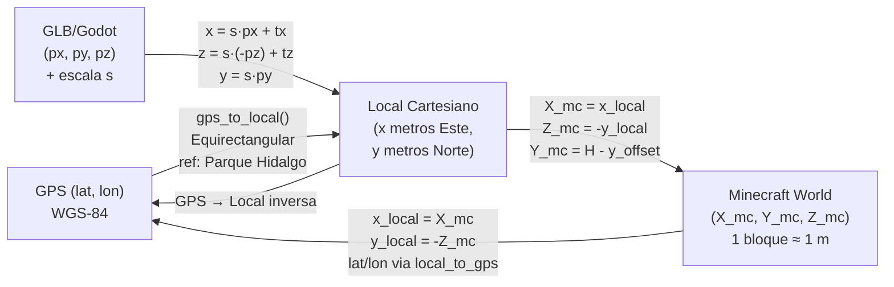

# Modelo Espacial del Minecraft Pipeline

## 1. Sistemas de coordenadas involucrados

El pipeline maneja **cuatro sistemas de coordenadas** distintos que deben mantenerse coherentes en todo momento.

---

### CS1: WGS-84 (GPS)

**Tipo:** Geográfico esférico  
**Ejes:** latitud (°N) × longitud (°E)  
**Unidades:** grados decimales  
**Uso:** Datos originales de OSM, coordenadas de la ciudad real

**Punto de referencia del proyecto:**
```
Centro: Parque Hidalgo, Tecate, B.C., México
TECATE_LAT_CENTER = 32.573229
TECATE_LON_CENTER = -116.626536
```

---

### CS2: Local Cartesiano (metros)

**Tipo:** Plano tangente local (Equirectangular local)  
**Ejes:** x (Este) × y (Norte)  
**Unidades:** metros  
**Origen:** Parque Hidalgo = (0, 0)  
**Implementación:** `src/core_io/coords.py`

**Fórmula GPS → Local (Equirectangular):**
```python
dx = EARTH_RADIUS * (lon_rad - lon_c_rad) * cos(lat_c_rad)
dy = EARTH_RADIUS * (lat_rad - lat_c_rad)
```

**Fórmula Local → GPS (inversa):**
```python
lat_rad = (y / EARTH_RADIUS) + lat_c_rad
lon_rad = (x / (EARTH_RADIUS * cos(lat_c_rad))) + lon_c_rad
```

**Error de distorsión:** La proyección equirectangular introduce error de distorsión proporcional a `cos(lat)`. Para Tecate (lat ≈ 32.57°), el factor de compresión horizontal es `cos(32.57°) ≈ 0.843`. Este factor está implícito en la corrección de longitude al proyectar. El error acumulado dentro del área urbana de Tecate es submétrico.

**Orientación de ejes:**
- `+x` apunta al Este
- `+y` apunta al Norte
- Este sistema se usa en el `reconstruction_export.json` para coordenadas de polígonos y nodos de calles.

---

### CS3: Minecraft World Space

**Tipo:** Cartesiano 3D entero  
**Ejes:** X (Este) × Y (Arriba) × Z (Sur)  
**Unidades:** bloques (1 bloque ≈ 1 metro real)  
**Origen:** (0, 0, 0) corresponde a Parque Hidalgo al nivel del suelo (con offset vertical aplicado)

**Convención crítica del eje Z en Minecraft:**
En Minecraft, **Z positivo apunta al Sur**. En el sistema local Cartesiano, **Y positivo apunta al Norte**.  
Por lo tanto: `Z_minecraft = -Y_local`

**Ecuaciones de transformación:**
```
X_mc = X_local
Y_mc = H_real(X_local, Y_local) - y_offset
Z_mc = -Y_local
```

Donde `H_real` es la altura real del terreno en metros y `y_offset` es el desplazamiento vertical calculado.

---

### CS4: GLB / Godot Engine Space

**Tipo:** Cartesiano 3D flotante  
**Ejes:** X × Y (Arriba) × Z (negativo hacia la cámara, es decir, Sur en Godot)  
**Unidades:** unidades del engine (equivalentes a metros via factor de escala)  
**Uso:** Vértices del modelo de terreno TIN en `tecate.glb`

**Transformación GLB → Local Cartesiano** (implementada en `load_terrain_vertices`):
```python
x_godot = s * positions[:, 0] + tx
z_godot = s * (-positions[:, 2]) + tz  # Inversión Z
y_godot = s * positions[:, 1]          # Altura sin inversión
```

**Constantes de transformación calibradas** (hardcodeadas en `exporter.py`, líneas 2089-2091):
```python
s  = 0.8427785648661434  # Factor de escala (unidades engine → metros)
tx = 28052.404303473268  # Traslación X (metros)
tz = -16620.3853885848   # Traslación Z (metros)
```

Estas constantes mapean el espacio del engine Godot al espacio local Cartesiano centrado en Parque Hidalgo. Son el resultado de un proceso de calibración/registro entre el modelo 3D y el mapa OSM del proyecto.

---

## 2. Diagrama completo de transformación de coordenadas



---

## 3. Cálculo del offset vertical (`y_offset`)

El offset vertical es el mecanismo que ancla el terreno real de Tecate a un nivel Y válido dentro del mundo Minecraft.

**Algoritmo** (exporter.py, líneas 2152-2163):
```python
# Muestrea alturas en 5 puntos del área activa
active_corners = [
    (min_x, min_y), (max_x, min_y),
    (min_x, max_y), (max_x, max_y),
    (center_x, center_y)
]
corner_heights = [interpolator.query_height(c[0], -c[1]) for c in active_corners]
min_height = min(corner_heights)  # Altura mínima real del terreno

# Desplazamiento vertical: posiciona el punto más bajo a Y = 230 (aprox.)
y_offset = int(floor(min_height)) + 230
```

**Interpretación:**
- `y_offset` es el valor en metros de la altura real del terreno que corresponde a Y=0 en Minecraft menos 230.
- El punto más bajo del terreno en el área activa quedará en `Y ≈ -230 + 230 = 0` en Minecraft.
- El punto más alto quedará en `Y = max_height - y_offset`.

**Persistencia:** Una vez calculado, `y_offset` se guarda en `tecate_metadata.json` y se reutiliza en ejecuciones incrementales para mantener coherencia.

**Fórmula de conversión altura real → Y Minecraft:**
```
Y_mc = round(H_real) - y_offset
```

**Fórmula inversa (Y Minecraft → altura real en metros):**
```
H_real = Y_mc + y_offset
```

---

## 4. Resolución espacial y escala 1:1

El pipeline opera a escala **1 bloque = 1 metro**. Esta equivalencia no es aproximada — se mantiene con precisión de punto flotante durante la rasterización y solo se redondea al entero más cercano al momento de asignar un bloque.

**Consecuencias:**
- Un ancho de calle de 6 metros resulta en exactamente 6 bloques de ancho.
- Un terreno de 100×100 metros produce exactamente 100×100 bloques de plataforma.
- Las alturas del terreno preservan la topografía real al metro.

---

## 5. Transformación de polígonos de manzanas urbanas

Los polígonos de manzanas en `reconstruction_export.json` están en coordenadas locales `[x_local, y_local]`. La rasterización los convierte a Minecraft usando:

```python
# En rasterize_single_block() (exporter.py, línea 316):
poly_mc = [[pt[0], -pt[1]] for pt in poly]
```

Esto transforma `(x_local, y_local)` → `(X_mc, Z_mc)`:
```
X_mc = x_local
Z_mc = -y_local
```

El punto de la manzana en MC es la columna `(X_mc, Z_mc)` y su Y se determina mediante la interpolación del terreno.

---

## 6. Transformación de nodos del grafo vial

Los nodos del grafo vial también están en `[x, y]` locales. En `rasterize_roads_worker()` (línea 1813):

```python
x1, z1 = u_nd["x"], -u_nd["y"]  # Node U
x2, z2 = v_nd["x"], -v_nd["y"]  # Node V
```

El segmento de calle va de `(x1, z1)` a `(x2, z2)` en el plano XZ de Minecraft.

---

## 7. Transformación de datos de agua (OSM Waterways)

Las coordenadas GPS de los cuerpos de agua se convierten a Minecraft space usando la misma inversión Y:

```python
# En TerrainWaterInterpolator (exporter.py, línea 656-657):
lx, ly = gps_to_local(pt["lat"], pt["lon"])
poly_pts.append((lx, -ly))  # (X_mc, Z_mc)
```

---

## 8. Transformación de polígonos de clasificación de superficie

En `terrain_classifier.py` (líneas 134-135 y 142-143):

```python
lx, ly = gps_to_local(pt["lat"], pt["lon"])
poly_pts.append((lx, -ly))
```

Los vértices se almacenan en `(X_mc, Z_mc)` para coincidir con el sistema de coordenadas de Minecraft.

---

## 9. Transformación del importador (MC → Blender)

El importador invierte la transformación para generar la escena Blender:

```python
# importer.py, líneas 441-443:
loc_x = float(x)         # X_mc  → Blender X
loc_y = float(-z)        # -Z_mc → Blender Y (Norte)
loc_z = float(y + y_offset)  # Y_mc + y_offset → Blender Z (metros reales)
```

Esto restaura aproximadamente las coordenadas originales: `loc_x ≈ x_local`, `loc_y ≈ y_local`, `loc_z ≈ H_real`.

---

## 10. Coherencia espacial y reversibilidad

**Propiedad clave:** Dada la posición de cualquier bloque `(X_mc, Y_mc, Z_mc)` en el mundo Minecraft, es posible calcular su posición geográfica exacta:

```python
x_local = X_mc                          # x en metros al Este de Parque Hidalgo
y_local = -Z_mc                         # y en metros al Norte de Parque Hidalgo
H_real  = Y_mc + y_offset               # altura real en metros sobre el geoide
lat, lon = local_to_gps(x_local, y_local)  # GPS WGS-84
```

Esta reversibilidad es la base del **uso del mundo Minecraft como interfaz de edición territorial**.

---

## 11. Región especial: Cerro Cuchumá

El exportador añade chunks adicionales al rededor del Cerro Cuchumá (cima volcánica al noroeste del centro de Tecate) para incluirlo en la representación geográfica aunque esté fuera del área urbana activa:

```python
cuchuma_lat = 32.5796047
cuchuma_lon = -116.688985
cuchuma_r   = 1630.0  # radio 1.63 km
```

Los chunks dentro de ese radio desde la cima se fuerzan a entrar al proceso de generación de regiones, asegurando que el cerro quede representado en el mundo.
