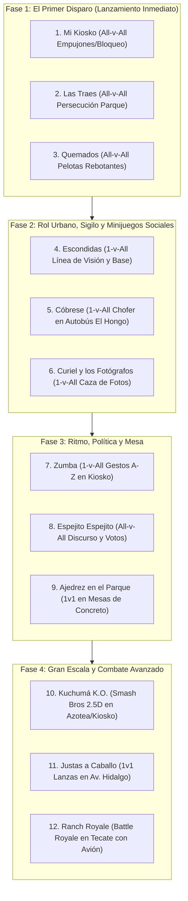

# Plan Maestro de Mecánicas, Vida Urbana y Arquitectura de Minijuegos para Tecate Simulator

## 1. Visión General y Filosofía de Diseño

Tecate Simulator trasciende el concepto de una maqueta arquitectónica digital para convertirse en un **punto de encuentro social persistente** (al estilo *Club Penguin* y *GTA Online Sandbox*) fusionado con un **ecosistema de minijuegos y torneos en vivo** (inspirado en *Wii Party* y *Super Smash Bros.*).

### 1.1 El "Primer Disparo": Estrategia de Primera Impresión
El objetivo primordial es que reunirse con amigos cercanos en Tecate Simulator sea intrínsecamente entretenido, divertido y memorable desde el primer segundo. La visita no debe sentirse como una auditoría de desarrollo, sino como una tarde auténtica entre amigos en el Parque Miguel Hidalgo:
- **Entrada inmediata y fluida**: Los jugadores aparecen directamente en el parque junto a sus amigos, inmersos en el paisaje sonoro de Tecate, sin pantallas de carga adicionales ni cinemáticas introductorias forzadas.
- **Micro-interacciones constantes**: Cada rincón, banca, fuente o kiosko posee un propósito lúdico o social antes de iniciar cualquier partida formal.
- **Risas mediante físicas (Slapstick)**: El combate y la interacción priorizan el humor físico, los empujones, el retroceso (*knockback*), las huidas desesperadas y el pique amistoso.
- **Preservación espacial**: Al concluir cualquier minijuego o reto, cada jugador es retornado automáticamente al punto exacto donde se encontraba en el mapa abierto, manteniendo la continuidad de la experiencia.

### 1.2 Disimulo Diegético del Mapa Incompleto (Obras Públicas de Tecate)
Dado que la reconstrucción fotorrealista de la ciudad avanza progresivamente manzana por manzana, las fronteras entre las zonas detalladas y los sectores vacíos o en construcción no se bloquean con muros invisibles genéricos. En su lugar, se emplea un elemento cotidiano y emblemático de la realidad urbana mexicana:
- **Atrezo Vial Auténtico**: En cada bocacalle saliente de las manzanas completadas se colocan retroexcavadoras amarillas, camiones de volteo municipales, motoconformadoras, montículos de grava y asfalto, tambos anaranjados reflejantes y cinta amarilla de precaución.
- **Señalética Local Humorística**: Letreros oficiales con leyendas como *"OBRA PÚBLICA EN PROCESO - DISCULPE LAS MOLESTIAS - H. AYUNTAMIENTO DE TECATE / CESPTE"* y carteles menores de *"Bacheo Preventivo Indefinido"*.
- **Colisión Física Natural**: La propia maquinaria y barreras bloquean físicamente el paso de los vehículos y avatares hacia las zonas no terminadas, transformando una limitación de desarrollo en un rasgo de identidad cultural y comedia local.

---

## 2. Vida Urbana de Plaza Estilo Club Penguin (Parque Miguel Hidalgo)

Para que el mapa sea un lugar vivo donde apetezca pasar el rato charlando y explorando, se implementa una capa de interacciones ambientales integradas en el mobiliario urbano del Parque Miguel Hidalgo:

1. **La Fuente de los Deseos (Fuente Central)**:
   - Los avatares pueden acercarse al brocal y presionar `[E]` para lanzar una moneda con física parabólica hacia el agua.
   - Emite un efecto de salpicadura sonoro y un contador visual sutil de deseos acumulados por la comunidad.
2. **Puesto de Elotes y Carretilla de Nieve de Garrafa**:
   - Puestos ambulantes atendidos por personajes locales donde se pueden comprar consumibles mediante Pesos Tecatenses.
   - El avatar sostiene visiblemente en su mano un elote con chile o un vaso de nieve, con animación de consumo que regenera estamina.
3. **La Campana del Kiosko**:
   - En la balaustrada superior del Kiosko, un cordel interactivo permite hacer sonar la campana con un tañido resonante audible en todo el parque, útil para llamar la atención o celebrar victorias.
4. **Mesas de Ajedrez y Dominó**:
   - Las tradicionales mesas de concreto con tableros grabados distribuidas entre los árboles permiten a dos jugadores sentarse frente a frente e iniciar una partida interactiva de ajedrez (1v1) o jugar contra un NPC bolero/jubilado.
5. **Palomas del Parque**:
   - Bandadas de palomas que caminan picoteando migajas en las losas de piedra. Si un jugador corre o brinca cerca de ellas, levantan el vuelo en desbandada con aleteo realista hacia las copas de los árboles antes de posarse nuevamente.
6. **Bocina / Rocola Compartida del Kiosko**:
   - Una rocola o amplificador en el Kiosko donde cualquier jugador puede sintonizar estaciones de radio ficticias locales, música tradicional norteña o temas cómicos que todos en el parque escuchan sincronizadamente.
7. **Emotes Urbanos Rápidos**:
   - Rueda de gestos mediante la tecla `[B]`: baile norteño/cumbia, silbido callejero, sentarse en la orilla de la banqueta, saludar con el sombrero o cruzarse de brazos.

---

## 3. Catálogo Integral de Minijuegos (Hoja de Ruta en 4 Fases)

Los 11 minijuegos diseñados en `docs/minigames/master.md` se estructuran en cuatro fases de desarrollo iterativo organizadas de menor a mayor complejidad técnica, asegurando que la primera fase esté operativa y probada de inmediato.



### 3.1 Fase 1: El Primer Disparo (Mecánicas Físicas Directas)

#### Minijuego 1: "Mi Kiosko"
- **Modalidad**: *All-vs-All* (2 a 8+ jugadores).
- **Escenario**: Plataforma octagonal superior del Kiosko del Parque Hidalgo.
- **Mecánica Central**: Los jugadores combaten a base de empujones físicos con impulso (*knockback*) y bloqueos (*parry*). El objetivo es expulsar a los rivales haciéndolos caer por los accesos o sobre la barandilla hacia el jardín.
- **Límites de Arena**: El barandal y el desnivel del kiosko. Quien toca el suelo del parque queda eliminado y pasa a modo espectador sobre la valla.
- **Condición de Victoria**: El último jugador en pie dentro del Kiosko se corona campeón.

#### Minijuego 2: "Las Traes"
- **Modalidad**: *All-vs-All* (o modo infección opcional).
- **Escenario**: Todo el perímetro del Parque Miguel Hidalgo (jardineras, bancas, pasillos y fuente).
- **Mecánica Central**: Un jugador inicia "trayéndola", identificado con un letrero flotante y un efecto sonoro distintivo. Los jugadores corren aprovechando el sprint, saltos entre bancas y esquivas. El portador debe tocar a otro jugador para transferirle la marca antes de que expire el temporizador.
- **Anti-Campamento**: Quedarse inmóvil por más de 3 segundos acumula una penalización de velocidad o descalificación directa.
- **Condición de Derrota/Victoria**: Quien tenga la marca al agotarse el tiempo pierde; gana el jugador que acumuló menos tiempo portándola.

#### Minijuego 3: "Quemados"
- **Modalidad**: *All-vs-All* o por equipos (2v2 / 4v4).
- **Escenario**: Explanada central del Parque Hidalgo acotada con conos de obra.
- **Mecánica Central**: Cada jugador cuenta con la habilidad de lanzar pelotas de básquetbol balísticas con física de rebote elástico sobre muros, banquetas y postes. Las pelotas rebotan varias veces antes de desvanecerse. Si una pelota impacta a un jugador (incluso un rebote de su propio tiro), queda eliminado de inmediato.
- **Regla Dinámica**: Prohibido permanecer inmóvil; los avatares deben estar en continuo movimiento para evitar una advertencia de expulsión.

---

### 3.2 Fase 2: Rol Urbano, Sigilo y Minijuegos Sociales

#### Minijuego 4: "Las Escondidas"
- **Modalidad**: *1-vs-All* (1 buscador, resto escondidos).
- **Escenario**: Manzana Central y Parque Hidalgo cerrados por obras.
- **Mecánica Central**: El buscador se coloca de espaldas en la base (el asta bandera o el Kiosko) con la pantalla oscurecida mientras cuenta 15 segundos. Los demás se dispersan para ocultarse tras macetas, portales de edificios o sentarse disimuladamente en bancas. Al terminar el conteo, el buscador debe localizar a los rivales mediante línea de visión directa (*line-of-sight* raycast), marcar su nombre y correr de regreso a la base para "quemarlo". Los escondidos pueden correr a la base para gritar *"1, 2, 3 por mí"* o *"1, 2, 3 por todos mis amigos"* para salvar a los eliminados.

#### Minijuego 5: "Cóbrese"
- **Modalidad**: *1-vs-All* (1 chofer, resto pasajeros).
- **Escenario**: Interior del autobús urbano *El Hongo* en movimiento a lo largo de su ruta.
- **Mecánica Central**: Un jugador toma el rol de conductor y debe cobrar el pasaje exacto a cada pasajero que sube. Los demás jugadores intentan pagar con combinaciones confusas y absurdas de monedas y billetes (morralla suelta, billetes de denominaciones raras). El chofer debe validar contrarreloj si el pago es igual o superior al boleto. Si el saldo total recaudado es menor al esperado, pierde el chofer; si un pasajero paga de más, pierde ese pasajero.

#### Minijuego 6: "Curiel y los Fotógrafos"
- **Modalidad**: *1-vs-All* (1 jefe de redacción, resto fotógrafos reporteros).
- **Escenario**: Fachada de *Foto Estudio Curiel* y calles de Tecate.
- **Mecánica Central**: El jefe exige contrarreloj una fotografía de un elemento o situación específica en el mapa (ej. "el reloj del Palacio Municipal al atardecer", "un camión El Hongo dando la vuelta en Cárdenas"). Los fotógrafos corren por la ciudad utilizando el modo cámara para encuadrar y enviar su mejor captura. El jefe califica las fotos y premia a la mejor.

---

### 3.3 Fase 3: Ritmo, Política y Juegos de Mesa

#### Minijuego 7: "Zumba"
- **Modalidad**: *1-vs-All* (1 instructor, resto participantes).
- **Escenario**: Tarima central del Kiosko.
- **Mecánica Central**: El instructor presiona secuencias de teclas rápidas que activan poses y pasos cómicos de baile en su personaje. Los demás participantes deben observar el gesto y replicarlo en su teclado en una ventana rítmica de tiempo. Quienes fallan el paso pierden ritmo y son eliminados.

#### Minijuego 8: "Espejito, Espejito, ¿Quién es el Candidato más Bonito?"
- **Modalidad**: *All-vs-All* (Oratoria política y diplomacia).
- **Escenario**: Kiosko convertido en estrado de campaña electoral.
- **Mecánica Central**: Los candidatos suben por turnos a dar un discurso cómico contrarreloj. Durante los turnos, los jugadores pueden pactar coaliciones secretas. Al finalizar las intervenciones, se abre una urna de votación secreta. Si hay empate, se celebra una segunda vuelta electoral.

#### Minijuego 9: "Ajedrez en el Parque"
- **Modalidad**: *1-vs-1* o *1-vs-NPC*.
- **Escenario**: Mesas de ajedrez de concreto bajo la arboleda del Parque Hidalgo.
- **Mecánica Central**: Partidas completas de ajedrez por turnos con piezas 3D interactivas mientras los demás jugadores pueden sentarse alrededor en modo espectador.

---

### 3.4 Fase 4: Modos a Gran Escala y Combate Avanzado

#### Minijuego 10: "Kuchumá K.O."
- **Modalidad**: *All-vs-All*, *1v1*, *2v2* estilo *Super Smash Bros.*
- **Escenario**: Azotea del edificio BBVA, vagones del tren de Tecate o el Parque Hidalgo.
- **Mecánica Central**: Cámara única fija con encuadre dinámico que sigue a todos los combatientes. Moveset característico por personaje (golpe rápido, ataque fuerte, especial en el aire, bloqueo y esquiva). Contador de daño porcentual (%): a mayor porcentaje recibido, mayor es el impulso del knockback al ser golpeado.
- **Condición de Salida**: Caer fuera de los límites de la pantalla o ser impactado por peligros ambientales (autobuses o trenes a alta velocidad).

#### Minijuego 11: "Justas"
- **Modalidad**: *1-vs-1*.
- **Escenario**: Avenida Hidalgo despejada de tráfico.
- **Mecánica Central**: Dos jugadores montados a caballo cabalgan a máxima velocidad en trayectoria opuesta sosteniendo una lanza. Requiere cálculo preciso de aceleración e inclinación de la lanza hacia el corazón del adversario para desmontarlo en el cruce.

#### Minijuego 12: "Ranch Royale"
- **Modalidad**: *Battle Royale All-vs-All* en todo el territorio municipal de Tecate.
- **Despliegue Aéreo**: Los jugadores inician a bordo de un vuelo comercial con destino regional (Tijuana / Mexicali / Ensenada) que sobrevuela el cielo de Tecate, lanzándose en caída libre o paracaídas sobre cualquier manzana.
- **Zona Segura Diegética**: El área de juego no se reduce con un círculo genérico, sino mediante polígonos que van clausurando manzanas completas con retroexcavadoras, motoconformadoras y cintas amarillas de obra vial de Tecate.
- **Arsenal Urbano**: Armas cómicas y disparadores de globos, elotazos y extintores repartidos por los callejones. El último jugador en pie gana.

---

## 4. Arquitectura Técnica en Godot 4 (`MinigameFramework`)

Para mantener el código desacoplado del controlador de personaje y del núcleo de red, se diseña un subsistema modular en `res://systems/minigames/`:

```
godot_project/systems/minigames/
├── core/
│   ├── minigame_base.gd          # Clase abstracta base con ciclo de vida estándar
│   ├── minigame_manager.gd       # Orquestador global (Singleton / Autoload)
│   ├── minigame_participant.gd   # Estructura de estado y restauración del jugador
│   └── minigame_boundary.gd      # Control de perímetros y advertencias de descalificación
├── economy/
│   ├── profile_economy.gd        # Guardado local persistente de monedas y accesorios
│   └── cosmetic_catalog.gd       # Catálogo de sombreros, chalecos y comida
├── ui/
│   ├── minigame_hud.gd           # HUD contextual reactivo (marcador, timer, avisos)
│   ├── minigame_radial_menu.gd   # Menú radial [M] para convocar retas
│   └── minigame_podium_screen.gd # Pantalla de victoria, ranking y fanfarria
└── games/
    ├── mi_kiosko/
    │   └── minigame_mi_kiosko.gd
    ├── las_traes/
    │   └── minigame_las_traes.gd
    └── quemados/
        ├── minigame_quemados.gd
        └── basketball_projectile.gd
```

### 4.1 Ciclo de Vida Estandarizado (`MinigameBase`)
Cada minijuego implementa la siguiente máquina de estados limpia:
1. `setup(participants: Array[CitizenEntity], config: Dictionary)`:
   - Almacena la posición global (`global_transform`), rotación y estado previo de cada jugador.
   - Reasigna el mapa de acciones del `PlayerController` activando solo los verbos correspondientes al minijuego.
   - Posiciona a los avatares en los puntos de inicio (*spawn spots*) de la arena.
2. `countdown(seconds: float)`:
   - Congela el movimiento durante 3 segundos mientras muestra la tarjeta del minijuego con su objetivo en una línea y sonido de conteo.
3. `start()`:
   - Habilita los controles del minijuego y arranca el temporizador de partida.
4. `tick(delta: float)`:
   - Ejecuta la lógica periódica (chequeo de límites, temporizadores de acampada, puntuación).
5. `on_player_action(player, action_name, payload)`:
   - Procesa eventos específicos (empujón, pase de tag, tiro de pelota).
6. `finish(results: Dictionary)`:
   - Congela controles, reproduce la fanfarria de victoria y muestra el podio con los ganadores.
   - Otorga las monedas tecatenses correspondientes al archivo de guardado local de cada jugador.
7. `restore_players()`:
   - Teletransporta a cada jugador de vuelta a sus coordenadas originales previas al minijuego y restaura su controlador estándar de exploración urbana.

### 4.2 Reconfiguración Dinámica de Verbos (`PlayerController`)
El `PlayerController` expone un método limpio para alternar perfiles de control sin alterar su física base:
```gdscript
func apply_minigame_context(context_id: String, custom_actions: Dictionary = {}) -> void:
    # Restringe o habilita sprint, salto, empuje, puntería según el minijuego activo
```

---

## 5. Sistema de Economía Persistente y Cosméticos Locales

- **Moneda**: *Pesos Tecatenses* (o *Corcholatas*).
- **Almacenamiento**: Archivo cifrado local `user://player_economy_profile.json` que persiste entre ejecuciones del juego.
- **Obtención**:
  - Participar en un minijuego: +15 Pesos.
  - Ganar un minijuego (1er lugar): +50 Pesos.
  - Segundo y tercer lugar: +30 / +20 Pesos.
  - Logros urbanos en el mapa: lanzar moneda a la fuente, limpiar basura en contenedores (+5 Pesos).
- **Catálogo de Tienda en el Parque**:
  - *Sombrero Norteño Tradicional*
  - *Lentes Oscuros de Aviador*
  - *Chaleco de Obra Reflejante del Municipio*
  - *Elote con Chile y Limón (Consumible en mano)*
  - *Nieve de Garrafa en Vaso (Consumible en mano)*
  - *Camiseta "Yo Estuve en Tecate"*

---

## 6. Plan de Pruebas y Validación Inmediata

1. **Prueba Unitaria de MinigameBase y MinigameManager**:
   - Verificar la correcta captura y restauración de la posición del jugador al iniciar y cancelar un evento.
2. **Prueba de "Mi Kiosko"**:
   - Validar la física de impulso (*knockback*) entre dos avatares y la detección precisa de caída fuera de la plataforma del Kiosko.
3. **Prueba de "Las Traes"**:
   - Validar la transferencia del tag por contacto de proximidad y la penalización por inmovilidad prolongada.
4. **Prueba de "Quemados"**:
   - Validar el rebote físico de la pelota de básquetbol y la eliminación instantánea al colisionar con una entidad.
5. **Prueba de Persistencia Económica**:
   - Validar que las monedas ganadas se guarden correctamente en disco y se puedan consultar al reiniciar.
