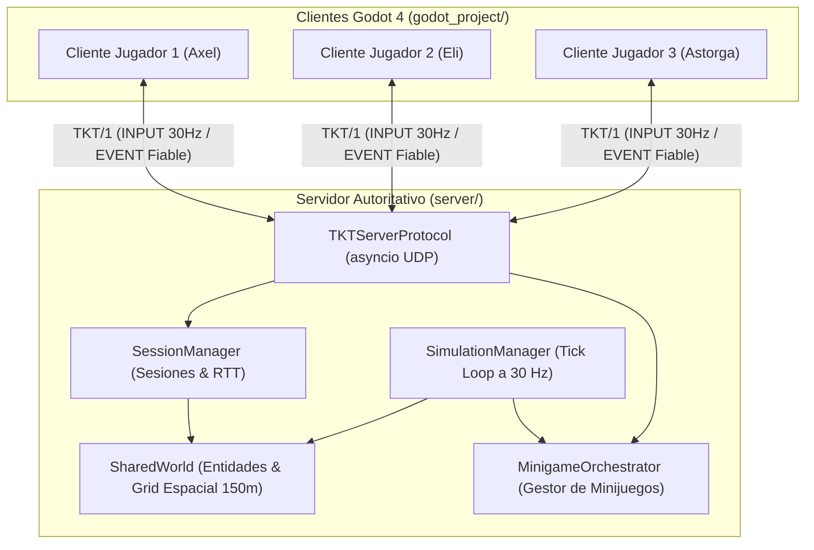
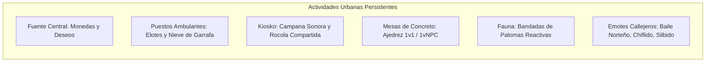
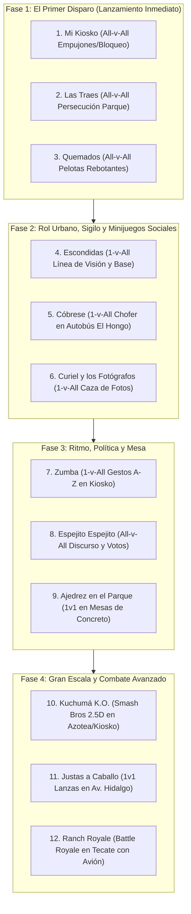
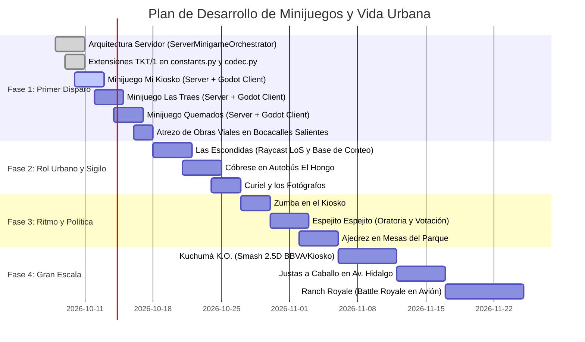

# Documento Maestro de Arquitectura, Vida Urbana y Orquestación Multijugador (TKT/1) para Tecate Simulator

## 1. Visión General y Filosofía de Diseño

Tecate Simulator trasciende el concepto de una maqueta arquitectónica digital para convertirse en un **punto de encuentro social persistente** (inspirado en la interacción ambiental de *Club Penguin* y el dinamismo de *GTA Online Sandbox*) integrado con un **ecosistema de minijuegos y retas en tiempo real** (inspirado en *Wii Party* y *Super Smash Bros.*).

### 1.1 El "Primer Disparo": Estrategia de Primera Impresión
El objetivo primordial es que la primera sesión con amigos cercanos sea un éxito rotundo:
- **Cero Fricción de Entrada**: Los jugadores se conectan y aparecen directamente en el Parque Miguel Hidalgo de Tecate, sin pantallas de carga intermedias ni cinemáticas obligatorias.
- **Autoridad y Estabilidad en Red**: Toda partida, eliminación, puntuación y cambio de estado es coordinado autoritativamente por el servidor dedicado en `server/` mediante el protocolo binario **TKT/1**, evitando discrepancias o desincronizaciones entre clientes.
- **Preservación Espacial Exacta**: Al concluir cualquier minijuego o reto, cada jugador es retornado automáticamente al punto exacto donde se encontraba en el mapa abierto, manteniendo la continuidad de la sesión.
- **Risas mediante Físicas (*Slapstick*)**: El combate y la interacción priorizan el humor físico, los empujones, el retroceso (*knockback*), las huidas desesperadas y el pique amistoso.

### 1.2 Disimulo Diegético del Mapa Incompleto (Obras Públicas de Tecate)
Dado que la reconstrucción de Tecate avanza progresivamente manzana por manzana, las fronteras entre las zonas detalladas y los sectores vacíos o en construcción no se bloquean con muros invisibles genéricos. En su lugar, se emplea un elemento cotidiano y emblemático de la realidad urbana mexicana:
- **Atrezo Vial Auténtico**: En cada bocacalle saliente de las manzanas terminadas se colocan retroexcavadoras amarillas, camiones de volteo municipales, motoconformadoras, montículos de grava y asfalto, tambos anaranjados reflejantes y cinta amarilla de precaución.
- **Señalética Local Humorística**: Letreros oficiales con leyendas como *"OBRA PÚBLICA EN PROCESO - DISCULPE LAS MOLESTIAS - H. AYUNTAMIENTO DE TECATE / CESPTE"* y carteles menores de *"Bacheo Preventivo Indefinido"*.
- **Colisión Física Natural y Validación en Servidor**: La maquinaria bloquea físicamente el paso en el cliente (`godot_project/`), mientras que el servidor (`server/`) valida las coordenadas en `SharedWorld` para evitar que ningún avatar atraviese hacia sectores no habilitados.

---

## 2. Arquitectura de Red y el Orquestador Central en el Servidor (`server/`)

El servidor en `server/` opera como la **única fuente de verdad** de la simulación. Está construido con Python asíncrono (`asyncio`), escucha tráfico UDP en el puerto `52665` y ejecuta un ciclo de simulación a 30 Hz (33.3 ms por tick).

### 2.1 Subsistemas Clave del Servidor
1. **`TKTGameServer` (`server/network/udp_server.py`)**:
   - Administra el socket de datagramas UDP.
   - Procesa paquetes entrantes: `HELLO`, `INPUT`, `EVENT`, `CHAT`, `PING`, `GOODBYE`.
   - Transmite periódicamente los `SNAPSHOT` con el estado de todas las entidades activas dentro del radio de interés espacial (grilla de 150 metros).
2. **`SessionManager` (`server/core/session_manager.py`)**:
   - Mantiene la tabla de sesiones activas (`ClientSession`), asignando un `session_id` único (1..65535) y un `player_entity_id`.
   - Controla el tiempo de inactividad (*timeout* a los 10 segundos) y calcula la latencia de ida y vuelta (RTT).
3. **`SharedWorld` (`server/core/world.py`)**:
   - Almacena el diccionario de entidades dinámicas (`DynamicEntity`) indexadas en una cuadrícula espacial de celdas de 150 m.
   - Gestiona el `SimulationManager`, despachando eventos a los controladores de cada entidad.
4. **`SimulationManager` (`server/core/simulation.py`)**:
   - Itera a 30 Hz sobre todos los controladores activos (`EntityController.update(dt, world)`).
   - Re-indexa las entidades tras cada movimiento y canaliza los eventos discretos (`handle_event`).

### 2.2 El Orquestador de Minijuegos (`ServerMinigameOrchestrator`)
Para coordinar los juegos sin depender de la honestidad o sincronía de los clientes, se establece el componente `MinigameOrchestrator` como módulo autoritativo en el servidor:
- **Gestión de Lobbies y Convocatorias**: Recibe peticiones de reto (`MINIGAME_SUMMON`), valida si el solicitante cumple con la proximidad física al punto de activación (ej. el Kiosko o el autobús) y gestiona las aceptaciones de los demás jugadores (`MINIGAME_JOIN`).
- **Preservación y Congelamiento de Coordenadas**: En el tick en que un minijuego es confirmado, el servidor extrae la posición exacta (`pos_x, pos_y, pos_z, yaw`) de cada participante en `SharedWorld` y la almacena en el estado de la sesión.
- **Teletransportación Autoritativa de Inicio**: El servidor asigna los puntos de inicio (*spawn spots*) de la arena y los difunde mediante un paquete fiable `MINIGAME_START`.
- **Árbitro de Reglas a 30 Hz**:
  - En *Mi Kiosko*: Monitorea la altitud $Y$ y el radio horizontal $R$ respecto al centro del Kiosko; si un jugador cae, el servidor decreta autoritativamente su eliminación (`MINIGAME_ELIMINATE`).
  - En *Las Traes*: Registra quién porta el tag (`current_tagger_id`), valida si la distancia entre portador y víctima es menor a $1.85\text{ m}$ para transferirlo, impone $2.0\text{ s}$ de inmunidad contra retornos y sanciona la inmovilidad (*anti-camping*).
  - En *Quemados*: Simula la cinemática de las pelotas (gravedad, rebotes elásticos contra el piso y colisión con las cápsulas de los jugadores), registrando las bajas de forma inapelable.
- **Restauración Espacial Garantizada**: Al finalizar el juego, el servidor reescribe las coordenadas de cada entidad a su posición previa guardada, emite el evento fiable `MINIGAME_END` con el podio y reanuda el flujo de exploración urbana.
- **Economía y Premiación Verificada**: El servidor acredita las monedas locales (*Pesos Tecatenses*) en el perfil verificado de cada jugador según el resultado de la partida, impidiendo la manipulación client-side.

---

## 3. Protocolo de Red TKT/1: Extensiones para Minijuegos

El protocolo TKT/1 utiliza paquetes binarios Little-Endian de 28 bytes de cabecera (`PacketHeader`) seguidos de un cuerpo de datos (*payload*):

$$\text{Cabecera TKT/1} = \langle \text{Magic (4B)}, \text{ProtoVer (1B)}, \text{MsgType (1B)}, \text{Flags (1B)}, \text{Reserved (1B)}, \text{SessionID (4B)}, \text{Seq (4B)}, \text{Ack (4B)}, \text{Timestamp (4B)}, \text{Len (2B)}, \text{Checksum (2B)} \rangle$$

### 3.1 Nuevos Códigos de Evento (`EventCode`) en `constants.py` y `tkt_codec.gd`

| Código | Identificador | Origen | Descripción |
| :---: | :--- | :---: | :--- |
| `20` | `MINIGAME_SUMMON` | Cliente $\rightarrow$ Servidor | Petición para convocar un minijuego en un punto físico o menú radial. |
| `21` | `MINIGAME_JOIN` | Cliente $\rightarrow$ Servidor | Respuesta de un jugador aceptando la invitación a la partida. |
| `22` | `MINIGAME_START` | Servidor $\rightarrow$ Clientes | Notificación fiable de inicio, cuenta regresiva y coordenadas de spawn. |
| `23` | `MINIGAME_ACTION` | Cliente $\leftrightarrow$ Servidor | Acción de juego (empujón, parry, pase de tag, tiro de pelota). |
| `24` | `MINIGAME_ELIMINATE`| Servidor $\rightarrow$ Clientes | Anuncio autoritativo de eliminación de un participante y motivo. |
| `25` | `MINIGAME_END` | Servidor $\rightarrow$ Clientes | Conclusión de partida con ranking, monedas otorgadas y restauración. |
| `26` | `MINIGAME_CANCEL` | Servidor $\rightarrow$ Clientes | Cancelación forzada por desconexión o falta de quórum. |

### 3.2 Estructura Binaria de los Payloads de Evento (`EventPayload.data`)

1. **`MINIGAME_SUMMON` (10 bytes)**:
   - `game_id`: 2 bytes (`uint16`). Ej. `1` = Mi Kiosko, `2` = Las Traes, `3` = Quemados.
   - `mode`: 1 byte (`uint8`). `0` = Reta local, `1` = Modo Fiesta de Servidor.
   - `max_players`: 1 byte (`uint8`).
   - `arena_id`: 2 bytes (`uint16`). Ej. `1` = Kiosko, `2` = Parque Hidalgo, `3` = Azotea BBVA.
   - `reserved`: 4 bytes (`uint32`).
2. **`MINIGAME_START` (Variable, mínimo 8 bytes)**:
   - `game_id`: 2 bytes (`uint16`).
   - `countdown_seconds`: 1 byte (`uint8`).
   - `participant_count`: 1 byte (`uint8`).
   - *Array de participantes*: Por cada jugador, $\langle \text{entity\_id (uint32)}, \text{spawn\_x (float32)}, \text{spawn\_y (float32)}, \text{spawn\_z (float32)}, \text{spawn\_yaw (float32)} \rangle$ (20 bytes por jugador).
3. **`MINIGAME_ACTION` (Variable, mínimo 6 bytes)**:
   - `action_type`: 1 byte (`uint8`). `1` = Empujón, `2` = Bloqueo (*Parry*), `3` = Pase de Tag, `4` = Tiro de Pelota.
   - `target_entity_id`: 4 bytes (`uint32`).
   - `param_float`: 4 bytes (`float32`). Fuerza o ángulo.
   - `param_vec`: 12 bytes (`Vector3`). Dirección del impulso o vector de tiro.
4. **`MINIGAME_END` (Variable, mínimo 6 bytes)**:
   - `game_id`: 2 bytes (`uint16`).
   - `winner_entity_id`: 4 bytes (`uint32`).
   - `ranking_count`: 1 byte (`uint8`).
   - *Array de resultados*: Por cada participante, $\langle \text{entity\_id (uint32)}, \text{score (int32)}, \text{coins\_rewarded (uint16)} \rangle$ (10 bytes por participante).

---

## 4. Vida Urbana de Plaza Estilo Club Penguin (Parque Miguel Hidalgo)

Para que el mapa sea un espacio de convivencia placentero donde apetezca charlar y pasar el rato antes de iniciar una reta, se diseña un conjunto de actividades y utilidades integradas en el mobiliario urbano del Parque Miguel Hidalgo:

1. **La Fuente de los Deseos (Fuente Central del Parque)**:
   - **Interacción**: Acercarse al brocal y presionar `[E]` permite arrojar una moneda física con trayectoria parabólica hacia el agua.
   - **Sincronización en Red**: El servidor emite un evento `ENTITY_INTERACT` que reproduce la salpicadura de agua y el tañido de moneda para todos los jugadores en la celda espacial.
   - **Mecánica Comunitaria**: La fuente mantiene un contador persistente en servidor de "Deseos Cumplidos". Al alcanzar múltiplos de 100 deseos, las luces de la fuente cambian de color temporalmente.
2. **Puestos de Elotes y Carretilla de Nieve de Garrafa**:
   - **Interacción**: Puestos ambulantes atendidos por personajes locales en las esquinas del parque. Los jugadores pueden comprar un elote preparado con chile o un vaso de nieve de garrafa usando Pesos Tecatenses.
   - **Prop en Mano**: El avatar sostiene visiblemente el alimento con cinemática articular en el brazo. Al consumirlo (`Click Izquierdo`), reproduce una animación cómica y restaura la barra de estamina de carrera.
3. **La Campana y la Rocola del Kiosko**:
   - **Campana Superior**: Cordel interactivo en el Kiosko. Al tirar de él, emite una campanada potente con atenuación acústica esférica que reverbera en varias manzanas de Tecate, sirviendo como llamada comunitaria para armar retas.
   - **Rocola Compartida**: Un equipo de sonido en el Kiosko permite a cualquier jugador cambiar la estación de radio ficticia local o reproducir canciones tradicionales norteñas. El servidor sincroniza el identificador de la pista y el segundo exacto de reproducción para todos los presentes en el parque.
4. **Mesas de Ajedrez y Dominó en el Parque**:
   - **Interacción 1v1 o 1vNPC**: Las tradicionales mesas de concreto con tableros cuadriculados situadas bajo los árboles permiten que dos jugadores se sienten frente a frente. Al sentarse ambos, se abre una interfaz minimalista de ajedrez donde las piezas se mueven en 3D sobre la mesa. Los demás jugadores pueden pararse alrededor como espectadores.
5. **Palomas del Parque**:
   - **Comportamiento Reactivo**: Pequeñas bandadas de palomas que deambulan picoteando en el adoquín. Si un jugador camina despacio, las palomas se apartan tranquilamente; si un jugador corre, salta o se aproxima a gran velocidad, levantan el vuelo en desbandada con aleteo realista hacia las copas de los árboles antes de descender nuevamente.
6. **Emotes Urbanos Rápidos (`[B]`)**:
   - Rueda de expresiones gestuales: baile norteño/cumbia, silbido callejero, sentarse en la orilla de la banqueta, saludar tocándose el sombrero o recargarse de espaldas contra un poste.

---

## 5. Catálogo Integral de los 11 Minijuegos (Hoja de Ruta en 4 Fases)

Los 11 minijuegos diseñados en `docs/minigames/master.md` se estructuran en cuatro fases iterativas de desarrollo organizadas de menor a mayor complejidad arquitectónica:

---

### 5.1 Fase 1: El Primer Disparo (Físicas Directas y Acción Inmediata)

#### Minijuego 1: "Mi Kiosko"
- **Concepto**: Reta campal (*All-vs-All*, 2 a 8+ jugadores) en la tarima elevada del Kiosko de Parque Hidalgo.
- **Mecánica Central**: Empujones físicos con impulso (*knockback*) y bloqueos oportunos (*parry*). El objetivo es empujar a los adversarios haciéndolos caer por los accesos o sobre la barandilla hacia el pasto.
- **Orquestación en Servidor (`server/`)**:
  - Centro del Kiosko: $\vec{P}_{\text{centro}} = (-6.684, 401.80, 2.688)\text{ m}$, radio de plataforma $R = 4.80\text{ m}$, cota de caída $Y_{\text{límite}} = 401.10\text{ m}$.
  - El servidor valida la dirección del empujón enviada en `MINIGAME_ACTION` y calcula si el receptor tenía activo el estado de bloqueo defensivo. Si el receptor bloqueó a tiempo, el atacante sufre un retroceso defensivo; si no bloqueó, recibe un impulso $\vec{V}_{\text{knockback}}$.
  - Cada tick (30 Hz), el servidor verifica: si $Y < Y_{\text{límite}}$ o $\text{distancia\_horizontal} > R$, el servidor decreta la eliminación del jugador y emite `MINIGAME_ELIMINATE`.
  - Cuando queda exactamente un jugador en la tarima, el servidor finaliza la partida (`MINIGAME_END`), corona al ganador y restaura a todos los avatares a su posición previa al reto.

#### Minijuego 2: "Las Traes" (La Roña Urbana)
- **Concepto**: Persecución y agilidad (*All-vs-All*) en todo el perímetro del Parque Miguel Hidalgo (jardineras, bancas, pasillos y fuente).
- **Mecánica Central**: Un jugador inicia portando la marca ("la trae"). Debe corretear y tocar a otro jugador para transferirle la marca antes de que expire el temporizador (75 segundos). Quedarse quieto está penalizado.
- **Orquestación en Servidor (`server/`)**:
  - El servidor designa al azar al portador inicial y emite `MINIGAME_START`.
  - Mide la distancia euclidiana entre el portador y los demás jugadores. Si $\text{distancia} \le 1.85\text{ m}$ y el objetivo no posee inmunidad activa, el servidor transfiere la marca y activa un temporizador de inmunidad de $2.0\text{ s}$ para el jugador que la cedió, evitando pases instantáneos de ida y vuelta.
  - **Detector Anti-Campeo**: El servidor calcula el desplazamiento de cada jugador en ventanas de 3.5 segundos. Si un participante se desplaza menos de $0.5\text{ m/s}$, el servidor le aplica una penalización de velocidad o le asigna la marca automáticamente.
  - Al agotarse el tiempo, pierde el jugador que porte el tag; el ganador es quien acumuló la menor cantidad de segundos portándola.

#### Minijuego 3: "Quemados" (Balón Prisionero Callejero)
- **Concepto**: Partida de quemados en la explanada del Parque Hidalgo con pelotas de básquetbol balísticas que rebotan en muros, bancas y banquetas.
- **Mecánica Central**: Cada jugador puede lanzar una pelota cada $1.25\text{ s}$. El impacto directo o de rebote de cualquier pelota elimina al jugador.
- **Orquestación en Servidor (`server/`)**:
  - Al recibir `MINIGAME_ACTION (Tiro)`, el servidor valida el tiempo de recarga (*cooldown*) del lanzador e instancia una entidad de proyectil autoritativa con velocidad $\vec{V} = \vec{D}_{\text{tiro}} \times 18.0\text{ m/s} + (0, 1.5, 0)$.
  - El servidor integra la trayectoria balística considerando gravedad ($g = 9.8\text{ m/s}^2$) y rebote con coeficiente de restitución ($e = 0.70$).
  - Detecta la intersección entre la esfera de la pelota ($r = 0.25\text{ m}$) y la cápsula antropométrica de los demás jugadores. Al registrar un impacto, emite `MINIGAME_ELIMINATE`.
  - El último jugador en pie es declarado vencedor.

---

### 5.2 Fase 2: Rol Urbano, Sigilo y Minijuegos Sociales

#### Minijuego 4: "Las Escondidas"
- **Concepto**: Juego de sigilo y velocidad (*1-vs-All*) por las manzanas cerradas del centro de Tecate.
- **Mecánica Central**: Un buscador cuenta de espaldas en la base (el asta bandera o el Kiosko) durante 15 segundos con la pantalla oscurecida mientras los demás se esconden tras fachadas, esquinas o macetones. Luego sale a buscar; al tener línea de visión despejada con un escondido, lo apunta y debe correr a la base para "quemarlo". El escondido puede correr a la base para salvarse a sí mismo ("1, 2, 3 por mí") o salvar a todos ("1, 2, 3 por todos mis amigos").
- **Orquestación en Servidor (`server/`)**:
  - El servidor bloquea la visión y controles del buscador durante el conteo.
  - Valida el raycast de línea de visión (*line-of-sight*) entre el buscador y los escondidos para impedir avistamientos a través de paredes sólidas.
  - Administra el área de colisión de la base de salvación y determina quién tocó la base primero en caso de carrera simultánea.

#### Minijuego 5: "Cóbrese"
- **Concepto**: Minijuego de rol y destreza matemática rápida (*1-vs-All*) en el interior del autobús urbano *El Hongo* en movimiento.
- **Mecánica Central**: Un jugador es designado como conductor y debe cobrar el pasaje a los pasajeros que van subiendo en las paradas. Cada pasajero intenta pagarle con combinaciones confusas y absurdas de morralla suelta (monedas de 50 centavos, billetes rotos, monedas viejas) para pagarle de menos. El conductor debe validar rápidamente si el monto entregado cubre la tarifa.
- **Orquestación en Servidor (`server/`)**:
  - El servidor sincroniza la ruta cinemática del autobús *El Hongo* a lo largo de las calles Juárez y Cárdenas mientras el minijuego ocurre en su interior.
  - Genera las combinaciones aleatorias de pago entregadas por cada cliente y calcula el balance total recaudado versus el valor esperado.
  - Si el total recaudado al terminar la ruta es menor al costo de operación, el chofer pierde; si un pasajero pagó de más, ese pasajero pierde puntos.

#### Minijuego 6: "Curiel y los Fotógrafos"
- **Concepto**: Cacería fotográfica urbana (*1-vs-All*) por todo Tecate con epicentro en la fachada de *Foto Estudio Curiel*.
- **Mecánica Central**: Un jugador toma el rol de director de redacción y exige a contrarreloj una fotografía con criterios específicos (ej. "el campanario de la Parroquia de Guadalupe con el cielo rojo del atardecer" o "dos jugadores sentados en el portal de Cárdenas 33"). Los fotógrafos corren por la ciudad utilizando el modo fotográfico para encuadrar y enviar su captura. El director califica las fotografías entregadas y premia a la mejor.
- **Orquestación en Servidor (`server/`)**:
  - Gestiona el temporizador de la misión y el tema solicitado.
  - Coordina la entrega de las capturas (metadatos de encuadre, coordenadas de cámara y miniaturas codificadas en TKT/1) y la votación del jefe de redacción.

---

### 5.3 Fase 3: Ritmo, Política y Juegos de Mesa

#### Minijuego 7: "Zumba"
- **Concepto**: Minijuego rítmico de imitación (*1-vs-All*) en el estrado del Kiosko.
- **Mecánica Central**: Un jugador actúa como instructor de zumba y presiona secuencias de teclas (`A` a `Z`), activando pasos y poses cómicas en su personaje. Los demás participantes deben observar el gesto y presionar la misma tecla en una ventana de ritmo de 1.5 segundos. Quienes pierden el ritmo son descalificados; gana el último alumno en pie o el instructor si logra descalificar a todos antes de 90 segundos.
- **Orquestación en Servidor (`server/`)**:
  - El servidor registra el gesto detonado por el instructor y abre la ventana temporal para recibir las respuestas de los alumnos, validando la precisión rítmica sin margen de trampa.

#### Minijuego 8: "Espejito, Espejito, ¿Quién es el Candidato más Bonito?"
- **Concepto**: Sátira política y diplomacia (*All-vs-All*) en el Parque Hidalgo.
- **Mecánica Central**: Los participantes suben al estrado del Kiosko a dar un discurso cómico contrarreloj (mediante globos de texto o chat de proximidad). Durante los discursos, los jugadores pueden pactar coaliciones secretas seleccionando a sus aliados en su interfaz. Al finalizar, se abre una votación secreta. Si ningún candidato alcanza la mayoría absoluta o hay empate, se celebra una segunda vuelta electoral entre los finalistas.
- **Orquestación en Servidor (`server/`)**:
  - Administra los turnos de oratoria, encripta las intenciones de voto y coaliciones, procesa los escrutinios electorales y gestiona el balotaje.

#### Minijuego 9: "Ajedrez en el Parque"
- **Concepto**: Minijuego clásico de tablero (*1-vs-1* o *1-vs-NPC*) en las mesas de concreto bajo los árboles.
- **Mecánica Central**: Partidas completas de ajedrez por turnos con piezas 3D que se levantan y colocan en el tablero mientras el resto del servidor puede observar la partida o sentarse en bancas aledañas.
- **Orquestación en Servidor (`server/`)**:
  - Valida la legalidad de los movimientos de ajedrez (jaques, enroques, coronaciones), gestiona el reloj de tiempo por turno y actualiza el estado de las piezas en la mesa para todos los espectadores.

---

### 5.4 Fase 4: Gran Escala y Combate Avanzado

#### Minijuego 10: "Kuchumá K.O."
- **Concepto**: Arena de combate estilo *Super Smash Bros.* en 2.5D/3D con cámara única fija de encuadre dinámico en la azotea del edificio BBVA o la explanada del Parque Hidalgo.
- **Mecánica Central**: Movilidad fluida con golpes rápidos, ataques fuertes, especiales aéreos, bloqueos y esquivas. Cada personaje posee un contador de daño porcentual (%): a mayor porcentaje recibido, mayor es la distancia y velocidad de lanzamiento al ser golpeado.
- **Orquestación en Servidor (`server/`)**:
  - El servidor calcula las cajas de impacto (*hitboxes*) y de daño (*hurtboxes*), el acumulo de porcentaje de cada luchador y las trayectorias de expulsión.
  - Controla los límites del encuadre y los peligros ambientales externos (vehículos en las calles o trenes pasando a alta velocidad que eliminan instantáneamente a quien aterrice fuera de la zona segura).

#### Minijuego 11: "Justas a Caballo"
- **Concepto**: Duelo medieval urbano (*1-vs-1*) a lo largo de la Avenida Hidalgo.
- **Mecánica Central**: Dos jugadores montan caballos y galopan a toda velocidad en trayectoria opuesta sosteniendo una lanza. Requiere calcular la aceleración del caballo y apuntar el extremo de la lanza hacia el corazón o torso del oponente en el instante exacto del cruce para desmontarlo.
- **Orquestación en Servidor (`server/`)**:
  - Simula la física de galope y la colisión de alta velocidad entre las dos lanzas y los jinetes, calculando el vector resultante de puntería y letalidad.

#### Minijuego 12: "Ranch Royale" (Battle Royale Municipal de Tecate)
- **Concepto**: *Battle Royale All-vs-All* a escala masiva por todo el municipio de Tecate.
- **Despliegue Aéreo**: Los jugadores inician a bordo de un avión comercial en ruta regional (Tijuana / Mexicali / Ensenada / San Diego) que sobrevuela el cielo de Tecate a gran altitud, lanzándose en paracaídas sobre cualquier manzana de la ciudad.
- **Zona Segura Diegética por Manzanas**: En lugar de un círculo radioactivo genérico, la zona segura se reduce mediante **polígonos de manzanas urbanas**. El cierre de calles es ejecutado en tiempo real por motoconformadoras, retroexcavadoras y cintas amarillas de precaución del Gobierno de Tecate. Quedar atrapado en una manzana clausurada aplica asfixia por polvo de obra o descalificación.
- **Arsenal Urbano**: Armas cómicas repartidas por callejones (resorteras con bolitas de papel/frijol, globos de agua, pistolas de pintura, extintores y elotes explosivos).
- **Orquestación en Servidor (`server/`)**:
  - Controla la trayectoria del vuelo del avión, los momentos de salto de cada sesión, la reducción periódica de polígonos de manzanas habilitadas y la verificación del último sobreviviente en pie.

---

## 6. Economía Persistente, Cosméticos y Guardado de Datos

El sistema económico incentiva la rejugabilidad y el progreso continuo entre sesiones con amigos:

### 6.1 Moneda: Pesos Tecatenses (o Corcholatas)
- **Almacenamiento Autoritativo en Servidor**: El servidor mantiene el balance de cada jugador en su registro de perfil (`server/data/profiles/[player_id].json`) y lo replica al cliente en `user://player_economy_profile.json`.
- **Estructura de Premios**:
  - Participar en cualquier minijuego: $+15\text{ Pesos}$.
  - Victoria (1er lugar): $+50\text{ Pesos}$.
  - 2do y 3er lugar: $+30 / +20\text{ Pesos}$.
  - Actividades de civismo en la plaza (tirar basura en contenedores, lanzar moneda a la fuente): $+5\text{ Pesos}$.

### 6.2 Catálogo de la Tienda de la Plaza
Los Pesos pueden canjearse en el puesto de la plaza por accesorios cómicos e indumentaria que se sincronizan en los modelos 3D de Axel, Eli y Astorga a través del evento `PROPERTY_CHANGED`:
1. *Sombrero Norteño Tradicional* (Accesorio de cabeza).
2. *Lentes Oscuros de Aviador* (Accesorio facial).
3. *Chaleco de Obra Reflejante del Municipio* (Prenda de torso).
4. *Elote con Chile y Limón* (Consumible en mano).
5. *Vaso de Nieve de Garrafa* (Consumible en mano).
6. *Camiseta "Pueblo Mágico Tecate"* (Skin cosmético).

---

## 7. Plan de Implementación por Fases de Desarrollo

Para garantizar que el "primer disparo" sea impecable sin dispersar esfuerzos, el desarrollo se organiza en cuatro fases estrictas:

### 7.1 Criterios de Aceptación para la Fase 1
1. **Servidor Autoritativo Operativo**:
   - `server/` procesa eventos `MINIGAME_SUMMON`, `MINIGAME_START`, `MINIGAME_ACTION` y `MINIGAME_END` sin excepciones y con retransmisión fiable a todas las sesiones activas.
2. **Preservación Espacial Comprobada**:
   - Tras terminar una partida de *Mi Kiosko*, *Las Traes* o *Quemados*, cada jugador regresa exactamente a la posición donde estaba en el Parque Hidalgo antes de iniciar el juego.
3. **Físicas y Reglas Validadas**:
   - En *Mi Kiosko*, el servidor detecta con precisión las caídas fuera de la tarima.
   - En *Las Traes*, la transferencia por proximidad y la inmunidad de retorno funcionan con cero desincronización.
   - En *Quemados*, las pelotas rebotan elásticamente y eliminan al impactar.
4. **Bordes Diegéticos de Obras**:
   - Las bocacalles salientes de las manzanas modeladas cuentan con retroexcavadoras, camiones de volteo y letreros cómicos del Ayuntamiento de Tecate / CESPTE, bloqueando físicamente el paso hacia las áreas en desarrollo.
