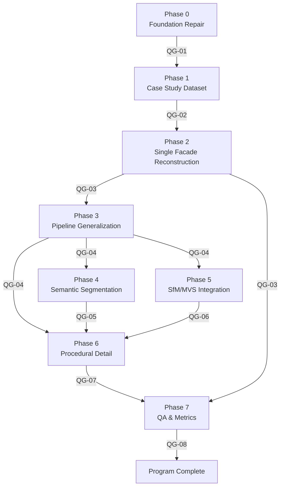

# DEPENDENCY_GRAPH.md
## Tecate 2009 — Implementation Dependency Graph

---

## 1. Task-Level Dependency Table

| Task | Depends On | Blocks |
|------|-----------|--------|
| P00-T001 | — | P00-T002 |
| P00-T002 | P00-T001 | QG-01 (as regression) |
| P00-T003 | — | QG-01 |
| P00-T004 | — | P00-T005 |
| P00-T005 | P00-T004 | — |
| P00-T006 | — | All agents using env |
| P01-T007 | QG-01 | P01-T008, P01-T011 |
| P01-T008 | P01-T007 | P01-T009, P01-T011 |
| P01-T009 | P01-T007, P01-T008 | P01-T010, P01-T011 |
| P01-T010 | P01-T009 | P01-T011 |
| P01-T011 | P01-T007–T010 | QG-02 |
| P02-T012 | QG-02 | P02-T013 |
| P02-T013 | P02-T012 | P02-T014, P02-T016 |
| P02-T014 | P02-T013 | P02-T015, P02-T016 |
| P02-T015 | P02-T014 | P02-T016, QG-03 |
| P02-T016 | P02-T013–T015 | QG-03 |
| P03-T017 | QG-03 | QG-04 |
| P03-T018 | QG-03 | QG-04 |
| P04-T019 | QG-04 | P04-T020 |
| P04-T020 | P04-T019 | QG-05 |
| P05-T021 | QG-04 | P05-T022 |
| P05-T022 | P05-T021 | QG-06 |
| P07-T023 | QG-03 | P07-T024 |
| P07-T024 | QG-05, QG-06, QG-07, P07-T023 | QG-08 |
| P07-T025 | P07-T024 | QG-08 |

---

## 2. Phase-Level Dependency Graph (Mermaid)



---

## 3. Critical Path

The critical path (longest sequential chain with no parallelism) is:

```
P00-T001 → P00-T003 → QG-01
→ P01-T007 → P01-T008 → P01-T009 → P01-T010 → P01-T011 → QG-02
→ P02-T012 → P02-T013 → P02-T014 → P02-T015 → P02-T016 → QG-03
→ P03-T017 → P03-T018 → QG-04
→ P04-T019 → P04-T020 → QG-05
→ Phase 6 → QG-07
→ P07-T024 → P07-T025 → QG-08
```

Estimated weeks on critical path: ~12–14 weeks

---

## 4. Parallelism Opportunities

After QG-04, these task chains can execute in parallel:

| Parallel Track A | Parallel Track B |
|-----------------|-----------------|
| P04-T019 → P04-T020 → QG-05 | P05-T021 → P05-T022 → QG-06 |

Both tracks feed into Phase 6. Phase 6 can only begin when BOTH QG-05 and QG-06 pass.

Within Phase 0, these tasks are fully independent and can run in parallel:
- P00-T001 + P00-T002 (bug fix + tests)
- P00-T003 (coordinate tests)
- P00-T004 + P00-T005 (fixture recording + parsing tests)
- P00-T006 (environment doc)

---

## 5. External Dependency Map

| Dependency | Required by | Risk |
|------------|-------------|------|
| Google photometa API | P01-T010 (screenshot capture) | HIGH — unauthenticated, may break |
| Playwright + Chromium | P01-T010 | MEDIUM — requires display or headless mode |
| COLMAP (external tool) | P05-T021, P05-T022 | MEDIUM — installation required |
| Selected segmentation model weights | P04-T020 | MEDIUM — URL and license must be verified |
| `trimesh` Python library | P02-T015 | LOW — pip install |
| Blender | P02-T014 | MEDIUM — path configuration required |
| `gltf-validator` CLI | QG-07 | LOW — npm install -g |

---

## 6. File Dependency Map

### Input files that must exist before any task runs:

| File | Required by tasks |
|------|------------------|
| `data/blocks_cache.json` | P01-T007, P01-T008, P02-T013 |
| `data/facades_cache.json` | P01-T007, P01-T008, P01-T009 |
| `data/panoramas_cache.json` | P01-T009 |
| `data/structural_graph/road_graph.json` | P01-T007 |
| `export/reconstruction_export.json` | P02-T014, P03-T017 |
| `src/reconstruction/prism_generator.py` | P00-T001, P01-T008, P02-T013 |
| `src/core_io/coords.py` | P00-T003, all geospatial tasks |
| `src/data_acquisition/browser_scraper.py` | P00-T004, P01-T010 |

### Output files and which tasks produce them:

| File | Produced by |
|------|------------|
| `data/case_study/target_facade.json` | P01-T007 |
| `data/case_study/target_panoramas.json` | P01-T009 |
| `data/case_study/case_study_manifest.json` | P01-T011 |
| `data/case_study/QG02_report.json` | P01-T011 |
| `export/case_study/target_facade_texture.png` | P02-T013 |
| `export/case_study/target_block.glb` | P02-T014 |
| `export/case_study/reprojection_report.json` | P02-T015 |
| `export/case_study/phase2_quality_report.json` | P02-T016 |
| `data/segmentation_cache/` | P04-T020 |
| `data/case_study/sfm/sparse/` | P05-T021 |
| `export/case_study/qa_report.json` | P07-T024 |

---

## 7. Circular Dependency Check

No circular dependencies exist. The graph is a directed acyclic graph (DAG) with clear topological ordering from Phase 0 → Phase 7.

---

## 8. Task-to-File Input/Output Matrix

| Task | Reads | Writes |
|------|-------|--------|
| P00-T001 | `prism_generator.py` | `prism_generator.py` |
| P00-T003 | `coords.py` | `tests/unit/test_coords.py` |
| P01-T007 | `blocks_cache.json`, `facades_cache.json`, `road_graph.json` | `data/case_study/target_facade.json` |
| P01-T008 | `blocks_cache.json`, `facades_cache.json` | `facades_cache.json`, `recomputed_midpoints.json` |
| P01-T009 | `facades_cache.json`, `panoramas_cache.json`, `screenshots/` | `target_panoramas.json`, `target_images/` |
| P01-T010 | `target_panoramas.json` | `screenshots/pano/`, `target_images/` |
| P01-T011 | All case_study files | `case_study_manifest.json`, `QG02_report.json` |
| P02-T012 | `target_facade.json`, `target_panoramas.json` | `pose_validator.py`, `pose_validation_report.json` |
| P02-T013 | `target_images/`, `target_facade.json`, `prism_generator.py` | `target_facade_texture.png`, `texture_extraction_report.json` |
| P02-T014 | `reconstruction_export.json`, `target_facade_texture.png` | `target_block_scene.json`, `target_block.glb` |
| P02-T015 | `target_block.glb`, `target_panoramas.json`, `target_images/` | `reprojection_validator.py`, `reprojection_report.json` |
| P07-T023 | `target_facade_texture.png`, `target_images/` | `psnr_evaluator.py` |
| P07-T024 | All QG reports, all metric files | `qa_report.json` |
| P07-T025 | `qa_report.json`, all case_study outputs | Test results |
