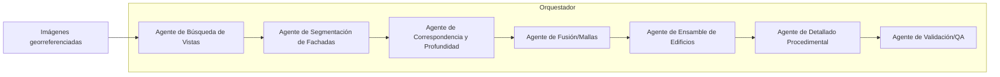
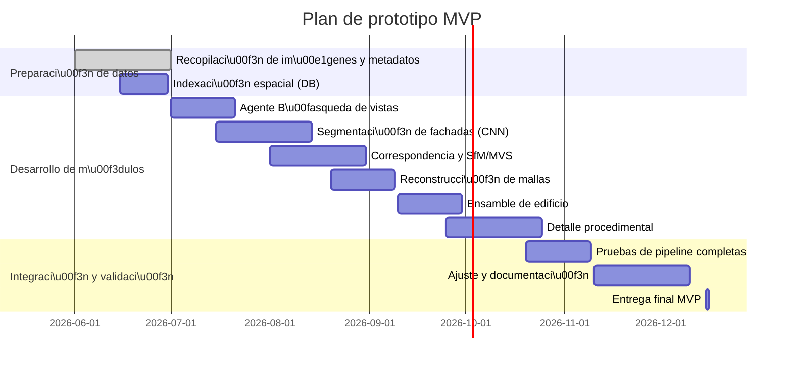

# Resumen Ejecutivo  
La reconstrucción 3D urbana combina técnicas clásicas de visión por computador y métodos de última generación. Por un lado, la **fotogrametría clásica** (SfM/MVS) sigue siendo robusta para obtener mallas precisas a partir de imágenes superpuestas【13†L110-L119】. Por otro, enfoques basados en **aprendizaje profundo** y síntesis de vistas (NeRF) ofrecen generación rápida de vistas novel, aunque a veces con menor detalle geométrico【25†L63-L72】【13†L110-L119】. Recientemente, **Gaussian Splatting** supera a NeRF en velocidad y fidelidad visual【25†L63-L72】【35†L64-L72】. También se usan métodos *híbridos* con reglas procedimentales (ej. CityEngine【18†L18-L26】) para escalar a nivel ciudad. Proponemos un sistema modular: agentes encargados de búsqueda de vistas, segmentación semántica de fachadas, correspondencias y estimación de profundidad, fusión de mallas, detalle procedimental y validación. El orquestador central coordina los agentes. Se detallan requisitos de metadatos (geolocalización, orientación, calibración), arquitecturas de datos espaciales, librerías recomendadas (COLMAP【16†L45-L48】, Open3D【49†L39-L47】, PDAL【81†L308-L317】, CityEngine【18†L18-L26】, Blender, PyTorch/TensorFlow, etc.), y un plan de proyecto con cronograma en Mermaid. El análisis exhaustivo incluye tablas comparativas de métodos, componentes y diagramas de flujos (ver Figuras). En conjunto, el informe ofrece un diseño completo para crear un prototipo mínimo viable de reconstrucción urbana detallada.  

## 1. Revisión de enfoques  

【72†embed_image】 *Fotogrametría clásica (SfM + MVS)*: se basa en emparejar puntos de interés entre imágenes solapadas para obtener posiciones de cámara (Structure-from-Motion) y luego densificar con Multi-View Stereo. Este método produce nubes de puntos y mallas de alta precisión geométrica【13†L110-L119】, siendo ideal cuando se dispone de muchas imágenes con buena superposición. Sin embargo, requiere procesamiento intensivo y puede fallar en zonas uniformes o brillantes.  

- *Marcos y algoritmos:* COLMAP es una herramienta SfM/MVS de propósito general con interfaz gráfica/CLI【16†L45-L48】. Otras opciones open-source son OpenMVG/OpenMVS, Meshroom (AliceVision), VisualSFM (legado) u ODM (OpenDroneMap). Para alinear múltiples vistas se usan SIFT/ORB para detección de características y algoritmos de correspondencia robusta. La triangulación y Poisson (o pivotamiento de bolas) convierten nubes de puntos en mallas【13†L110-L119】.

- *Calibración:* Si faltan datos intrínsecos, se estiman mediante patrones o conjeturas (p.ej. asumir campo de visión típico ~60° para cámaras estándar). Aun sin calibración exacta, muchas herramientas como COLMAP pueden autocalibrar focal usando la geometría de múltiples vistas.  

*NeRF / Rendering Neural:* NeRF (2020) es un campo emergente que modela escenas como campos radiantes neurales, permitiendo generar vistas nuevas con realismo fotográfico. Se entrenan redes profundas que representan color y densidad en cada punto 3D. NeRF produce resultados muy visuales, especialmente en escenas con pocos cambios, pero su detalle geométrico (y tiempo de cómputo) a veces es inferior al de la fotogrametría tradicional【25†L63-L72】【13†L110-L119】. Fue revolucionario en CV y ha sido aplicado incluso en patrimonio cultural【11†L54-L63】. Entre sus variantes, destacan NeRF adaptados a áreas urbanas (p.ej. BirdNeRF) y multi-escala (Mip-NeRF).

- *Ventaja:* síntesis de vistas de alta calidad sin necesidad de generación explícita de mallas.  
- *Desventaja:* entrenar redes volumétricas suele ser costoso en GPU; reconstruye bien texturas suaves, pero puede difuminar detalles finos comparado con MVS.  

*Gaussian Splatting (3DGS):* Presentado en 2023, es una técnica derivada de NeRF que reemplaza las neuronas volumétricas por millones de *“splat”* gaussianos 3D con color y opacidad【13†L134-L142】【35†L64-L72】. La representación explícita por gaussianas acelera enormemente el entrenamiento y renderizado en GPU, a la vez que mejora la fidelidad geométrica. Estudios recientes muestran que 3DGS produce resultados de síntesis de vistas más realistas y con mucho menor tiempo y memoria que NeRF【25†L63-L72】【35†L64-L72】. Por ejemplo, Aryal et al. reportan velocidades de render en tiempo real (89 fps) y mejoras de ~3× en tiempos de entrenamiento respecto a NeRF, manteniendo alta PSNR (~32 dB)【55†L113-L122】. 

- *Ventaja:* convergencia ultra-rápida, excelente calidad en escenas estáticas, apropiado para reconstrucción urbana en tiempo real【25†L63-L72】【35†L64-L72】.  
- *Desventaja:* requiere pipeline inicial (poses de cámara por SfM) y grandes recursos GPU durante optimización. Puede complicarse con objetos dinámicos (vehículos, peatones) o condiciones variables【35†L72-L74】.  

*Modelado procedimental e híbrido:* En entornos urbanos a gran escala, se incorporan reglas de inferencia para construir edificios detallados donde falte evidencia visual. Por ejemplo, ArcGIS CityEngine【18†L18-L26】 usa datos GIS (calles, parcelas) para generar ciudades 3D con extrusión de huellas y detalles procedimentales de ventanas, puertas, etc. Este enfoque es excelente para grandes áreas, pero depende de datos vectoriales (foothprints) existentes. También se pueden usar redes generativas o plantillas CAD para completar fachadas faltantes. Un sistema híbrido combinará evidencias visuales (imágenes) con reglas de diseño urbano (OpenStreetMap, arquitecturas típicas) para inferir geometría cuando las vistas son parciales.  

**Tabla 1.** Comparativa de métodos.  
| Enfoque                    | Ventajas                                        | Desventajas                                   | Casos de uso                  |
|----------------------------|-----------------------------------------------|----------------------------------------------|------------------------------|
| SfM/MVS (fotogrametría)    | Alta precisión geométrica; bien conocido【13†L110-L119】 | Lento, requiere muchas fotos superpuestas; falla en texturas pobres | Edificios históricos, precisa topografía |
| NeRF (Red neural)          | Renderización foto-realista; no requiere malla explícita | Computación intensiva (GPU); detalle modesto【25†L63-L72】 | Visualizaciones interactivas, VR |
| Gaussian Splatting (3DGS)  | Muy rápido en GPU; alta fidelidad visual【25†L63-L72】【35†L64-L72】 | Construcción inicial costosa; sensible a objetos dinámicos | Reconstrucción en tiempo real, simulación de conducción |
| Procedimental (CityEngine) | Escala ciudad, generar vistas donde faltan datos【18†L18-L26】 | Depende de datos GIS, menos «foto-realista» | Grandes modelos urbanos, simulación |

## 2. Arquitectura modular propuesta  

Proponemos un **sistema orquestado** por agentes especializados. Cada agente realiza tareas independientes, facilitando desarrollo paralelo y validación modular. Los agentes clave son: **Búsqueda de vistas**, **Segmentación semántica de fachadas**, **Correspondencia y estimación de profundidad**, **Reconstrucción de mallas de fachadas**, **Ensamble de edificios**, **Detalle procedural**, y **Validación/QA**. Un orquestador central coordina el flujo de datos entre agentes según un protocolo interno (p.ej. mensajes REST o colas de datos). A continuación se esboza esta arquitectura:  



- **Agente de Búsqueda de Vistas:** Dado un bloque o fachada objetivo, consulta la base de datos espacial (p.ej. índice R-tree) para seleccionar imágenes relevantes. Filtra según orientación: busca imágenes cuyo ángulo de visión (heading) esté alineado con la normal de la fachada. Por ejemplo, una query espacial puede ser “seleccionar imágenes donde `ABS(heading - normal_fachada) < δ` y `distancia < D`”. Utiliza metadatos de cámara (lat, lon, alt, bearing) y del polígono de la fachada.  
- **Agente de Segmentación Semántica:** Toma cada imagen de fachada y la segmenta (p. ej. CNN). Identifica ventanas, puertas, muros, balcones, etc. (por ejemplo, usando una red al estilo DeepFacade【44†L9-L18】 o arquitecturas de segmentación de fachada). Esto permite luego aplicar texturas procedurales coherentes.  
- **Agente de Correspondencia y Profundidad:** Emplea SfM/MVS entre las imágenes seleccionadas para obtener nubes de puntos 3D de la fachada. Usa herramientas como COLMAP u OpenMVG para extriangular características y luego OpenMVS para densificar. Produce mapas de profundidad o nube de puntos local de la fachada.  
- **Agente de Fusión/Mallas de Fachadas:** Convierte las nubes de puntos densas en mallas poligonales (Poisson, Ball Pivoting). Crea una malla por fachada en coordenadas locales (xyz). Corrige artefactos (ruido, outliers).  
- **Agente de Ensamble de Edificios:** Une las mallas de varias fachadas contiguas según los planos del edificio. Ajusta la base (suelo) y techo a la altura de piso / techo del edificio (posiblemente extraída de metadatos o estimada). Genera el modelo volumétrico básico del edificio.  
- **Agente de Detallado Procedimental:** Añade detalles arquitectónicos faltantes (columnas, ornamentación, cornisas) usando reglas o modelos prediseñados. En fachadas con pocas imágenes, infiere ventanas y balcones periódicos según patrones detectados【44†L9-L18】. Puede integrar generadores de terreno o vegetación para situar el edificio en contexto.  
- **Agente de Validación/QA:** Comprueba métricas de calidad (consistencia geométrica, cobertura). Evalúa la distorsión y errores de reconstrucción. Por ejemplo, proyecta la malla reconstruida de vuelta a imágenes para medir reproyección (error pixel) y calcula distancia media 3D frente a datos de control (si los hay).  


## 3. Metadatos y formatos requeridos  

Cada imagen debe estar **totalmente georreferenciada**. Los campos mínimos indispensables son:  
- **Coordenadas geográficas:** latitud, longitud, altitud de la cámara (GPS/INS)【48†L29-L37】.  
- **Orientación de la cámara:** *heading* (brújula), *pitch* (inclinación vertical) y *roll* (inclinación lateral)【48†L29-L37】. Estos ángulos permiten alinear la dirección de la imagen con la normal de las fachadas.  
- **Parámetros intrínsecos:** distancia focal (o campo de visión), centro óptico (principal point) y parámetros de distorsión. Si no se dispone, se pueden estimar: por ejemplo, asumir focal típica o calcular focal = (imagen_width/2)/tan(HFOV/2). La base de datos ejemplo muestra *hfov, vfov* nulos; conviene llenarlos para precisión.  
- **Dimensiones de la imagen:** ancho y alto en píxeles (importante para calibración).  
- **Identificador de edificio/fachada:** enlace a un *block_id* y *facade_index*, con su polígono local y normal. En la muestra JSON se incluyen `facade_midpoint_local` y `facade_normal`, útiles para indexar búsquedas.  
- **Relaciones viales:** nombre de calle, distancia mínima al borde de vía (p. ej. `road_distance_meters`) para priorizar imágenes con vista frontal.  
- **Metadatos temporales:** fecha/hora de captura (puede ayudar si hay cambios estacionales).  

Ejemplo de consulta espacial: 
```
SELECT image_id 
FROM metadata 
WHERE block_id = 'B123' 
  AND ABS(heading - facade_normal_angle) < 20 
  AND road_distance_meters < 10;
```  
Esto hallaría imágenes del bloque B123 tomadas casi frontalmente (±20°) a la fachada. Para índices espaciales conviene usar R-trees o KD-trees con llaves (lat, lon) y adicionalmente índices angulares para orientaciones. ArcGIS, por ejemplo, almacena *Heading, Pitch, Roll* y *HorizontalFieldOfView* para cada imagen orientada【48†L29-L37】, lo que permite calcular huellas de cámara (footprints) sobre el terreno y filtrar imágenes relevantes.  

## 4. Algoritmos y librerías recomendados  

- **Reconstrucción 3D (SfM/MVS):** OpenMVG/OpenMVS, COLMAP【16†L45-L48】 y Meshroom (AliceVision) son frameworks probados. COLMAP destaca por ser de propósito general, con interfaz y CLI, soporte GPU y algoritmos flexibles【16†L45-L48】. Agisoft Metashape (comercial) es otra opción. Para densificación y texturizado se usan Poisson Surface Reconstruction (OpenMVS) o Ball Pivoting.  

- **Visión y ML:** PyTorch o TensorFlow para redes neuronales. Para segmentación y detección se pueden usar arquitecturas preentrenadas (DeepLab, Mask R-CNN o especializadas para fachadas【44†L9-L18】) implementadas en frameworks comunes.  

- **Nubes de puntos:** Open3D es una biblioteca open-source de alto nivel para procesamiento 3D (ICP, meshing, filtrado)【49†L39-L47】. PDAL maneja formatos LiDAR/point cloud; aunque aquí trabajamos con fotogrametría, PDAL puede filtrar y analizar densidades de puntos【81†L308-L317】. Blender (con BlenderGIS) sirve para ensamblar y exportar modelos; plugin Python permite automatizar tareas de texturizado.  

- **Modelado procedimental:** ArcGIS CityEngine【18†L18-L26】 es líder industrial para crear ciudades 3D a partir de datos GIS mediante reglas. OSMnx (Python) puede extraer redes de calles y huellas de OSM como base. Unity/Unreal Engine integran plugins (p.ej. Cesium/indoor) para visualizar resultados.  

- **Frameworks NeRF:** Instant-NGP (NVIDIA), Plenoxels, Nerfstudio, etc. Para Gaussian Splatting, las implementaciones de los autores (por ejemplo, el repositorio oficial de *3D Gaussian Splatting*) pueden integrarse tras la etapa de poses.  

- **Ajustes de parámetros:** En COLMAP, activar *exhaustive matching* para pocos cientos de imágenes, o *sequential* para videos/series ordenadas. Para MVS (OpenMVS), ajustar la resolución mínima de reconstrucción (p.ej. 800px) y descarte de triangulaciones débiles. En NeRF/3DGS, ajustar tasa de aprendizaje y número de iteraciones según complejidad; la literatura sugiere entornos simples convergen rápido【35†L64-L72】. Para CityEngine, definir reglas (CGAs) adaptadas al contexto local.  

## 5. Pipeline detallado por pasos  

1. **Selección de imágenes:** A partir de la base de datos de metadatos, elegir las fotos que cubren cada fachada. Se priorizan vistas cercanas y frontales (heading alineado con la normal de la fachada)【48†L29-L37】. Se agrupan imágenes por fachada.  
2. **Calibración de cámaras:** Si no están dadas, calibrar intrínsecos usando algoritmos de autocalibración de COLMAP/SfM, o con plantillas (chequear campo visual y focal). Corregir distorsión radial si es posible.  
3. **Extracción de características y correspondencias:** Detectar keypoints (SIFT/SURF/ORB) en cada imagen. Hallar correspondencias entre imágenes adyacentes del grupo. Aplicar SfM (por ejemplo con COLMAP) para estimar posiciones relativas de las cámaras y generar una nube de puntos dispersa de la fachada.  
4. **Densificación (MVS):** Usar multi-view stereo para generar nube densa: algoritmos PatchMatch o variantes en OpenMVS/MVE. Esto produce nubes de cientos de miles de puntos de la fachada.  
5. **Reconstrucción de mallas por fachada:** Convertir cada nube densa en una malla continua. P.ej., Poisson Reconstruction produce superficies suavizadas que luego se recortan según el polígono de la fachada. Se mejoran detalles con *surface refinement*.  
6. **Alineación geográfica:** Situar la malla en el sistema de coordenadas local/global. Si las cámaras se georreferenciaron, el SfM debería ya dar escalas métrica en coordenadas reales. Si no, escalar la malla usando distancias conocidas (altura de puertas, pisos).  
7. **Fusión y ensamblaje de edificio:** Unir mallas de distintas fachadas adyacentes para formar el edificio completo. Asegurar continuidad en vértices comunes (esquinas). Generar plano de suelo (interpolando altura de terreno) y techo. Si hay datos LIDAR o CAD de referencia, fusionarlos para corregir aliniación final.  
8. **Texturizado:** Proyectar las fotos originales sobre la malla (UV mapping), eligiendo la mejor vista para cada triángulo (blending de imágenes o texturizado global). Herramientas como Blender pueden automatizar esto. Para detalles menores (grafitis, letreros), se incorporan imágenes segmentadas de alta resolución.  
9. **Detalle procedimental:** Sobre el modelo base, insertar automáticamente elementos faltantes. Ejemplos: generar balaustradas, cornisas o perforaciones regulares de ventanas usando reglas geométricas; colocar ventanas geométricamente uniformes si la segmentación indicó su disposición. Si el edificio es un simple extruido, aplicar plantilla de ventanas según reglas arquitectónicas locales.  
10. **Validación:** Ejecutar tests automáticos: calcular **completitud** (porcentaje de la fachada cubierto por puntos/malla), **precisión** (error medio de puntos vs posibles datos de referencia) y métricas de visualización (PSNR de vistas renderizadas【55†L113-L122】). Verificar reproyección: retransformar la malla a cada imagen y medir la discrepancia. Si hay discrepancias grandes o huecos visibles, iterar con más imágenes o ajustar parámetros.  

Este flujo se basa en prácticas de vanguardia. Por ejemplo, Aryal et al. describen un pipeline de reconstrucción que primero estima poses de cámara (SfM), luego optimiza gaussianas 3D adaptativas, finalmente limpia y exporta el modelo para visualización【55†L119-L124】. Otros flujos similares combinan SfM/MVS tradicionales seguidos por refinamientos neural/procedurales.

## 6. Escalabilidad y paralelización  

Para procesar manzanas o ciudades enteras se aplican estrategias de división de trabajo:  
- **Shard por región/fachada:** Dividir el área urbana en bloques (por calles, manzanas o cuadrados regulares). Cada bloque se procesa de forma independiente (SFM/MVS por bloque) en un nodo diferente, evitando que un solo sistema enfrente todos los datos simultáneamente. Por fachada, las imágenes pueden procesarse en paralelo (por ejemplo, un servicio calcula SfM para cada fachada).  
- **Balance GPU/CPU:** Activar aceleración GPU para tareas compatibles (SfM/MVS, redes) y usar CPU multi-hilo para otros (gestión de datos, I/O). Por ejemplo, ejecutar múltiples instancias de COLMAP en paralelo en diferentes GPUs o procesos.  
- **Almacenamiento eficiente:** Emplear bases de datos espaciales (PostGIS, SQLite con R-tree) para índice de imágenes y geometrías. Almacenar intermedios (nubes densas, mallas ligeras) en formatos comprimidos (e.g. Draco, .obj optimizados). Mantener caché de correspondencias clave para reuso.  
- **Caché de procesos:** Los resultados de etapas pesadas (cámaras calibradas, nubes de puntos parciales) se guardan para evitar recomputaciones si cambian parámetros. Se puede usar un gestor de flujo de trabajo (p.ej. Apache Airflow) para orquestar esto.  
- **Escala en nube:** Para grandes volúmenes, la solución puede desplegarse en la nube. Cada bloque podría mapearse a un contenedor o VM. Estimar costos: según estudios, la reconstrucción fotogramétrica es intensiva en CPU/GPU; por ejemplo, procesar 1 km² de imágenes aéreas podría requerir decenas de miles de imágenes y varias máquinas GPU, potencialmente decenas de miles de dólares en la nube. El balance costo/escalabilidad se logra procesando en paralelo muchos bloques pequeños en instancias spot/GPU.  

## 7. Métricas de calidad y pruebas automáticas  

Se definen métricas objetivas para evaluar resultados:  
- **Completitud:** Porcentaje de la fachada reconstruida. Se compara el área superficial reconstruida frente al esperable (p.ej. desde planos o CAD). Debe aproximarse al 100%.  
- **Precisión geométrica:** Distancia media de puntos o vértices de la malla reconstruida al modelo de referencia (LIDAR o planos). Se mide con RMSE o Chamfer Distance (debe ser sub-métrico).  
- **Error de reproyección:** Dado el modelo final, proyectarlo en las imágenes originales. El error pixel medio/reproyección (píxeles de discrepancia) debe ser pequeño si la geometría es consistente.  
- **PSNR/LPIPS en síntesis de vistas:** Para métodos NeRF/3DGS, evaluar cuán similares son las imágenes generadas versus reales【55†L113-L122】. Un PSNR >30 dB indica alta fidelidad visual.  
- **Stable Completeness en benchmarks:** Usar conjuntos de prueba (KITTI, ETH3D) para medir precisión global. Por ejemplo, trabajos de Gaussian Splatting reportan mejora del 10-20% en completitud frente a NeRF【55†L113-L122】.  

También se automatizan **pruebas de robustez**: reproducibilidad de los flujos, verificación de integridad de datos (p.ej. que la normal de fachada concuerde con las fotos usadas). Las pruebas unitarias deben cubrir cada agente (p.ej. dado un conjunto de imágenes, validar que el agente de correspondencias produzca una nube de puntos con densidad mínima).  

## 8. Riesgos, limitaciones y recomendaciones operativas  

- **Cobertura de datos:** Zonas con pocas imágenes o vistas oblicuas pueden provocar reconstrucciones incompletas. En estos casos, se debe recurrir a inferencia (ej. extrusión simple de fachadas o datos GIS).  
- **Calidad de imágenes:** Iluminación pobre, reflejos o cambios dinámicos (tránsito, gente) degradan SfM/MVS. NeRF/3DGS sufren con elementos móviles – su rendimiento baja con tráfico o iluminación cambiante【35†L72-L74】. Se recomienda filtrar o detectar estas regiones (objetos movidos) antes de la reconstrucción.  
- **Geometría ambigua:** Fachadas muy lisas (sin texturas) o repetitivas pueden confundir algoritmos de matching. El uso de métodos de segmentación ayuda a imponer estructura (por ejemplo, sabiendo que se esperan ventanas periódicas【44†L9-L18】).  
- **Inferencia vs evidencia visual:** Si faltan imágenes o la calidad es baja, conviene usar más modelo procedimental (basado en reglas de diseño arquitectónico) en lugar de confiar en un resultado inseguro de MVS. Por ejemplo, rellenar vacíos con una fachada genérica parametrizada puede ser preferible a un modelo erróneo.  
- **Sesgo de datos:** Los modelos aprendidos (p.ej. redes de fachadas) pueden no generalizar a estilos arquitectónicos locales. Es recomendable incluir muestras representativas en cualquier entrenamiento de ML.  
- **Limitaciones técnicas:** El procesamiento NeRF/Gaussian requiere hardware especializado (GPU modernas). Los plazos de entrenamiento deben considerarse en el cronograma. Igualmente, depurar y validar cada módulo toma tiempo sustancial.  

## 9. Plan de prototipo mínimo viable  

### Objetivos y entregables  
Desarrollar un prototipo que procese una manzana urbana de prueba (por ejemplo, una cuadra típica) desde imágenes georreferenciadas hasta un modelo 3D texturizado. Los entregables clave son: (1) Data pipeline documental (imagen → metadata), (2) Módulos de reconstrucción por fachada, (3) Ensamblado de edificio, (4) Procedural añadido, (5) Validación automatizada con métricas, (6) Informe final con evaluaciones.  

### Recursos necesarios  
- **Equipo:** 1–2 expertos en visión computacional (fotogrametría/SfM), 1 ingeniero ML (seguridad segmentación/NeRF), 1 desarrollador de sistemas (integración), 1 especialista GIS (datos espaciales).  
- **Infraestructura:** Servidor con 2 GPUs (NVIDIA A100 o similares) para NeRF/3DGS, varios CPUs + 32+ GB RAM para SfM/MVS, base de datos espacial (PostGIS). Software: COLMAP, OpenMVS, Open3D (MIT), CityEngine (licencia), Blender (open source), librerías ML (PyTorch).  
- **Datos:** Conjunto de imágenes georreferenciadas de alta resolución para la manzana; planos/footprints de edificios (p.ej. OSM, datos catastrales), modelos de referencia si existen (LIDAR o CAD).  

### Cronograma estimado (6 meses)  


### Criterios de \u00e9xito  
- El prototipo debe generar un modelo 3D texturizado de la manzana con **al menos 90% de completitud** en las fachadas reconstruidas y **precisión métrica** (error medio < 0.5 m frente a referencia).  
- Todos los módulos se ejecutan de forma automatizada (sin intervención manual en procesamiento de mallas).  
- Demostrar escalabilidad horizontal: el pipeline debe poder repetirse en bloques adyacentes con configuraciones mínimas.  

## 10. Referencias y fuentes clave  

- Reinhard Kaetzle et al., *3D Gaussian Splatting for Real-Time Radiance Field Rendering*, Inria Lab (2023) – documento base de Gaussian Splatting.  
- Goswami et al., *NeRF in the Age of AI: A Survey*, ACM (2024) – revisión de NeRF/3DGS en CV【25†L63-L72】【25†L109-L118】.  
- Diana and Spuhler, *Reconstrucción virtual del patrimonio con NeRF e IA*, Boli (2023) – caso de uso en patrimonio【11†L54-L63】.  
- Liu et al., *DeepFacade: A Deep Learning Approach to Facade Parsing*, IJCAI’17【44†L9-L18】.  
- ArcGIS Pro Docs, *Camera Orientation* – explica encabezados/ángulos y FOV【48†L29-L37】.  
- COLMAP Official (GitHub) – descripción de funcionalidades SfM/MVS【16†L45-L48】.  
- Esri CityEngine Documentation – software comercial procedural【18†L18-L26】.  
- Zhou et al., *Open3D: A Modern Library for 3D Data Processing* (arXiv 2018)【49†L39-L47】.  
- Aryal et al., *Efficient 3D Reconstruction with Gaussian Splatting* (2025) – resultados de rendimiento (PSNR, tiempo)【55†L113-L122】.  
- Mohamad et al., *DENSER: 3D Gaussian Splatting for Dynamic Urban Scenes* (ArXiv 2024)【35†L64-L72】【35†L72-L74】.  
- PDAL (Point Data Abstraction Library) – manipulación de nubes de puntos (C++/Python)【81†L308-L317】.  

Estas fuentes (españolas e inglesas) y las URLs de las herramientas mencionadas proporcionan fundamentos y ejemplos actuales para implementar cada parte del sistema. Las tablas y diagramas resumidos sintetizan los métodos, metadatos y componentes clave comparados. Cada sección anterior se basa en estas referencias para sustentar las recomendaciones técnicas.